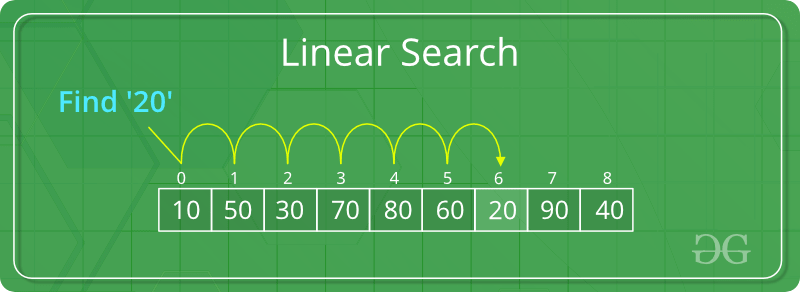
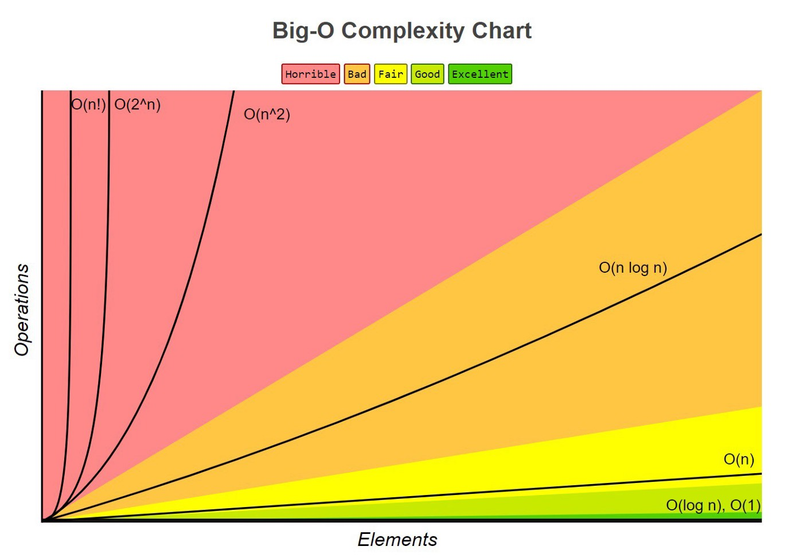

In previous lessons, you learned object-oriented programming, and the basics of python syntax. This lesson focuses on algorithmic thinking, a skill that you will use to solve problems with the knowledge you have learned. 

You will use the skills you learn in this lesson to solve problems of increasing difficulty and complexity, as well as rethink approaches to problems in order to make them more efficient. 

# What is Algorithmic Thinking? 

Essentially, algorithmic thinking is the process of creating the steps to solve a problem. The word _algorithm_ simply refers to a set of instructions that can be followed. In our case, they are instructions that computers can follow. By thinking algorithmically, we can create algorithms to solve our problems. 

Let's start with a simple example of an algorithm, such as baking a cake.
Before you read on, try to write your own algorithm for baking a cake. You don't need to include every ingredient, but remember all the key steps. 

1. Collect ingredients for the cake
2. Mix the ingredients in a bowl
3. Pour the batter into a tray, then bake it. 
4. Let it cool before cutting and eating

These instructions technically describe how to bake a cake, but are not very specific. When writing code, your instructions will need to be very specific, since computers cannot infer what you mean. If you forget to write something, computers will simply not do it. 

There are a lot of problems with this recipe: we didn't include any specific ingredients, or describe how to get them. We need to include some more specific instructions: 

1. Collect ingredients for the cake
    * Grab 2 eggs from the fridge
    * Measure 3 cups of flour from the pantry
    * Measure 1 cup of sugar from the sugar jar
    * Cut 1 cup of butter from the fridge
2. Mix the ingredients in a bowl
    * Melt the butter in a microwave
    * Mix the butter with the sugar
    * Add the eggs
    * Add the flour
    * Stir
4. Pour the batter in a tray
    * Grease the tray
    * Pour the batter in
5. Bake the batter
    * Preheat the oven to 350 F. 
    * Once preheated, put the tray in
    * Take it out after 30 minutes
6. Let the cake cool
    * Take the cake out of the oven
    * Turn off the oven
    * Put the cake somewhere to cool

By being slightly more specific, our list of instructions just got a lot longer. But there are still some things we can focus on. 

Let's turn these instructions into pseudocode. Pseudocode follows some of the conventions we use when we write a programming language (in this case, Python), but is readable by humans, instead of computers. 

```python
preheat_oven(350)
ingredients.get_item('eggs', 2)
ingredients.get_item('flour', 3)
ingredients.get_item('sugar', 1)
ingredients.get_item('butter', 1)
batter = mix(ingredients)
pour(batter, tray)
move(tray, oven)
wait(30)
move(tray, counter)
turn_oven_off()
```
Each of these functions is quite abstract, but I can define them in detail later. 

This is the process you might go about when you solve a programming problem: 

1. Determine the outputs and behavior of the code you will write
    * If it is a written problem, be sure to read it in its entirety
2. Break the code into a smaller, more codable parts
3. Write down some pseudocode for how each part will work
4. Implement the steps in code
5. Debug: Does it match what the intended output from 1)? Are there any bugs? 
    * If there are, determine what they are and what's causing them. Then, fix what's causing the bug. 

Let's break down *long division* from an algorithmic perspective. 
Similarly to the baking analogy, let's trace out the steps.
Remember, divisor is the number being divided and the dividend is what we divide it with
1. Is the first digit of the divisor bigger or less than the dividend?
2. If so, count the number of times it goes into the number, put it up top, then subtract the amount of times the dividend goes into the divisor. Then pull the next digits down until the number formed by the digits are bigger than the dividend
3. If not, pull down digits until the digits pulled down from the divisor are bigger than the dividend. Then, go to step 2.
    * When the digits pulled down are bigger than the dividend, repeat steps 1a and 2 until you cannot pull down anymore digits.
# Common Algorithms

## [Linear Search](https://replit.com/@liuj05/Linear-Search#main.py)

*Search algorithms* search for information in a given data structure. For example, given a list like this:
```python
numbers = [10, 50, 30, 70, 80, 60, 20, 90, 40]
```
If you wanted to find the index of `20`, you would use a search algorithm to find it.

The simplest type of search algorithm is called _linear search_.

A linear search algorithm that searches for x in a list called vals would go like this: 
1. Start at index 0. Check if the element at index 0 is equal to x.
2. If it is not, increment the index. Check if the element at that index is equal to x.
3. Repeat 2. till a number matching x is found. 
4. If a number is found, return the current index.
5. If a number is not found, return -1 to show that the element is not in the list.

Here's what it would look like as a diagram:




Let's implement that in code: 

```python
def linear_search(vals, x):
   for i in range(len(vals)):
      if vals[i] == x:
         return i
   return -1
```

Now let's find where 20 is in the list:

```python

def linear_search(vals, x):
   for i in range(len(vals)):
      if vals[i] == x:
         return i
   return -1
   
numbers = [10, 50, 30, 70, 80, 60, 20, 90, 40]

print(linear_search(numbers, 20))

>>> 6
```

An interesting thing to notice is that because the function will return `-1` if there is a value is _not_ in a list, it also doubles as a function that checks whether a value is *in* in the list, or not.

For example, if I wanted to find whether the number 20 was in that same list, I could use the function like this:

```python
def linear_search(vals, x):
   for i in range(len(vals)):
      if vals[i] == x:
         return i
   return -1

numbers = [10, 50, 30, 70, 80, 60, 20, 90, 40]

if linear_search(numbers, 20) == -1:
   print("This number isn't there!")
else:
   print("This number is there!")
```

## [Binary Search](https://replit.com/@KevinLu28/binary-search#main.py)

While linear search is a simple and easy to implement algorithm, it isn't very efficient. For example, if we were to search a very long list of numbers, and the number we want is at the end of the list, it would take a very long time.

We can implement something known as a binary search to make this much easier.

Binary searches only work on sorted lists, by taking advantage of a feature of sorted lists. 

You can sort a list in Python with the `sort()` function:

```python
nums = [9, 8, 5, 2, 7, 9]
nums.sort()
print(nums)

>>> [2, 5, 7, 8, 9, 9]
```

To understand the process of a binary search algorithm, let's analyze how a binary search algorithm would find a number in a list like this:
```python
[12, 15, 18, 21, 24, 27, 30, 33, 36, 39, 42]
```
This list has 11 terms. So, the middle term is `27`. Let's try to find `39`. 
Looking at the middle term, we know that `39 > 27`. We haven't found our index yet, but more importantly, we know that the location of `39` must be after `27`, because it is greater (It can't be before, because the list is *in order*). We can therefore rule out the lesser half of the list. 
Now, our choices look like this:
```python
[30, 33, 36, 39, 42]
```
Now, the middle term is `36`. Let's do the same test! `39 > 36`. It is still greater, so we can rule out the first two terms of the list (with the same logic as the prior iteration). Now, we're left with
```python
[39, 42]
```
We have an even number of items - how do we find the middle? Generally, we use the earlier element, rather than the later one. Since `39 == 39`, We've found our item. 

As you can see, this only took 3 iterations, excluding the sort. A linear search would have taken 10 iterations.

Or, for example, we can try finding the number `24` in the same list:
```python
[12, 15, 18, 21, 24, 27, 30, 33, 36, 39, 42]
```

Let's start with `27` again, since it's the middle term. `24 < 27`, so we know that the value **cannot** be in the second half of the list. Therefore, we can rule that part out.
```python
[12, 15, 18, 21, 24]
```
Now the middle number is `18`. `24 > 18`, so we know that it must be in the second half. 
```python
[21, 24]
```
Taking the middle number to be the earlier item, we find again that `24 > 21`. Let's eliminate that:
```python
[24]
```
We are left with one term, which must be the term we are searching for. 

Now we know that you know what the algorithm is like, let's summarize this:
1. Start at the middle of the list. Determine whether the target is greater than or less than the middle number.
   * If it is greater than the middle number, you can eliminate the first half of the list. 
   * If it is less than the middle number, you can eliminate the second half of teh list.
   * If it is equal, you have found your target
2. Repeat this, but with the new boundaries that you have determined from step 1. 
3. When there is only one term left, you have found your element.

We can implement this in code, like this: 

```python
def binarySearch(lis, l, r, x):
#x represents the number being called, l represents the lowest constraint of the index and r represents the highest constraint of the index
    # checks if the low constraint is higher than the high one. If true that means we have split the array so many times that the low is higher than the supposed high, meaning the number is not in the list
    if r >= l:

        mid = l + (r - l) // 2

        #checks if element is in the middle
        if lis[mid] == x:
            return mid

        # If element is smaller than mid, then it can only be present in left subarray
        elif lis[mid] > x:
            return binarySearch(arr, l, mid-1, x)

        # Else the element can only be present in right subarray
        else:
            return binarySearch(arr, mid + 1, r, x)

    else:
        #element not in present
        return -1


# Driver Code
arr = [2, 3, 4, 10, 40]
x = 10
print(binarySearch(arr, 0, len(arr), 10))

>>> 3
```

## [Fibonacci Numbers](https://replit.com/@liuj05/Fibonacci-Numbers#main.py)

Fibonacci numbers are part of the fibonacci sequence, where each number is the sum of the two before it, starting with 0 and 1. 
The first couple fibonacci numbers look like this:

```
0, 1, 1, 2, 3, 5, 8, 13, 21, 34, 55
```
We can implement this using recursion. We will call this function inside itself. 

First, we need to define base cases for our recursive function. We can't get the previous numbers of the first two numbers, so we will need to define them:
```python
def fib(n):
   # base cases
   
   if n == 0:
      return 0
   if n == 1:
      return 1
```
If the number is neither of the first two, we'll go call the fibonacci functions for the previous two numbers and add them together:
```python
return fib(n-1) + fib (n-2)
```
Combining this together,
```python
def fib(n): 
  #base cases
  #
  if n == 0:
   return 0  
  if n == 1:
    return 1  
  else:
    #each number will be reduced to the base case, and then accumulated into what term of fib it will be
    #Go to walkthrough for representation of above
    return fib(n-1) + fib(n-2)
num=int(input("Enter fib number here:"))
print(fib(num))
```
A diagram here explains this idea: 


## [Duplicates in a list](https://replit.com/@liuj05/Duplicates#main.py)

Let's write a program to find the duplicates in a list. From the logic of this program, you will also be able to develop an algorithm that returns the unique elements of a list.

To start, we want to record the values that we have seen already. 

We will iterate through the list of values. If the number hasn't been seen yet, we will put it in `seen`. If it *has* been seen, we will check if it is in `duplicates` or not. If it's already in `duplicates`, we won't append it, since we don't want duplicates in our `duplicate` list. If it is not in duplicates, we'll add it. 

This program looks like this: 

```python
def find_duplicates(vals):
   seen = []
   duplicates = []
   for val in vals:
      if val not in seen:
         seen.append(val)
      else:
         if val not in duplicates:
            duplicates.append(val)
   return duplicates
   
arr = [1, 2, 2, 3, 6, 5, 6, 8, 1, 0]
print(find_duplicates(arr))

>>> [2, 6, 1]
```

Thinking about this, how can you make a program that returns the unique elements of a list only (removes duplicates)?

In the next lesson, you will learn about a data structure called the `set`. `set` can only store unique items, which makes this program much shorter and easier to write. A shortened example of this algorithm that uses `set` will be in the next lesson; but understanding this basic algorithm is a good way to learn about algorithms. 

# Big O Notation

## What is Big O notation?

Big O notation is a mathematical representation of the time complexity of a program as input size increases.

Different kinds of algorithms perform differently based on the input given to them. For example, two different algorithms to sort may have similar speeds for small inputs, but have very large differences for larger inputs. The way that we describe a program's behavior based on input is the Big O notation. 

If you haven't taken an algebra class before, this may be a bit confusing, so you don't need to worry about it yet. If you have, this will be familiar. 

We usually write Big O as a function of *n*. *n* represents the input size. 

Let's go through some common time complexities:

### O(1)

O(1) programs are *constant*. A O(1) program takes the same kind of time to run regardless of the input. An example of a O(1) program might be this:


```python
def first_of(data):
    return data[0]
```

This program returns the first element of any data type you give it. This kind of program always takes constant time to run. 

### O(n)

O(n) programs are *linear*. A O(n) program's runtime increases linearly with the input size. This means that an increase in input size will always increase the run time by a constant amount. 

```python
for element in data:
    print(element)
```

In this program, if the size of `data` is increased, there will be more elements to print, which it will do linearly. 

### O(log(n))

O(log(n)) programs are *logarithmic*. If you don't know, logarithmic functions are always increasing, but their rate of increase is decreasing. 

This means that a O(log(n)) will usually reduce the size of the input as it goes on, which makes it faster as the program continues. Or, for example, the binary search algorithm we introduced earlier is logarithmic. Because the size of each binary search array is reduced each time, the program is logarithmic.

### O(n^2)

O(n^2) programs are *quadratic*. A program has quadratic time complexity when it performs an operation on each value on the data multiple times. 

```python
for x in vals1:
    for y in vals2:
        print(x, y)
```

You can visualize different kinds of algorithms with this diagram: 


This diagram illustrates the different kinds of time complexity that your program might have. Notice that the worst kind of algorithm is O(n!), which grows very fast. This means that if your program receives even a slightly large amount of input, it will take a very long time to run. 

## Determining the Big O notation of your program

Firstly, you should break down your algorithm: determine the time complexity of each of your steps. A basic step could be `print()` or `a = 5 + b`. 
Next, determine how they are run, and if they match any of the criteria for log(n) or n^2 algorithms. Additionally, if you are using a specific algorithm, you can find its time complexity  [here](https://cooervo.github.io/Algorithms-DataStructures-BigONotation/).


