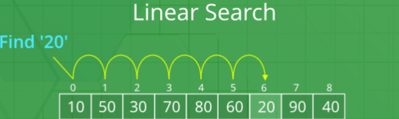
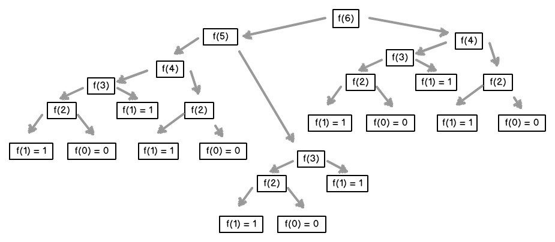

In previous lessons, you learned object-oriented programming, and the basics of python syntax. This lesson focuses on algorithmic thinking, a skill that you will use to solve problems with the knowledge you have learned. 

You will use the skills you learn in this lesson to solve problems of increasing difficulty and complexity, as well as rethink approaches to problems in order to make them more efficient. 

# What is Algorithmic Thinking? 

Essentially, algorithmic thinking is the process of creating the steps to solve a problem. The word _algorithm_ simply refers to a set of instructions that can be followed. In our case, they are instructions that computers can follow. By thinking algorithmically, we can create algorithms to solve our problems. 

Let's start with a simple example of an algorithm, such as baking a cake.
Before you read on, try to write your own algorithm for baking a cake. You don't need to include every ingredient, but remember all the key steps. 

Collect ingredients for the cake
Mix the ingredients in a bowl
Pour the batter into a tray, then bake it. 
Let it cool before cutting and eating

These instructions technically describe how to bake a cake, but are not very specific. When writing code, your instructions will need to be very specific, since computers cannot infer what you mean. If you forget to write something, computers will simply not do it. 

There are a lot of problems with this recipe: we didn't include any specific ingredients, or describe how to get them. We need to include some more specific instructions: 

Collect ingredients for the cake
Grab 2 eggs from the fridge
Measure 3 cups of flour from the pantry
Measure 1 cup of sugar from the sugar jar
Cut 1 cup of butter from the fridge
Mix the ingredients in a bowl
Melt the butter in a microwave
Mix the butter with the sugar
Add the eggs
Add the flour
Stir
Pour the batter in a tray
Grease the tray
Pour the batter in
Bake the batter
Preheat the oven to 350 F. 
Once preheated, put the tray in
Take it out after 30 minutes
Let the cake cool
Take the cake out of the oven
Turn off the oven
Put the cake somewhere to cool

By being slightly more specific, our list of instructions just got a lot longer. But there are still some things we can focus on. 

Let's turn these instructions into pseudocode. Pseudocode follows some of the conventions we use when we write a programming language (in this case, Python), but is readable by humans, instead of computers. 

```python
preheat_oven(350)
ingredients.get_item('eggs', 2)
ingredients.get_item('flour', 3)
ingredients.get_item('sugar', 1)
ingredients.get_item('butter', 1)
batter = mix(ingredients)
pour(batter, tray)
move(tray, oven)
wait(30)
move(tray, counter)
turn_oven_off()
```
Each of these functions is quite abstract, but I can define them in detail later. 

This is the process you might go about when you solve a programming problem: 

Determine the outputs and behavior of the code you will write
If it is a written problem, be sure to read it in its entirety
Break the code into a smaller, more codable parts
Write down some pseudocode for how each part will work
Implement the steps in code
Debug: Does it match what the intended output from 1)? Are there any bugs? 
If there are, determine what they are and what's causing them. Then, fix what's causing the bug. 

Let's break down *long division* from an algorithmic perspective. 
Similarly to the baking analogy, let's trace out the steps.
Remember, divisor is the number being divided and the dividend is what we divide it with
Is the first digit of the divisor bigger or less than the dividend?
If so, count the number of times it goes into the number, put it up top, then subtract the amount of times the dividend goes into the divisor. Then pull the next digits down until the number formed by the digits are bigger than the dividend
If not, pull down digits until the digits pulled down from the divisor are bigger than the dividend. Then, go to step 2.
When the digits pulled down are bigger than the dividend, repeat steps 1a and 2 until you cannot pull down anymore digits.
# Common Algorithms

## Linear Search



We literally just go down the list until we find the number. Just one by one through each index
## [Binary Search](https://replit.com/@KevinLu28/binary-search#main.py)
```python
def binarySearch(lis, l, r, x):
#x represents the number being called, l represents the lowest constraint of the index and r represents the highest constraint of the index
    # checks if the low constraint is higher than the high one. If true that means we have split the array so many times that the low is higher than the supposed high, meaning the number is not in the list
    if r >= l:

        mid = l + (r - l) // 2

        #checks if element is in the middle
        if lis[mid] == x:
            return mid

        # If element is smaller than mid, then it can only be present in left subarray
        elif lis[mid] > x:
            return binarySearch(arr, l, mid-1, x)

        # Else the element can only be present in right subarray
        else:
            return binarySearch(arr, mid + 1, r, x)

    else:
        #element not in present
        return -1


# Driver Code
arr = [2, 3, 4, 10, 40]
x = 10

```

## Fibonacci Numbers
```
def fib(n): 
  #base cases
  #
  if n == 0:
   return 0  
  if n == 1:
    return 1  
  else:
    #each number will be reduced to the base case, and then accumulated into what term of fib it will be
    #Go to walkthrough for representation of above
    return fib(n-1) + fib(n-2)
num=int(input("Enter fib number here:"))
print(fib(num))

```



Diagram mentioned ^
## [Duplicates in a list](https://replit.com/@KevinLu28/Duplciates#main.py)
```def compare(list):
  #comset keeps track of numbers we've seen in the list already
  comset=set()
  #count keeps track of where we are in the list, which pointer uses
  count=0
  
  
  while count!=len(list):
    #using count, we can use variable to see what the value of the index is..
    pointer=list[count]
    #if we've seen that number already, we terminate the program and print out the number
    if pointer in comset:
      print(pointer)
      return pointer
    else:
      #if we haven't seen the value before, then we add it to comset to keep track of it o we can say if later indices have the value or not
      comset.add(pointer)
      #go to next index of the list
      count+=1
#driver code
compare([2,3,4,4,5])
```
# Big O Notation

##What is Big O notation?

Big O notation is a mathematical representation of the time complexity of a program as input size increases.

Different kinds of algorithms perform differently based on the input given to them. For example, two different algorithms to sort may have similar speeds for small inputs, but have very large differences for larger inputs. The way that we describe a program's behavior based on input is the Big O notation. 

If you haven't taken an algebra class before, this may be a bit confusing, so you don't need to worry about it yet. If you have, this will be familiar. 

We usually write Big O as a function of *n*. *n* represents the input size. 

Let's go through some common time complexities:

O(1) programs are *constant*. A O(1) program takes the same kind of time to run regardless of the input. An example of a O(1) program might be this:


```python
def first_of(data):
    return data[0]
```

This program returns the first element of any data type you give it. This kind of program always takes constant time to run. 

O(n) programs are *linear*. A O(n) program's runtime increases linearly with the input size. This means that an increase in input size will always increase the run time by a constant amount. 

```python
for element in data:
    print(element)
```

In this program, if the size of `data` is increased, there will be more elements to print, which it will do linearly. 

O(log(n)) programs are *logarithmic*. If you don't know, logarithmic functions are always increasing, but their rate of increase is decreasing. 

This means that a O(log(n)) will usually reduce the size of the input as it goes on, which makes it faster as the program continues. Or, for example, the binary search algorithm we introduced earlier is logarithmic. Because the size of each binary search array is reduced each time, the program is logarithmic.

O(n^2) programs are *quadratic*. A program has quadratic time complexity when it performs an operation on each value on the data multiple times. 

```python
for x in vals1:
    for y in vals2:
        print(x, y)
```


## Determining the Big O notation of your program

Firstly, you should break down your algorithm: determine the time complexity of each of your steps. A basic step could be `print()` or `a = 5 + b`. 
Next, determine how they are run, and if they match any of the criteria for log(n) or n^2 algorithms. Additionally, if you are using a specific algorithm, you can find its time complexity  [here](https://cooervo.github.io/Algorithms-DataStructures-BigONotation/).


