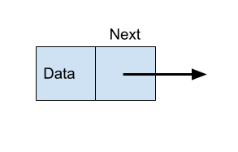

Data Structures
In this lesson, you will learn about data structures, which are just ways of organizing data. You've already learned a couple of them, like lists. Now, you will learn about linked lists and other data structures that will help you improve the algorithms you write and help you model other types of data. 

# Linked Lists
Linked lists are collections of **nodes** that are chained together by **links**. Each node stores some data and a *next*. You can visualize a node like this:
  

*next* points at the next node in the linked list. 

That's where the name comes from - each node is "linked" to the next, except for the last one (which is linked to `null`, or `None` in Python). 

Additionally, we call the first node the *head*. 

This is a linked list with 4 nodes:


# Implementation

Now that we've visualized what a linked list looks like, let's try implementing that in code. First, we'll define a class for `Node`. 

Node will have two variables, one that stores its value, and another that points towards the next node:

```python
#Declaration of a node
class Node:
  def __init__(self, val, next = None):
    # Value of the linked list
    self.val = val
    # Points to the next node
    self.next= next
```

Now let's link them together using a class called `LinkedList`:

```python
class LinkedList:
  def __init__(self):
    self.head = None
```

With these two classes, let's try to implement the first linked list shown as an example, first by defining the nodes with our `Node` class:
```python
e1 = Node('a')
e2 = Node('b')
e3 = Node('c')
e4 = Node('d')
```
But these nodes aren't really linked yet - let's link them together, starting with the head:
```python
linked_list = LinkedList()
linked_list.head = e1
e1.next = e2
e2.next = e3
e3.next = e4
e4.next = None
```
Each `next` points to the next node of the linked list, except for the last one - which points to `None` (literally nothing, since it's the end). 

But our `linked_list` class is pretty useless right now - it doesn't really do anything, except give the linked list a head. Let's implement a useful function, like one to print each value of the linked list. 

```python
class LinkedList:
  def __init__(self):
    self.head = None
  def print_list(self):
    print_val = self.head
    while print_val is not None:
      print(print_val.val)
      print_val = print_val.next
```
To implement our `print_list` function, first we start with initializing the value we want to print first to the head. Then, we'll use a loop that continues looping as long as the next value isn't `None` (the end of the list). With each iteration, we print out the value of the node, and then move onto the next node. 

Our final code looks like this: 

```python
class Node:
  def __init__(self, val, next = None):
    # Value of the linked list
    self.val = val
    # Points to the next node
    self.next= next

class LinkedList:
  def __init__(self):
    self.head = None
  def print_list(self):
    print_val = self.head
    while print_val is not None:
      print(print_val.val)
      print_val = print_val.next

linked_list = LinkedList()
e1 = Node('a')
e2 = Node('b')
e3 = Node('c')
e4 = Node('d')

linked_list.head = e1
e1.next = e2
e2.next = e3
e3.next = e4
e4.next = None
linked_list.print_list()
```

Now our linked list has some functionality. Let's explore some of the benefits of linked lists. 

# Benefits of a linked list

Firstly, linked lists act as a useful model to explain other real life structures, or even in software. Think of the browser you're using right now - you can use the back and forward buttons to navigate through the web pages that you've been through. That's implemented using a linked list - each node has a web address, and points to the one you previously entered. Or, for example, a picture viewer on your phone. 

Secondly, linked lists are more efficient in terms of memory. They are often used because they have constant time complexity of node insertion or deletion (O(1)) - which we'll look at in the next section. However, because each node must be checked every time to find one, a search algorithm would have a time complexity of O(n). 

# Adding to our Linked List

## Inserting Nodes

One of the best parts of linked lists is that they are dynamic - we can add as many nodes as we want, when we want. However, 3 different functions are usually implemented for this, as there are different cases for each type of insertion. 

First, we can insert at the beginning of the linked list, moving the head value to the next node:

```python
class LinkedList:
  def __init__(self):
    self.head = None
  def print_list(self):
    print_val = self.head
    while print_val is not None:
      print(print_val.val)
      print_val = print_val.next
  def insert_beginning(self, new_data):
    new_node = Node(new_data)
    new_node.next = self.head
    self.head = new_node
```

First, we create a new node with the data given. Then, we set our new node to point towards the head of our linked list, and set our new node to the head of the linked list.

Notice that because there are only 3 instructions that are executed every time, this function has a time complexity of O(1), meaning it is constant for any input. 

But what about in the middle of the list? Our approach is slightly different:

```python
class LinkedList:
  def __init__(self):
    self.head = None
  def print_list(self):
    print_val = self.head
    while print_val is not None:
      print(print_val.val)
      print_val = print_val.next
  def insert_beginning(self, new_data):
    new_node = Node(new_data)
    new_node.next = self.head
    self.head = new_node
  def insert_middle(self, prev_node, new_data);
    new_node = Node(new_data)
    new_node.next = prev_node.next
    prev_node.next = new_node
 ```
 
In this method, our approach is similar, except we're using the node prior to the one we want to insert instead of `head`. First, we'll create a Node with the data given, and set it to point towards whatever the previous node was pointing to (the next node). Then, we'll make the previous node point towards the new node, so that it's in front of it. 

But our method changes a bit when we want to add a node at the *end* of the list:

```python
class LinkedList:
  def __init__(self):
    self.head = None
  def print_list(self):
    print_val = self.head
    while print_val is not None:
      print(print_val.val)
      print_val = print_val.next
  def insert_beginning(self, new_data):
    new_node = Node(new_data)
    new_node.next = self.head
    self.head = new_node
  def insert_middle(self, prev_node, new_data);
    new_node = Node(new_data)
    new_node.next = prev_node.next
    prev_node.next = new_node
  def insert_end(self, new_data):
    new_node = Node(new_data)
    last = self.head
    while last.next:
      last = last.next
    last.next = new_node
```
Like in the other methods, we'll create a new node first. Then, we need to find the end of the list, which is usually not explicitly defined like `head` is. So, we'll find it, by going through each node of the list. When `last.next` is `True`, it means that there's a node after `last`. However, if it is `False`, it means `last` is the final noe. Therefore, we will increment `last` till `last.next` is `False`, or we have found the end.

Once we've found the end, we can define the last node as our new one. 

## Deleting Nodes

Deleting nodes might not be split into multiple methods, but it *is* slightly more complex. Let's figure out what our method should do:
Let's say we have a node A with value `k` that should be deleted. 
1. Find the node with value `k`. 
2. Find the node right before `A`. 
3. Change the `next` of the node before `A` to point towards the node *after* `A`. 

This effectively removes the node from the linked list.

Let's try implementing that:

 
```python
class LinkedList:
  def __init__(self):
    self.head = None
  def print_list(self):
    print_val = self.head # Make the head of the list the first value to be printed

    while print_val is not None: # Loop till the linked list ends
      print(print_val.val)
      print_val = print_val.next # Increment the node
  def insert_beginning(self, new_data):
    new_node = Node(new_data) # Define a new node
    new_node.next = self.head # Make the new node point to head
    self.head = new_node # Replace the current head with our new node
  def insert_middle(self, prev_node, new_data);
    new_node = Node(new_data) # Define a new node
    new_node.next = prev_node.next # Make the new node point to the one before it
    prev_node.next = new_node # Make the previous node point towards the new one
  def insert_end(self, new_data):
    new_node = Node(new_data) # Define a new node
    last = self.head
    while last.next: # Search for the end
      last = last.next
    last.next = new_node # Set the end to the new node
  def delete(self, delete_val):
    temp = self.head # Create a temp variable to track nodes
    if temp.data == delete_val: # Check if the node is equal to the delete value
      self.head = temp.next
      temp = None
      return
    while temp is not None: # Check each node till the end of the list
      if temp.data == delete_val: # If we found it, continue to the rest of the program
        break
      prev = temp
      temp = temp.next # Increment the node
    if temp == None: # If the delete value was never found, return nothing
      return
    prev.next = temp.next  # Unlink the node
    temp = None
```

First, we'll check if the head has our value. If not, we'll go through each node, checking if it's equal to our delete value. Finally, we'll unlink the node that should be removed. 

# Other Data Types

## Sets
This is similar to a list in the sense that it is a collection of objects. However, this list is *unordered*. If you were to iterate through the list, it would be a different result every time as every object is never in the same order. Like a jumbled bag of sorts. This is useful for when you don't necessarily need to have the objects sorted or counted, but just to have them grouped. For example, if we have a list of all the cities in the world, we do not need to have them ordered. This makes it especially useful to use with the *in* operator as it allows for faster checking whether or not an object is in the set. Sets cannot have duplicates.


#Declaration
To declare a set, we use the set() function.
For example
```
set1=set()
```
From there we can append
(Note that to append to a set, we instead use .add() instead of .append())


If you want to initialize it as well.

```
set2= set([something,somethingagain,moresomethings])

```
#Dictionaries

Dictionaries are similar to HashMaps in other languages. Essentially, it is a list of objects where a *key* can refer to a certain *value*.


As shown above.

This is especially useful for keeping track of details of objects. For example, if we wanted to have a collection of all the capitals of all the countries in the world, we may use the country name as the ky and the capital as the value in order to intuitively order our dictionaries

#Declaration
To declare a dictionary, we use the curly brackets {} and for each key-value pair, we use the format Key:value which each pair is separated by a comma

For example
```dict1 = {“USA”:”DC”, “Brazil”:”Brasília”, “China”: “Beijing”}
```
#Useful Methods
.key() returns a tuple of all keys in the dictionary
.values() returns a tuple of all values in the dictionary
.items() returns a tuple of key-value pairs, each paired inside a separate tuple inside the tuple.
.get() returns the value of the specified key
.update() is like the append of dictionaries. Takes a key:value parameter


