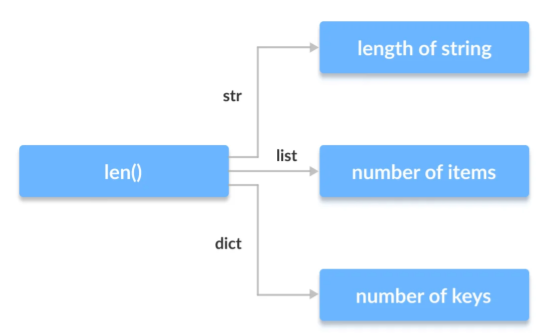

Object-oriented programming has many advantages, which is why we use it. One of the principles of object-oriented programming is _inheritance_. Inheritance helps us reduce the amount of code that we write, by letting certain classes "inherit" other variables and methods from other classes. 
Another feature which you have been introduced to is _polymorphism_. Polymorphism ("many shapes") lets us perform the same task in multiple ways, depending on the object. For example, the `+` operator can both add integers, but when used with strings it can concatenate them. 

# Inheritance

By using inheritance, programmers can create a base class, then extend that class to more complex classes with additional features. We call the inherited class the "child" class, and the class being inherited from the "parent" class. 

Child classes inherit public and protected members of the parent class, but not the private members. 

Imagine that you are writing some code to represent a wide variety of motor vehicles, such as cars, trucks, buses, and motorcycles. 

Instead of writing variables like `color` and `model` for them, which they all have, we can define them in a class called `MotorVehicle`, and then define shared methods, such as `drive()`. Then, we can let other classes like `FireTruck` or `Bus` inherit these members, then define their own special attributes. For example, a Fire Truck can drive, but it can also put out fires. 

Parent classes are simply classes that other classes may inherit from, so there is no modification to their syntax. The syntax to let a child class inherit from a parent class looks like this: 

```python
class Child (Parent):
	#Body of class
```
Here's a diagram of the vehicle example:


A simple implementation of the example we referenced earlier: 
```python
class MotorVehicle:
	def __init__(self, color, name):
		self.color = color
		self.name = name
	def drive(self):
		print("Driving")

class FireTruck(MotorVehicle):
	def put_out_fire(self):
		print("Spraying water")

class Bus(MotorVehicle):
	def pick_up_passengers(self):
		print("Picking up passengers")

firetruck = FireTruck("red", "Standard")
firetruck.drive()
firetruck.put_out_fire()

>>> Driving
>>> Spraying Water
```
By defining it in a parent class, we remove the need to rewrite code, not just for one class, but for all classes that are derived from `MotorVehicle`. 

Even though it is called a parent-child relationship, it does not necessarily need to apply to that situation. For example, if you were to define a class designed to represent athletes, different kinds of athletes could inherit their properties from the original class. 

# Polymorphism

Polymorphism is the ability for different objects to be accessed through the same name, but from different classes. Essentially, different types can be accessed in the same way, using the same function. 

By taking advantage of this, we can generalize certain classes that have similar methods. Most animals walk. Dogs and elephants can both walk. Yet, they walk differently. We can call the same method on both of them to make them both walk, rather than individually calling walk from both of them. 

Consider a class representing polygons on a canvas, and several classes that inherit from `Polygon`, such as `Triangle`, `Square`, and `Pentagon`. Many of these shapes of similar properties, such as their number of sides. All objects of the class `Polygon` can be drawn; using the `draw()` function. We can call `draw()` from each of these objects, and they will perform different tasks. 



This sounds very confusing, but you've already seen polymorphism in action - for example, the `+` operator behaves differently depending on what we use it on. When we use the `+` operator on integers, it performs the add function, but when we use it on strings, it concatenates them.
Another example is `len()`. `len()` is used on strings to find the length of the string, but can also be used on lists or other collections to determine the number of elements in it. 

The way we can implement this is actually quite simple: define methods with the same name in different classes, and then call those methods while ignoring the differences in class. 
This example was presented to you in [Lesson 2](object-oriented).
```python
class Dog:
  def walk():
    print("pat pat")
class Elephant:
  def walk():
    print("thump thump")

for animal in [Dog(), Elephant()]:
  animal.walk()

>>> pat pat
>>> thump thump
```

In this example, we called the `walk()` function in each class, but they performed differently based on the class. You can try implementing this example with any objects that do the same thing, but do it differently. 

# Method Overriding: Using both Inheritance and Polymorphism

> Not to be confused with method overloading (using the same function with different parameters). For reference, Python does not have this feature yet. There are some ways we can get around this, but they are more complicated. You can learn about it [here](https://www.geeksforgeeks.org/python-method-overloading/). 

You can define a method of the same name in both a child and parent class:

```python
class Parent:
  def show(self):
    print("From the parent class")

class Child:
  def show(self):
    print("From the child class")

obj1 = Parent()
obj2 = Child()
obj1.show()
obj2.show()

>>> From the parent class
>>> From the child class
```
In this example, we defined `show()` in the parent class, and then overrode it in the child class. When we called the same function from each object, they behaved differently. 

This property of classes is most useful when the parent and child classes share similar properties. Consider class `mammal` and its children:

```
class Mammal:
  def move(self):
    print("walking... ")

class Bat(Mammal):
  def move(self):
    print("flying... ")

class Human(Mammal):
  def do_something(self):
    print("discovering fire!")

animal1 = Mammal()
animal2 = Bat()
animal3 = Human()

animal1.move()
animal2.move()
animal3.move()
animal3.do_something()

>>> walking... 
>>> flying... 
>>> walking... 
>>> discovering fire!
```
Most mammals walk on land. Therefore, we will define `move` as a method of `Mammal`. However, not all mammals walk. Some, like the bat, fly. To adapt to this, we can redefine `move`, causing a different result. 

# Accessing Parent Methods in a Child Class

If you want to access a parent method that has been overridden, you can call it inside the child class like this:
```python
ParentClass.method()
```
In the above example, class `Bat` can walk if we call `Mammal.move()` inside of it:
```
class Mammal:
  def move(self):
    print("walking... ")

class Bat(Mammal):
  def move(self):
    Mammal.move(self)

animal1 = Mammal()
animal2 = Bat()

animal1.move()
animal2.move()

>>> walking… 
>>> walking… 
```

Remember to include `self` as a parameter of these methods. Alternatively, you can use the `super()` method to access it:
The syntax looks similar to the method we learned before:
```python
super().method()
```


