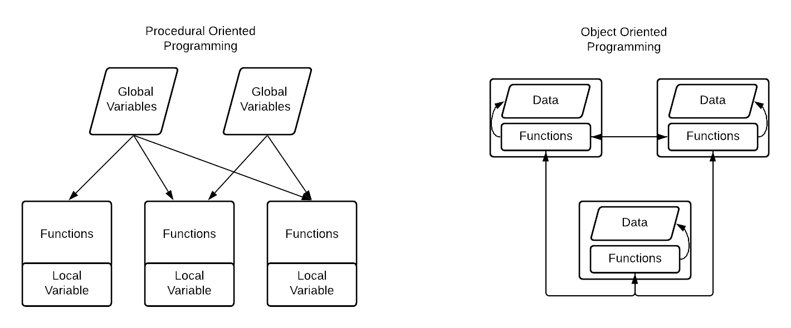

# Why Object Oriented?
There are many ways to program, and you've learned one of them: procedural programming. The paradigm of procedural programming is to split tasks into variables and subtasks which can be directly implemented to solve problems. Any code you've written prior to this course can be classified as procedural oriented.

We use programs to help us solve problems in the real world - that's why we program. But, procedural programming fails to represent everything well - in the real world, we have objects that interact with one another, rather than a sequence of events that happen. Programmers in the 1960s realized this, and created a new paradigm of programming: object-oriented programming. 
# Classes and objects
Object-oriented programming seeks to fix the flaws of procedural programming by creating objects, which are data structures that contain data and procedures (code to interact with one another). 

Objects can interact with one another, depending on what we tell them to do. They contain functions known as methods, which represent the behavior and actions of an object. 




We model things with classes, which act as blueprints for objects. Objects are created from classes. For example, I could define a class dog. Your specific dog, Rover, would be an object of class dog. If a class is a form, an object is a form that's been filled out with information. 

Look around you - find any object and identify its attributes and methods. 
For example, a plant outside has many attributes: green, living, size, age, type. It also has methods (things it can do), like grow. 

We will discuss the formal definition of a class in later topics, but here is a peek into what a defined class looks like:
```python
class Dog: # Class definition

	species = "Canis Familiaris" # Data storage
	
	def __init__(self, name, breed, age):
		self.name = name
		self.breed = breed
		self.age = age
		
	def bark():   # Class methods
		print("Bark! Bark!")
		
	def birthday():  # Class methods
		self.age += 1
		print(f"Happy {self.age}th Birthday, {self.name}!")
```

# Principles of Object-Oriented Programming

Object-oriented programming is based on four principles:

1. **Encapsulation**
	1. Data and functions are packed into one object
	2. The internal state of the object is hidden
2. **Inheritance**
	1. Classes can be derived from "parent classes", which have properties of the parent class along with new ones.
3. **Polymorphism**
	1. One entity can be used for many different purposes
4. **Abstraction**
	1. A class hides its complexity from the user

## Encapsulation

**Encapsulation is the first principle of object-oriented programming which we will look at.** When we pack data and functions within a single object, we are encapsulating it. For example, a class is an example of encapsulation. Classes have their own data and functions, and each belongs to its own unit. Furthermore, other classes cannot access the data of other objects unless specified, or using methods.

- A dog can bark, but a cat cannot make a dog bark.
- A bank account can only be accessed by someone with the right credentials. 

All members of a class are public by default. However, we can mangle the names of them to change that.

Protected members of a class are denoted by a `_` in front of them. They can be used by derived classes and base classes, but cannot be used outside of the class.

Private members are denoted with two underscores in front of them: `__`. They can only be used in their class, not by derived classes or outside of the class.

- `name` (public)
- `_bark()` (protected)
- `__withdraw()` (private)

## Inheritance

**Inheritance is the ability for some classes to be derived from another.** It stems from the idea that some objects in the real world share characteristics with others.

Consider the class **Truck**. Trucks do many things: they can drive, you can refuel them, you can load cargo onto them, and they have many attributes: they have different colors, models, makes, ages, etc. Another object, **Firetruck**, is very similar to **Truck,** and it can do all of the things a truck can, but with extra features, which it needs to put out fires.

Therefore, Firetruck inherits some properties from Truck, or for example Fruit vs. Apple.

```
Truck:

	Attributes:
		Color
		Model
		Make
		Age

	Actions:
		Drive
		Refuel
		Load


Firetruck:

	Everything in Truck, plus:
	
	Actions:
		PutOutFire
```

## Polymorphism

**Polymorphism allows a single entity to be used for different types of objects.** For example, you can use the '+' operator for many different things: You can add numbers, but you can also concatenate strings. 

```
Dog:

	Actions:
		Walk 


Elephant:

	Actions:
		Walk 
```

Many things can walk, but they walk differently. Consider the following code:

```python
class Dog:

  def walk():
    print("pat pat")
    
class Elephant:

  def walk():
    print("thump thump")
    

for animal in [Dog(), Elephant()]:
  animal.walk()

>>> pat pat
>>> thump thump
```

## Abstraction

**Abstraction allows classes to hide their complexity from the user.** You do not need to know the mechanism of a washing machine to use a washing machine. In fact, you don't need to know any engineering at all to use the technology that we have right now. 
