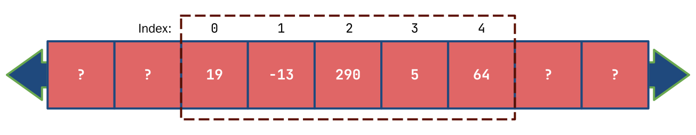

If you wanted to declare a set of related variables that are of the same type, like the cost of items 1 through 10, we would declare 10 separate int variables. Now if we wanted a 100, that would be really annoying to declare 100 separate variables. Writing `cin` for every single variable and taking the input again and again would also be annoying, and outputting them just the same. 

C++ has something called `arrays` which allow us to access a group of values using a single identifier (variable name). So these 100 separate variables are all under one name, and we access them using their position. This might not seem to help, we still have 100 different elements to access until you combine arrays with loops.

In this lesson we will cover when and how to use arrays effectively in your C++ programs.

# Declaring and Initializing Arrays
To declare an array, we use the following syntax:

```cpp
type varName[number of elements];
```

It's almost the same as declaring a variable, the only differense is the use of the square brackets. The square brackets are an operator, called the `subscript operator` or `array index operator`. When declaring the array, we write inside of it the number of elements we want it to have. If we wanted to declare 100 variables in the array, we would simply put `100` in the square brackets.

Arrays have two major drawbacks. All elements must be of the **same type**, and the **number of elements must be known at compile time**. What this means is you cannot take user input and resize an array accordingly. Instead, initialize an array to a size containing the maximum amount of elements you would expect to have. Be careful with declaring a variable of more than 100,000 elements. Remember that each variable takes a bit of memory, and that memory is limited.

To initialize the array, we can use the following 

```cpp
int myArr[5] = {1, 2, 3, 4, 5};
```

We use curly braces and inside we write each element with commas separating each element. When initializing an array, we actually don't need to write the number of elements in the square brackets because C++ will implicitly set the array size to the number of elements in the curly braces. 

We call this curly brace structure a `braced initializer list`, though in this lesson for short, we will refer to it as an `initializer list`.

We don't have to know the elements of the initializer list at compile time. These elements can be variables or literals as used in the example above. We also don't have to use an initializer list with the same number of elements as the array size. However, the initializer list must have the same or less elements than the amount stored in the array.

```cpp
int arr1[3] = {2, 4}; //valid syntax
int arr2[3] = {2, 4, 6, 8}; //compiler error
```

Arrays, just like variables do not necessarily initialize their values to zero. An array element may have `garbage` stored before it is initialized. To initialize all elements of a large array to zero, we can use the following syntax.

```cpp
int bigArr[10000] = {0};
```

>This syntax **does not** work with other values. You cannot initialize all values of an array to something like 3 or 7 with this syntax. This only works with zero.

# Accessing Elements of an Array
To output or do anything with a specific element of an array, we access it using square brackets, the same ones that we used when declaring the number of elements in an array. We access using a number that tells us what position it is in the array.

Arrays use `zero-indexing` to access elements of an array. What this means is that the first element of an array is retrieved with the index 0. 

For example, consider the following code: 

```cpp
int myArr[5] = {9, 4, 11, 15, 19};
cout << myArr[0] << " " << myArr[1] << " " << myArr[2] << " " << myArr[3] << " " << myArr[4] << endl;

>>> 9 4 11 15 19 //output
```

This code will allow us to output each element of the array. Notice how the the first element is index 0, and the last element is 4, which is the number of elements in the array minus 1. Trying to directly access an element of the array that is not within the elements will result in an error. 

```cpp
cout << myArr[5] << endl; //using the previous array would result in an error
```

## Accessing Elements Sequentially

Now at first glance, this might not seem to offer any benefit from declaring the variables individually aside from being a little shorter to declare and initialize. However, there is an easier way to output all the elements of an array. Since the index is a number, specifically an integral type, we can use a variable to select the index type. 

We can combine this with a loop to output the elements of an array.

```cpp
#include <iostream>

using namespace std;
int main()
{
	int myArr[10] = {3, 9, 4, 2, 6, 11, 13, 19, -6, 2};
	for (int i = 0; i < 10; ++i)
		cout << myArr[i] << " ";
}

>>> 3 9 4 2 6 11 13 19 -6 2 //output
```

For the for loop condition, we use `< number of elements in the array` because doing `myArr[10]` would actually be out of bounds of the array. That would refer to an 11th element because of zero-indexing. 

We can also use this technique with inputting values to an array.

```cpp
#include <iostream>

using namespace std;
int main()
{
	int myArr[10];
	cout << "Enter 10 values: ";
	for (int i = 0; i < 10; ++i)
		cin >> myArr[i];
	cout << "Your inputted array is: ";
	for (int i = 0; i < 10; ++i)
		cout << myArr[i] << " ";
}
```

# Errors with Arrays
However, we have to be very careful with accessing array elements using a variable. C++ will not always tell us that there is an error. For example, it we were to do the loop condition with `<=`, the program would compile fine. In fact, the program might even accept the 11 values and run perfectly fine. 

This can lead to a lot of silent problems that you may not even realize have happened. Accessing an array out of bounds is something called `undefined behavior` which means there is really no way of knowing what exactly will happen when you do so. Sometimes completely different variables might have their values changed or you might get a random error somewhere else. 

Always be extremely careful and make sure that you are only accessing elements that are part of the declared array bounds. 

## Segmentation Fault
When arrays are accessed out of bounds, they may sometimes cause a type of error called a `segmentation fault`. This error might also appear sometime later during the program's runtime. 

Try different input indexes in the following code

```cpp
#include <iostream>

using namespace std;
int main()
{
	int myArr[10] = {3, 9, 6, 4, 4, 2, 0, 1, -2, 0};
	int index;
	cin >> index;
	cout << myArr[index];
}
```

If we do something like 12, the program won't crash and we'll get a garbage output like `4196416`. Try some input like 906728, and the program will most likely crash, outputting an error like `signal: segmentation fault (core dumped)`.

As mentioned before, in longer and more complex programs, indexing to 12 may not immediately cause an error. However, later in the program's runtime you might get a segmentation fault on a random line of code. Always look to see if any code might access an array out of bounds in this case.

# Array Memory Structure
To help us understand all the constraints and somewhat strange behavior of arrays in C++, we need to look at how the compiler handles arrays. C++ is a language which typically needs to know exactly how much memory each variable is going to take up before your program runs so it can set enough aside for everything. This memory that C++ gets to do this is very fast, but rather limited which is why you might have gigabytes of RAM, but can't create arrays with more than 100,000ish elements. Obviously this number will vary by datatype because each element will then take different amounts of memory. 

When your program runs, C++ `allocates` space for the array. This memory space is of a fixed size and is only used for that array. This memory is contiguous, meaning each element is stored one after the other. Space outside of this region can be used for other things.

If we declared and initialized values of an integer array with 5 elements being `{19, -13, 290, 5, 64}`, in memory it might look something like this.


The area boxed in is allocated to the array. To the "left" and "right" and more memory spaces that contain values that we have no idea of. This goes on in a sense forever in both directions. Our array variable really just stores the memory address, a place where we can find the memory location for where the array starts. If we were to declare an array and "cout" it, it might look something like `0x7fff43a194c0`. When we access an element by index, it is sort of like a direction from the starting location of the first element. 

So we zero-index because the first element is at the starting point. The second element is `[1]` because we are going `+1` spaces. We could also theoretically do a negative index like `[-1]` which would be the space before the first element. However, C++ will not actually check if these numbers are part of the memory allocated to you. This is dangerous and we should always put checks in our code to make sure we are not going out of bounds. 

# Strings as Arrays
We can create arrays with any datatype we want. We could do integers, floats, bools, and even chars. We learned about strings before, and what we can think of them as are arrays of chars. Technically strings are not exactly the same as arrays of chars. We can change their size and other things during runtime, which is different from regular arrays.

However, we can access particular characters in a string with the same indexing method that we used with arrays. We can also learn a few things about what we can do with strings with arrays. For example, we can use range based for loops with arrays just as we did with strings. We can also declare an array of strings and access characters in particular strings. 

Recall from the previous lesson about loops how we can output individual characters using a range based for loop and even change their values in a range based for loop. [Review here](/introcpp/loops#range-based-for-loop)

We can use the same syntax with arrays. For example to take input and output an array, we can use the following code:

```cpp
#include <iostream>

using namespace std;
int main()
{
	int myArr[10];
	cout << "Enter 10 values: ";
	for (int& i: myArr)
		cin >> i;
	cout << "Your inputted array is: ";
	for (const int& i : myArr)
		cout << i << " ";
}
```

For the first type, we used `int&`. With a different type, we would write it as `type&`. We must include the ampersand, as it essentially tells C++ to not take a copy of the variable from the array, but give us the element itself straight from the array. With the output loop, we use the type `const int&`. We could simply use the type `int` or even `int&`, but since we aren't changing the value of the element, and we also don't need a copy, we can use this type. They keyword `const` tells the compiler that the variable isn't being changed, and we use the `&` because we don't need a copy.

> With variables that have a long type or you don't feel like writing it out, you can use the keyword `auto` instead of the type of the variable in your range based for loop.

Now, if we had an array of strings, we can access each of the characters by index in the following way.

```cpp
#include <iostream>

using namespace std;
int main()
{
	string myArr[] = {"this", "is", "multidimensional"};
	cout << myArr[2][5] << endl; //outputs `d`
}
```

This is essentially an array of an array of characters. What happens is `myArr[2]` evaluates to the string `"multidimensional"` and then the array index operator with 5 is applied to that, which gets us the 6th character in the string, which is `'d'`.

# Multidimensional Arrays
We can declare an array of arrays just like this with any type. In fact, we can declare an array of an array of an array of arrays, and so on forever. We can declare a 2D (2 dimensional) array with the following syntax:

```cpp
int my2DArr[3][2];
```

To initialize values with an initializer list, we would have to write it the following way:

```cpp
int my2DArr[3][3] = {{3, 4, 5}, {0, 1, 2}, {9, 10, 11}};
```

We could repeat this pattern for more dimensions of an array. However, even though you can let C++ implicitly know the size of 1D array, this does not exactly work for more dimensions. You can only omit the first dimensions size. You could rewrite the code as:

```cpp
int my2DArr[3][] = {{3, 4, 5}, {0, 1, 2}, {9, 10, 11}};
```

but not as

```cpp
int my2DArr[][3] = {{3, 4, 5}, {0, 1, 2}, {9, 10, 11}};
```

or 

```cpp
int my2DArr[][] = {{3, 4, 5}, {0, 1, 2}, {9, 10, 11}};
```

We typically iterate through multidimensional arrays using nested for loops. We could also technically use nested range based for loops. For example, we could output the previous array using those two methods.

```cpp
#include <iostream>

using namespace std;
int main()
{
	int my2DArr[3][3] = {{3, 4, 5}, {0, 1, 2}, {9, 10, 11}};
	cout << "Regular for loops: ";
	for (int i = 0; i < 3; ++i)
	{
		for (int j = 0; j < 3; ++j)
			cout << my2DArr[i][j] << " ";
		cout << "| ";
	}
	cout << endl;
	for (const auto& arr : my2DArr)
	{
		for (const auto& elem : arr)
			cout << elem << " ";
		cout << "| ";
	}
}
```

> Here we use the auto type so that we don't have to worry about getting the exact types.