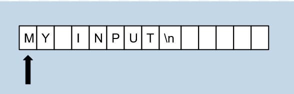

Every program you will write will take some form of input, and then give you back some output. In this lesson, you will learn how to take input and output information through the console. 

You've already learned some of this - in your first ever program, you outputted the text Hello World to the console. Now, you'll learn more of what exactly cout does along with how to C++ handles console input.

# Console Output

You've learned plenty of data types in the previous lesson, [variables](https://guide.returnstem.org/introcpp/variables?).
These data types can represent a variety of different numbers and other useful values, but they don't represent a really important type of data. All text, which can include characters (letters), words, sentences, and paragraphs, can be represented using strings. Strings are identified by double quotes surrounding them, and can contain any characters.  

For example, a string might look like this: 

`"I woke up at 8 am today."`

When you want to output text to the console, you will need to make it a string. 

If you don't include it as a string, C++ will think they are other variables and your code will not compile. 

# The `String` class

Strings can be defined like other data types, like this:
```cpp
string str1;
```

However, you must include the string header file to do this, just like `iostream`. Luckily for us, we don't have to include the string header if we already included the iostream header. This is because `iostream` already includes the `string` header for us.

```cpp
#include <string>
```

You can declare strings in different ways:

```cpp
string s = "a string";
```

Or simply,

```cpp
string s;
```

If you don't want to initialize it yet. 

# Escape Characters

Notice that because we open and close strings with `"`, when we want to use the `"` character in our strings, C++ will think you are making two strings, like this:

```cpp
cout << "Mary said, "hello everyone" on tuesday";
```

Thankfully, we can use escape characters to tell C++ that our quotes `"` are not part of declaring the string. When we use the backslash character, `\`, followed by another, C++ considers at as one escape character. To use quotes in your string, for example, you would use `\"`. 

Escape characters can also be used for other purposes: for example, a backslash followed by an n, `\n`, signifies a newline character. When C++ sees this character, it will cause the following text to be printed on the line below the current one. 

```cpp
#include <iostream>


using namespace std;

int main()
{
    cout << "Hello \nWorld";
}

>>> Hello
>>> World
```


Similarly, `\t` is a tab character, which moves the text to the next tab position. It doesn't add a new line. 

Finally, if we want to use the `\` character in a string, we can use two of them in a row: `\\`. 
```cpp
cout << "\"May the Force be with you\"";
```
Common escape characters: 
| Escape character | Function | 
| --- | --- | 
| `\n` | Outputs a newline | 
| `\t` | Outputs a tab | 
| `\’` | Outputs a single quotation mark | 
| `\”` | Outputs a double quotation mark | 
| `\\` | Outputs a back slash | 
| `\?` | Outputs a question mark |

# The `cin` statement

Now that we have gone over outputting something to the console for the user to see, we will learn how to take an input from a user. The object cin is used for this task. It takes an input entered in the console, and stores it in a variable. We use the `>>` operator to between the variable name and the cin statement. 

>Notice that for cin, we use `>>`, while for cout we use `<<`. To remember this, you can think of it as `<<` feeding the data into the console with cout and `>>` retrieving the data from of the console for cin. The direction of it follows the pattern.

If we wanted to  take the console input and store it into a variable of the `int` type, we would use the following code.

```cpp
int myVar;
cin >> myVar;
```

When using cin, the program will wait until the user types the input and presses the `Enter` or `Return`  key. Be careful, `cin` does not give a prompt or any text that it is waiting for an input. Instead, we have to use `cout` to remind the user that the program is waiting for an input.

Consider the following code: 

```cpp
#include <iostream>

using namespace std;
int main()
{
    int age; 
    cout << "What is your age? ";
    cin >> age;
    cout << "You are " << age << " years old. " << endl;
}
```

When run, this code will prompt the user for their name. Notice that it does not print what comes after it till you give it input. 

Try asking some questions to the user, collecting the input, and displaying the input in some way using `cin` and `cout`. 

If we want to accept multiple inputs in one `cin` statement, we can separate the different variables with the `>>` just as we would use `<<` for `cout`. 

```cpp
#include <iostream>

using namespace std;
int main()
{
    int month, day;
    cout << "Enter the month and day: ";
    cin >> month >> day;
    cout << "The day is " << day << " and the month is " << month << endl;
}
```

When taking in multiple variables of input, the user can either enter data like

```cpp
>>> 8
>>> 24
```

or

```cpp
>>> 8 24
```

`cin` will separate different inputs with spaces or newlines (pressing `Enter`), but it will only take in what you have typed into the console after you press your `Enter` key.

However, notice that in these examples, we all used the `int` data type. When you try to input something that is not an `int` into a cin for a `int` variable, you program will not output what you entered. 

Here's another example, this time accepting a string:

```cpp
#include <iostream>

using namespace std;
int main()
{
    string name;
    cout << "What is your name? ";
    cin >> name;
    cout << "Hello, " << name << endl;
  
}
```

# Input Stream Buffer

To really understand how `cin` works, we have to look at what is really happening with what you type into the keyboard. Take for example if I type `my input` and then hit enter on my keyboard. Regardless of what the variable that you are taking the console input into, all of what you just entered goes into something called a `buffer`. A `buffer` is just a bunch of memory locations which holds information (`char`) . We can refer to the `buffer` that `cin` has as the **input stream buffer**. Let's look at how the buffer might look.



We use the arrow to show where the buffer is at and the current position which is sort of like where your cursor is. When we `cin` different data types, it moves character by character to store the information into the variable. Where it stops depends on the data type. However, some things remain consistent: 
+ All whitespace and `\n` characters preceding the input will be ignored
+ After encountering a character, input stops at the next whitespace/`\n` character

Let's consider how C++ handles input for different data types. To look and figure out for your own, use the following code

```cpp
#include <iostream>

using namespace std;
int main()
{
	type myVar;
	string buf;
	cin >> myVar >> buf;
	cout << myVar << " " << buf << endl;
}
```

Depending on what the type of the variable you want to test, change the text which says type in the code accordingly. If we were to use different variables, we would notice that:
+ Integers stop taking input after the first non number character (excluding a negative sign at the beginning)
+ Floats/doubles stop taking input after the first non number characters, but also allow a single decimal point between the numbers (decimal points after the first will stop input, and a negative sign is accepted at the beginning)
+ Booleans take input until the first non number character, but will fail if the input is not zero/one
+ Chars take a single character of input
+ Strings take all character input

We will later go into specifics on manipulating the input stream buffer.

# I/O Manipulation

The basic format of the cin statement isn’t always useful because we might want to receive the input in other ways. For this reason, there are many functions in C++ that help with this. A function is a piece of code that can take inputs and run some code based on that. We will learn more about functions and how to create your own functions in a later lesson.

If you wanted the user to input a sentence and get that input with `cin`, you would be unable to do so. Consider the following code and respective input/output:

```cpp
#include <iostream>

using namespace std;
int main() 
{
	string sentence;
	cout << "Please enter a sentence: ";
	cin >> sentence;
	cout << "This is the sentence you inputted: \"" << sentence << "\"" << endl;
}

>>> This is my sentence.
>>> This is the sentence you inputted: "This"
```

Remember how before we said that you could input the values for multiple variables in one line by separating them with a space, and then it takes them all in when you press enter. That's what happened just now, and since "this" and "is" were separated by a space, `cin` thinks they should go into separate variables.

Now, we clearly didn't give `cin` more than one variable to put our data into. So shouldn't `cin` be smart enough to realize what we are trying to do and just put it all in the sentence variable? Well, we have to understand that `cin` isn't programmed to work like that.

This is because `cin` stops reading at a whitespace. In this case, it's the first space in the sentence, meaning it will only take in the first word of the sentence that we give it. 

The solution to the aforementioned problem is the function `getline(cin, str)`. Functions are ways to call code that can take inputs and give outputs. We will learn more about them and how to create them in a later lesson. For now, just know that we write them like `nameOfFunction(input1, input2)`. We could have no inputs in the parenthesis, or how man ever we need depending on the function. In the case of `getline`, it takes two inputs, the `cin` object and a string variable to write the input to. 

`getline` works a little differently than using `cin`. It will read your input until it reaches a `\n` character which we input to the console by hitting the `Enter` key. Unlike `cin`, `getline` will move to the character after the `\n` character in the stream buffer.

The same program, but using getline would look like this:

```cpp
#include <iostream>

using namespace std;
int main() 
{
	string sentence;
	cout << "Please enter a sentence: ";
	getline(cin, sentence);
	cout << "This is the sentence you inputted: \"" << sentence << "\"" << endl;
}

>>> This is my sentence.
>>> This is the sentence you inputted: "This is my sentence."
```

`cin.ignore(n, ch)` is used to ignore characters in an inputted string until either n characters have been read or a certain character (ch) has been read (whatever comes first). 

`cin` and `getline` read input in slightly different ways. When you use both of them in your program, you may run into something called the "Phantom newline" problem. Unlike `getline`, cin reads till the newline character (`\n`). When `getline` is used after `cin`, it consumes the `\n` character that `cin` left behind, causing it to read nothing. 

Here's an example of this happening:

```cpp
#include <iostream>

using namespace std;
int main()
{
    string first, last;
    cout << "Enter your first name: ";
    cin >> first;
    cout << "Enter your last name: ";
    getline(cin, last);
    cout << "Your name is " << first << " " << last;
}
```

If you run this code, you will find that the program will ask for your first name, then skip past the prompt for your last name and directly output just your first name. To solve this problem, we can use `cin.ignore`.  The syntax looks like this: `cin.ignore(INT_MAX, char)`

In our case, because a `\n` character is left in the input stream buffer, we want C++ to ignore it. Our problem can be solved like this: 

```cpp
#include <iostream>
#include <limits.h>

using namespace std;
int main()
{
    string first, last;
    cout << "Enter your first name: ";
    cin >> first;
    cout << "Enter your last name: ";
    cin.ignore(INT_MAX, '\n');
    getline(cin, last);
    cout << "Your name is " << first << " " << last;
}
```

The first value we gave the function tells it how long it should look for the target character before it stops. In our case, we choose to use `INT_MAX`, the largest value an integer can hold in C++. In order to use that value, we need to `#include <limits.h>`. We then include a `\n` character as the second value we give the function, telling it to ignore `\n`. 

Before we described an error that occurs when you input a `string` when the `cin` asks for an integer. This causes the `cin` to fail. If we'd like to know when this happens, we can use `cin.fail()`. `cin.fail()` returns a boolean (a value that is either true or false). It returns 1 when there was an error, and 0 where there was no error. 
(In this example, we use something called `boolalpha` to make the boolean display `true` or `false`, instead of `1` or `0`. Later on, you'll be able to use this to your advantage more easily with `if` statements.)

```cpp
#include <iostream>
#include <limits.h>

using namespace std;
int main()
{
    int input;
    cin >> input;
    cout << boolalpha << cin.fail();
}
```

If we input an integer, it displays `false`. However, if we input any other data type, it returns `true`. 

When an error occurs with `cin`, it raises an error flag, which makes future I/O operations work incorrectly. We can fix this issue with `cin.clear()`:

```cpp
#include <iostream>
#include <limits.h>

using namespace std;
int main()
{
  int input, input2;
  cout << "Enter a string: ";
  cin >> input;
  cout << "Input failed: " << boolalpha << cin.fail() << endl;
  cin.clear();
  cin.ignore(INT_MAX, '\n');
  cout << "Enter a number: ";
  cin >> input2;
  cout << "Your number is " << input2 << endl;
}
```

When you enter a string into this program, such as the word "Green", `cin` raises an error at the first character. Then, when you `cin.clear()` it, it clears the error state. Then, we `cin.ignore(INT_MAX, '\n')` to remove the rest of the bad input stored inside the buffer.
The following `cin` statement works properly. 

# Input Stream Manipulation Functions

>Any `cin` or related function that requires an input will wait for console input if there is nothing in the input stream buffer. If there is anything in the buffer, the program will continue on without waiting for user input.

`cin.get(ch)` will give the value of the character at the current position in the buffer and store it in the input variable `ch`  and move the position to the next spot. So if we had the following code, that would be the resulting I/O.

```cpp
#include <iostream>

using namespace std;
int main()
{
  char temp;
  cin.get(temp);
  cout << "output: " << temp << endl;
}

>>> test
>>> output: t
```

`cin.putback(ch)` will put the inputted character `ch` at the current position of the input stream buffer such that it moves anything that would be in front of the current position forward one spot. An example of this and the I/O is:

```cpp
#include <iostream>

using namespace std;
int main()
{
	char var1, var2;
	string buf;
	cin.get(var1);
	cin.putback('X');
	cin.get(var2);
	cin >> buf;
	cout << var1 << " " << var2 << " " << buf << endl;
}

>>> test
>>> t X est
```

`cin.peek()` will output the value of the character at the current position of the buffer. You must set this function to the `char` variable where you want to store that character. The difference between `cin.peek` and `cin.get` is that it does not move the buffer to the next position. 

```cpp
#include <iostream>

using namespace std;
int main()
{
	char var1, var2, var3;
	cin.get(var1);
	var2 = cin.peek();
	cin.get(var3);
	cout << var1 << " " << var2 << " " << var3 << endl;
}

>>> test
>>> t e e
```

# `<iomanip>`

Before you use any of the following tools, remember to include the `<iomanip>` library, like this: 
```cpp
#include <iomanip>
```

`setprecision()` is used to manage the number of digits that is in an output. For example, if we wanted to output a long number rounded to 3 digits, we pass 3 as the parameter to `setprecision()`. 

```cpp
#include <iostream>
#include <iomanip>

using namespace std;
int main()
{
  float pi = 3.1415;
  cout << pi << endl;
  cout << setprecision(3) << pi << endl;
}
>>> 3.1416
>>> 3.14
```

After settings the precision to 3, only 3 digits of pi are displayed. 

>`setprecision` **DOES NOT** say how many digits to round to, but how many digits to display. 

Another function that deals with outputting a certain number of digits is `fixed`. It is used along with `setprecision` and rounds the number of digits after the decimal point. When we use `fixed`, `setprecision` will act like a round to `x` number of digits function.

```cpp
#include <iostream>
#include <iomanip>

using namespace std;
int main()
{
  float profits = 300.75;
  cout << profits << endl;
  cout << fixed << setprecision(1) << profits << endl;
}
>>> 300.75
>>> 300.8
```

`showpoint` is used to display values with decimal points, even if it is a zero. It displays decimal points to match the precision of the stream, set by `setprecision`. 

```cpp
#include <iostream>
#include <iomanip>

using namespace std;
int main()
{
  cout << fixed << showpoint << setprecision(3) << 10.0 << endl;
}
>>> 10.000
```

Sometimes, we want to format the output that we display, since it is of varying widths. When we want to do this, we can use `setw(n)`. 
The width of the stream is then set to n, and it will fill the additional spaces needed with spaces ` `. 
```cpp
#include <iostream>
#include <limits.h>
#include <iomanip>

using namespace std;
int main()
{
  cout << "60" << endl;
  cout << setw(10);
  cout << "60" << endl;
  cout << setw(5);
  cout << "60" << endl;
}

>>> 60
>>>         60
>>>    60
```
You can alter the fill character that `setw` uses by using `setfill(char)`. For example, 

```cpp
#include <iostream>
#include <limits.h>
#include <iomanip>

using namespace std;
int main()
{
  cout << "60" << endl;
  cout << setfill('x') << setw(10);
  cout << "60" << endl;
  cout << setw(5);
  cout << "60" << endl;
}
>>> 60
>>> xxxxxxxx60
>>> xxx60
```
