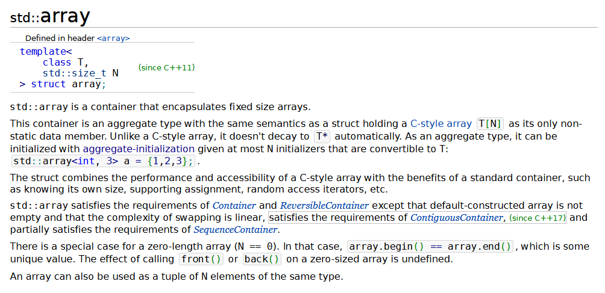
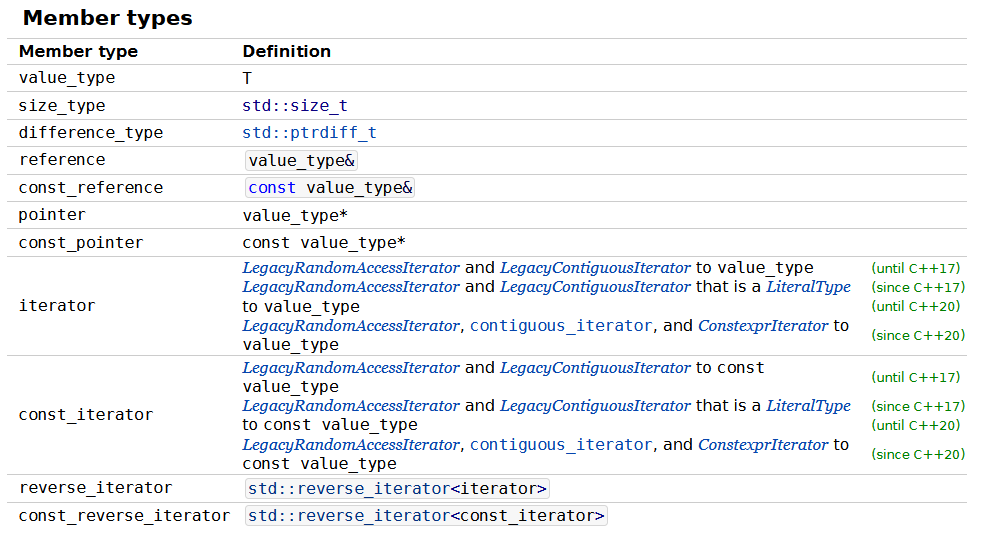

In the previous lessons, we learned about the various features of the C++ standard. However, that's not all there is that makes C++ so powerful. C++ as a language is implemented via the compiler that translates your code into machine language. There is also a C++ standard that determines exactly how this works, along with various features that should be implemented in a standard library.

This standard library comes with C++ code that implements various useful features. We have already worked with some of them, like `cout` and `cin`. In this lesson, we will explore various other features of the standard library as well as give you the tools to learn whatever you need.

# Prerequisites
Before diving into the C++ standard library, there are a few more advanced features of the C++ language we have to quickly go over. The first of these is a `class` which is something we have worked with before. A class is a user-defined data structure that contains data and functions. A class is a sort of blueprint that can be used to create **objects** of that class. 

## Classes

Let's try an example. Let's say we have a class for a `Car`. The class stores various data points like the make, max speed, and cost. The class also has functions like `drive()`, `park()`, and more. Now we could declare a variable of the class `Car`. Objects typically have a special function called a `constructor` which allows us to pass arguments to the object upon creation that can do things like set data values. So we could use the constructor to set a specific make and other various details.

We treat classes pretty much the same as a data type like `int` or `bool`, except they come with a few extra features. Classes are useful organizational structures like functions and can be quite powerful. They help us generalize and abstract code in such a way that allows us to use the same blueprint for different situations. 

The one thing to know about classes is the `dot operator` which allows us to access functions and data members of a class. When we write the variable name along with the dot operator and a function/data member, we can access that classes particular function and data member. Let's look at the following code with an example class.

```cpp
int main() {
	Car myCar("Honda", "Civic"); // constructs a car with an argument
	string make = myCar.make; //accesses the model data member
	cout << "This car is a " << make << " " << myCar.model() << "\n"; 
}
```

The first line of code instantiates an object with the identifier "myCar" of the "Car" class. We then assume that the Car classes has a data member "make" which stores the make of the car, and use the dot access operator to store that in a string. Then we output that, and also use a function that returns the model of the car. 

## Templates

A majority of the classes in the C++ standard library are containers meaning they store data in a particular form. Now classes normally store data members of a set type. The people who create the container might not know what classes you make or want to code each and every type in. Instead, C++ has templates which allow for generic programming. Templates take arguments just like a function. However, they can also take a type for an argument. 

To use template arguments, we use angled brackets, or the less than and greater than sign to contain it. For example, there is a vector class that we will learn about later. It is a dynamically sized container, and we can specify which type it will hold by declaring it as a `vector<type>` with the type insided the angled brackets. If we were to write `int`, then it would store integers. 

# Array Class
To begin, let's start with a class that does something we are quite familiar with. The Array class acts almost like a regular C++ array, but it offers some additional functionality. For example, passing it to a function will have effects more similar to thatof passing a regular variable rather than that of a regular C++ array. It will not decay into a pointer and will actually make a copy (unless you pass by  reference). 

To view documentation on the C++ standard library, our best friend is the website [https://en.cppreference.com](https://en.cppreference.com) In the top right, they have a searchbar which we can use, and so search for "array". Click on the first link and we get the documentation for the array class in C++.



The top of the page should look something like this. Now there's a lot of information here, and a lot of it relates to stuff that we have not learned yet. It's perfectly normal to feel overwhelmed and rather confused by all this information. There's a lot of jargon and things that you will get more and more familiar with the more you program with C++. Let's start with the first bit which says that it is defined as a `template<class T, std::size_t N> struct array;`. So the first thing to note is that it is a template, and it has two arguments. The first parameter says `class T` which means that it takes a type for an argument. The second parameter is `std::size_t N` which would take a number that tells how many elements go in the array. Then, it says that it is a `struct`, which functions almost identically to a class. Lastly, it just says `array` which simply tells us that it is called array.

Now, that's a lot of information, and a lot of it isn't obvious. However, the clear hint to most of this information is the sample code they give us which says `std::aray<int, 3> a = {1, 2, 3};` which appears to be an example of how to instantiate an array. Cpp reference always has a full example of code using the class at the bottom of the page. However, it may use functions and other things that you might not be familiar with.

Let's scroll down to where we see a section called `Member Types`.



With the way classes (and in this case a struct) are usually implemented, the member variables are usually unimportant to us. We don't usually deal with them directly. So this section doesn't really tell us anything we care about to just use this class.

The next section, titled `Member Functions` is probably the most important section. This is where most of the functionality of the class is and that's what we need to understand to use it. The first two member functions, the constructor and destructor are special to classes. The constructor as mentioned before is used when instantiating an object of the class type. The destructor is another special function that is called when ever the object is destroyed (goes out of scope). These functions are labeled as `implicitly declared` meaning that there is no implementation for them. It just uses the C++ default version which is to say it does essentially nothing.

Now, the next section of functions is quite useful. It is labeled as `Element Access` which tells us that these help us to access specific elements of the array. We can click on these functions to explore more about them. One of them says `operator[]` which means that it used something called operator overloading. This is a functionality of classes that lets them change the behavior of certain operators. This includes the subscript operator, and things like `+`, `-`, `*`, `/`, and more. In this case, the subscript operator is overloaded to behave as we might expect with a regular array.

Then, we get the iterators. Iterators are something that C++ containers have which allow us to traverse the elements of them. Different containers might store their data in completely different ways. Iterators allow us to traverse through the data in the same way despite the different ways they are stored. They store the address of a particular element of data and have various operators overloaded that allow us to move from one element to the next. 

We then have capacity functions that tell us about the elements stored in the array, and we have some operation functions that serve some functionality.

After that we have `Non-member Functions` and `Helper Classes`. These are separately implemented to change the functionality of other functions. If you need to view information about some of these particular ones, you can explore using the links provided on the website.

