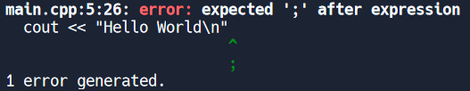
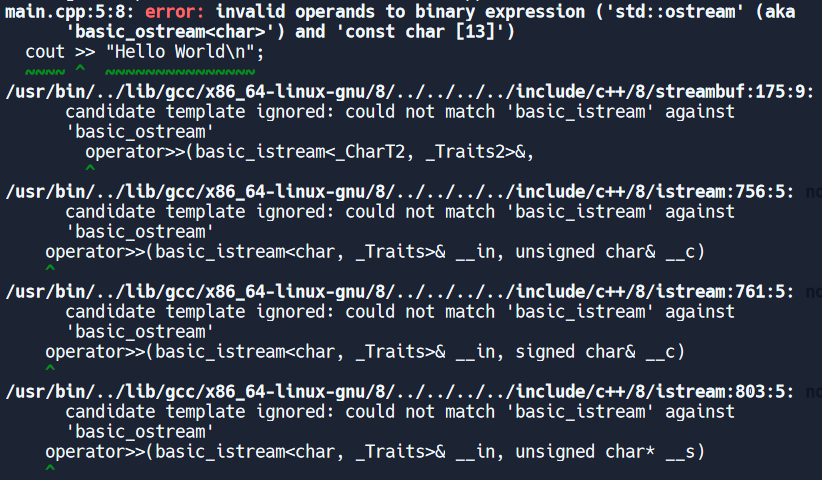
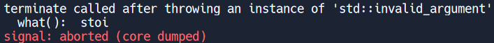
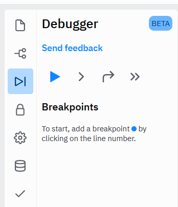
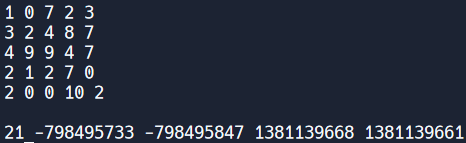
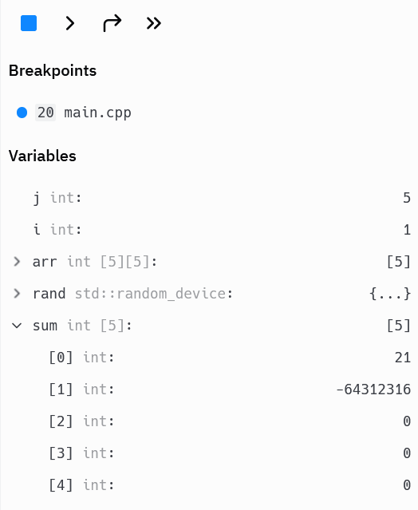
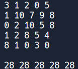

Programming is not easy. We have to translate what we want the program to do into the strictly typed language of C++. We have to make sure that the program follows all the rules and conventions of the language while also dealing with the limitations of what the language offers. Naturally, error occurs. The program doesn't do what we want it to: it doesn't compile, the output isn't what you expected, or it crashes midway through running it. We call any one of these or any combination of these a "bug". 

In this lesson, we will cover the main types of bugs you may encounter in your programming experience and how to deal with them. We will cover various tools that you can use offered by both the programming language and the debugger. However, at the end of the day, it will be your own trial and error, your own intuition that gets rid of the bug.

# Types of Errors
Almost all errors, or bugs in your program will fall into one of these three categories. They will either be a syntax error, a runtime error, or a logical error. A syntax error is like a grammatical mistake, and is one that is generally pointed out by the compiler. In fact, your IDE (like repl.it) will usually put a red squiggly line under the error, just like with spellcheck. A runtime error happens during the program's execution and usually results in the program crashing. Lastly, a logical error is probably the hardest of errors to detect. Usually you know it happened if your program runs fine, but doesn't produce the output or behavior you expected. It is up to you to look through your code and make sure that it is written correctly. 

## Syntax Errors
As mentioned before, syntax errors will usually be pointed out by the compiler or by the IDE. They may provide a simple way to resolve it, like just adding a semi-colon at the end of the line. It may tell you that you're missing a parenthesis or a curly brace. If attempting to compile, the compiler will give an error about this. Usually the line and position that it is missing is specified, making these rather simple to fix.

For example, if I were to try to run the following code: 

```cpp
#include <iostream>
using namespace std;

int main() {
    cout << "Hello World\n"
}
```

I get an error like this from the compiler



This is pretty straight forward and to the point. It tells me what I'm missing, the line that it's missing from and even the character in the line. There's also a helpful copy of the code and a little visual indication of the bug and suggested solution. That makes it quite simple to fix. However, not all syntax errors are so easy.

C++ is a complex language with a lot of features. Knowing and understanding these features well is the key to dealing with bugs and interpreting the error message correctly. Let's try a similar piece of code, with another common to make error. 

```cpp
#include <iostream>
using namespace std;

int main() {
    cout >> "Hello World\n";
}
```

See if you can spot the error on your own. If you haven't that's alright. With `cout`, we should be using the symbol `<<` . This code accidentally uses the symbol for `cin` with `cout` which is a common mistake to make. However, the error that C++ gives out when attempting to compile this program is a lot more complicated. In fact, it probably looks like complete gibberish. The error is so long in fact, that I'll only show a part of it.



If we notice, after the first error, the other stuff is pretty similar to the stuff after. They are basically all saying "candidate template ignored: could not match 'basic_istream' against 'basic_ostream'". But let's star at the first thing we get. Now this is actually quite helpful. This shows us the code snippet of where something went wrong, along with pointing at where the issue is. But it doesn't offer us a fix. 

Let's try to deduce what the compiler is telling us the error to be. It tells us that there are `invalid operands to binary expression ('std::ostream' (aka 'basic_ostream<char>') and 'const char [13]'` . That's a lot to process, but what we need to realize is that binary expression just means something like `1 + 4`. It just means you have an operator that takes two operands. The stuff in the parenthesis is just talking about the type of the operands. Now the error is telling us that these operands we put are invalid. 

Now, considering that we know what the actual problem is, that the `>>` should really be `<<`, this seems kind of backwards. The problem is in the operator, not the operand. However, the compiler doens't know this. The compiler doens't know what you are trying to do, and just produces an error assuming that the operator is correct, and maybe something else is wrong. It is up to us to figure out what's going on with the error.

The insight comes from the repeated messages below. They all say that `could not match 'basic_istream' against 'basic_ostream'`. If you recall from the previous lesson, `cout` and `cin` are really objects of a class. The class of `cout` is `ostream` and the class of `cin` is `istream`. Thus we realize that the operator expects `cin` instead of `cout` which helps us to realize that we used the wrong operator. 

Most of the syntax errors that are difficult to deal with really boil down to interpreting the error message. The greater understanding of the C++ language, the easier it is to interpret these errors. Other similar trick errors may arise when dealing with the STL and using the correct arguments. Make sure to read the documentation and thoroughly understand it to help work your way through the errors.

## Runtime Errors
Runtime errors usually occur along the same veins of a syntax erorr. There is something wrong with your code and the values of it. However, the problem is that the compiler could not detect the error. Instead, the program crashes midway through execution. This is usually common in programs based on user input, or with some sort of error in the way the code is written. 

For example, let's look at code that takes two integers and outputs the divided answer. 

```cpp
#include <iostream>
using namespace std;

int main() {
	int a = 5, b = 0;
	cout << a / b << "\n";
}
```

Running this program results in an error that says `signal: floating point exception (core dumped)`. Now, obviously looking at this code we see, woah, there's a divide by zero, that's the error. Problems arise when you have code that takes two user inputted numbers. Now, how do you fix the fact that someone can't enter zero, or else the program will crash? That's solvable via an if/else statement checking if one of the inputted numbers is zero. This type of programming is called defensive programming and is something that you should keep in mind.

Other runtime errors may involve certain functions that expect a specific input. For example, consider the `stoi` function that takes a string argument and returns an integer with the corresponding value stored in the string. Your program will crash if a string that contains non-integer values is passed to the function. However, the error outputted is a little bit different.

```cpp
#include <iostream>
using namespace std;

int main() {
	string crash = "not a number";
	cout << stoi(crash) << "\n";  
}
```



We get the same signal and core dumped stuff, but something happened before that. The program is telling us that the `stoi` function terminated the program because of an `std::invalid_argument`. Now, the one downside to this is if we had multiple `stoi` function calls, we wouldn't know which one actually caused the error. However, the main point to this is that the `std::invalid_argument` is actually something called an exception. C++ has a way to handle certain runtime errors that are directly thrown by code and ways to handle them that would not involve immediately crashing the program. We will learn about these later on in the lesson.

## Logical Errors

Logical errors are the most elusive type of programming bug. That's because they aren't actually errors. Your program will compile and run perfectly fine. It won't crash. It will compile. It will run smoothly. Yet it won't produce the output that you expect it to. The problem with logical errors are in the fact that the code you wrote is incorrect. There is something in it that isn't doing what you want it to do.

Let's consider code that determines based on input whether a temperature is classified as "hot", "cold", or "temperate". Depending on where the value falls, it should output the correct descriptive term.

```cpp
#include <iostream>
using namespace std;

int main() {
	int temp;
	cin >> temp;
	if (temp > 50)
		cout << "Hot\n";
	else if (temp < 50)
		cout << "Cold\n";
	else
		cout << "Temperate\n";
}
```

If we run this code, there are no errors. However, the only time the output is "temperate" is when the inputted value is 50. That's not what we want. We want a larger region, so in the first if/else block, we would have to change the 50 to something like 80. 

Other logical errors can occur in legal syntax that might come out of a typo. For example, if we want to determine if two numbers are equal to each other, we have to use the comparison operator `==`. However, if we were to accidentally type a single `=`, the code will still compile and run. The output will not be what we expect.

There are other various errors that can be found, but the best way to tackle logical errors is to systematically go through your code. Take the input and pretend to be the program, executing based on exactly what you see. Compare the results that the program is getting compared to what you want. When you find the difference, you know you found the bug. It's helpful to use `cout` statements and output your programs progress to find where it could have gone wrong. 

# Debugger
Sometimes there is just too much going on for you to process all the output statements. Other times the program crashes and you don't know where. The debugger is a useful tool that helps to debug these problems. On repl.it, we can access the debugger by clicking the third tab on the column of the left side.



The menu should look like this. We have four buttons, as well as something called a breakpoint. The first button will run your program with the debugger. The second button allows us to run the program a line at a time. It will go to the next line in the program just before running it. It is very useful in conjunction with breakpoints. The third button allows us to go to the next line, but skip through the line by line execution of certain things like functions. The last line just continues execution until the next breakpoint.

A breakpoint is a place where the user specifies the program to pause execution before running the debugger. Following the instructions specified in the above repl.it debugger, we can add breakpoints by clicking a little bit to the left of the numbers on each line. When we do, we should get a blue dot that signifies where a breakpoint will be. 

Let's practice debugging with the following code: 

```cpp
#include <iostream>
#include <random>
#include <cmath>
using namespace std;

int main() {
	int arr[5][5];
	random_device rand;
	for (int i = 0; i < 5; ++i)
		for (int j = 0; j < 5; ++j)
			arr[i][j] = abs((int)rand()) % 11; //assigns random values
	int sum[5] = {0};
	for (int i = 0; i < 5; ++i)
	{
		for (int j = 0; j < 5; ++j)
			cout << arr[i][j] << " "; //outputs the array
		cout << "\n";
	}
	cout << "\n";
	for (int i = 0; i < 5; ++i)
	{
	    for (int j = i; j < i + 5; ++j)
	      sum[i] += arr[j][j]; //stores the sum of a diagonal
	}
	for (int i = 0; i < 5; i++)
	    cout << sum[i] << " "; //outputs the sum of a diagonal
	cout << "\n";
}
```

This code is supposed to randomly store numbers into an array (from 1 to 10) and then sum the diagonals (wrapping around). It will output the array and then the sum. Assume the part that outputs the arrays as well as randomly assigns values to the array works correctly.

Now, that means we are essentially just looking at the loop that stores the sum of a diagonal because we know the rest works correctly (trust me). Now the problem is that there are random inputs every time, so that's going to make it hard to figure out what's going wrong. So let's just try running the program.

The first thing we notice from our outputs is that other than the first diagonal sum, we are getting some really large numbers.



Now since we know that all the numbers are from 1 to 10, and we see they are correctly in our array, we know some how the `arr[j][j]` part that is being added to the sum after the first iteration of the loop must be really large. This value can't come from the array. Let's put a breakpoint on the outer loop and then use the next step button to watch what happens to the values.

What's interesting is that we can see the values of the variables that we have stored. We don't have to output it and can see how they change with each iteration. We start seeing problems in the last iteration of the inside for loop on the second iteration of the outside for loop. Our variables look like this and we see that the sum went from being something expected to something rather strange.



When you are trying this, you might not see the expanded output of the array. Make sure to click on the arrow at the left of the name to expand it. What we must notice is that we are adding values of `arr[j][j]`. This is a 5 by 5 2D array. However, we are indexing at 5, which would correspond to the 6th element, which is out of bounds. If we recall, C++ does not always give us out of bound errors, so it is a silent error. However, we noticed the problem, and we can fix this by modding by 5 so that the value remains between 0 and 4 (inclusive). Now we replaced it with `arr[j % 5][j % 5]`. 

Running the program now gets us reasonable outputs, except that they are all the same. They match the sum of the first diagonal.



With some more debugging, we notice that no matter what, we always end up adding the index pairs of `[0][0], [1][1], [2][2], [3][3], [4][4]`, just in different orders. Addition is commutative, so the order isn't going to change anything, hence we get the same value. 

Try thinking about what we should change. Eventually, after some debugging you might come across a solution. The solution that we came up with would be to change the part to `arr[j - i][j % 5]`.

# Try/Catch
Earlier in the lesson, we mentioned something called exceptions. These are standard ways that C++ allows us to handle errors that will not cause us to crash the program. We can include the `<exception>` to help us with this.

Before, we mentioned that the `stoi` function will throw an exception and terminate the program if it is given a string that is not just a number. However, we can use something called a `try/catch` block which is kind of like an if/else for exceptions. If the code inside the `try` block raises an exception, the `catch` block will take the error and then execute code based on that. If no exception is raised, the `catch` block is never run. 

Let's introduce some new code.

```cpp
#include <iostream>
#include <exception>
using namespace std;

int main() {
  string crash;
  cin >> crash;
  try {
    cout << stoi(crash) << "\n";
  } catch (const exception& e) {
    cout << "the string " << crash << " is not a number\n";
  }
}
```

If we are to input something like `100`, the program just outputs `100`. However, if we were to enter `crash`, then the program will output `the string crash is not a number`. This follows the `catch` block and doesn't actually end our program beacuse it caught the exception.

The `exception` class even has a function that can tell us whatever the error is, or at least whatever is provided by whatever threw the error. We can use `e.what()` and output that to the console.

There are various types of exceptions that various C++ STL functions might throw. This try/catch block can help us to offer alternative code to circumvent this rather than just immediately terminating the program. With a little research, you can even learn how to throw your own exceptions and handle them in your code.

