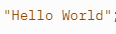
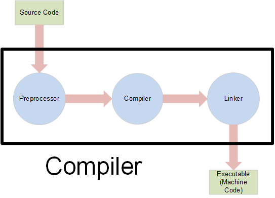

%%TODO include handout vocab stuff at the bottom%%
This lesson will consist of an introduction to the C++ language and explanations of how code is run and what happens within the computer. By the end, you will understand basic structure/syntax of C++ and you should be able to write a simple program. 

# Why do we program?
Programming makes human tasks much easier. The overall goal is to come up with an algorithm and implement it through a program to simplify tasks. For example, performing large calculations, converting between units, or even organizing information.

Programming has a variety of uses and allows you to improve your problem solving skills as you develop algorithms. %%TODOavoid transitions%%Additionally, once you have a solid understanding, you can combine it with your creativity to do whatever you want. 

# What is Programming?
Programming serves as a form of communication between humans and computers. There are many different languages that each have their own benefits and are used based on the task at hand. Essentially, **a program is a set of instructions for the computer**, and **we have to write it so that the computer can understand it.** 

%%TODO mention comments somewhere%%
## An Analogy

As we said, programming is like giving instructions to someone to perform a task. For example, if you (the programmer) wanted your brother (who is the computer) to make a sandwich you would leave a recipe for him (a program). The recipe might look similar to this. 

1.  Toast two pieces of bread 
2.  Put jelly on one slice of bread 
3.  Put peanut butter on the other slice
4.  Combine the two slices 
5.  Cut off the crusts before serving
    
Your brother will read the recipe (just like a computer) and follow the instructions. 

# What is C++?

C++ is one of the many programming languages that you can use. As we said before, different languages have their own advantages and disadvantages and this applies to C++ as well. The %%TODOclumsy wording here%%abundance of uses of C++ includes graphic-based softwares, games, browsers, mobile app development, etc. 

It is a **high level language**, meaning that it is very user-friendly and understandable. Additionally, it can be used for almost anything, as we previously said%%TODOtransition + repeating that you already said it, probably just delete the sentence%%. Lastly, C++ is **portable**. It doesn’t rely on any specific platform--most C++ programs will run on Windows, macOS, Linux and mobile devices without the programmer having to rewrite the code.

# Your First C++ Program 
[First C++ Program](https://replit.com/@SaiMinnal1/FirstCProgram-1#main.cpp) 

```cpp
#include <iostream>
using namespace std;
int main() {
	cout << "Hello World!";
}
```

Click on the link above, which contains a simple C++ program. Click the green "Run" button to the top-right of the code. Based on what's in the code, as well as the output, can you figure out what the code is doing? 

Let's get into the specifics of what happened in that program: 

First, line 1 tells C++ that we want to use tools%%TODOtools?%% from iostream, which provides functions and objects%%what is a function and object? how am I supposed to know this jargon%% that you can use to interact with the console (output text, ask for input, etc.)

Then, line 2 tells C++ that we want to use things from the std (standard) namespace, which includes `cout`.

%%TODO Maybe mention what you would do without the using%%

`int main()` defines the entrypoint of the program, or where the computer starts running your code. 

> All programs must have a `main` function. In your `main` function, you will write all the instructions of your program. 

Finally, the last line displays the text, `"Hello World!"` on the screen, using `cout`. 

# Breaking down the program

Now that we know about the purpose of programming languages and the benefits of C++, we can start learning the basics of the language. The following things were present in the example code so we will see what the purpose of them is. 

The first thing that appears in your C++ program is a **header file**. Header files contain pre-written code that you can use in your program.

You can include a header file like this:

```
#include <headerFile>.
```

Our code prints to the console, so we'll need to include the `iostream` header file, like this:

```
#include <iostream>.
```

%%TODO: Should this be here? I don't think so%%
%%I think a more direct example would be helpful. Split it up and just say something about how if people wrote different implementations of the same thing, rather than calling it two different things, they would just have their own namespace%%
%%When we have different variables, classes, functions, etc. that function the same way, we require namespaces to differentiate between them. For example, two variables can have the same name but they hold different values and are used for different functions.  One of the most commonly used namespaces in C++ is namespace std;. It includes commands such as cin, cout, and endl. Without writing using namespace std; at the top of our code, we would have to write std::cin everytime we want to use cin (you will learn more about this later in the lesson). However, if we write using namespace std; at the top we can just write cin. Writing code without the namespace at the top can be useful when you want to know what namespaces certain things are from. For example, std::cout signifies that cout is from the namespace std.%% 

## The `main` function

The entry point for our C++ program is the `main` function. The syntax for it is `int main()` and it ends with the `return 0` to signify the end of the program. By naming our function `main`, we are telling C++ to run the code inside `main` when we click the "Run" button.

%%TODO these needs to be consistency with the mention of the return, above in the main function we don't even use return, but we don't even talk about it. If we are talking about the reasoning behind it, like it could be used as an error code or smthing%%

```cpp
int main() {   # When we click "Run", the computer goes here 
	# All the code inside the {} is then run
}
```

%%## Scope%%

%%TODO definitely move scope to the next lesson%%

%%The scope of something shows how long something lives and where it can be used. If something is written in int main(), it is in the scope of that function. If there was something that could only be used within int main(), it is local to that function. On the other hand, if it can be used anywhere in the program, it is global.%% 

## What is `cout`?

The cout statement, which was used in the example code, is a command that we imported in the `<iostream>` library. `cout` is used to display text on the *standard output*, or in our case, the repl.it **console**. 
%%TODO cout -> consoleout%%
In the example, we displayed the text `"Hello World"`. This is known as a `string`. You will learn more about these later, but for now, all you need to know that a `string` represents text. Double quotes (`""`) around text signify that something is a `string`. 

> In repl.it, strings are highlighted green. This **syntax highlighting** makes it a lot simpler to read code.
> 
> 

Between a string you want to output and `cout` , we need to put a `<<`. This "inserts" the words `"Hello World"` into the terminal.

> This is largely oversimplified, but this is all you need to know to get started. See Lesson 3 for more details.

%%TODO Add a link to the lesson where we go into greater detail about cout%%

# What Happens Inside the Computer?

Now that we understand the programmer side of coding, let’s look at what the computer does with the instructions we provide. C++ is a high level language, so it is readable and user-friendly for the programmer, but not the computer. 

When you write code, generally it's in some form of English that can be understood, even if you don't know the exact syntax of C++. But computers don't understand English, or any language for that matter. How do computers get from code written by you to executing commands? 

Your computer can only understand one language: a set of instructions made up of ones and zeros. A simple instruction might look like this: 

```
00000 10011110
```

A %%TODO useful? probably delete%%useful program with multiple instructions might look like this: 

```
00000
10011110
00001
11110100
00010
10011110
00011
11010100
00100
10111111
00101
00000000
```

However, this isn't very human friendly. Writing code like this would be very tedious and difficult. 

The solution programmers came up with is to write **source code**, in a form understandable to humans, and then translate it into an **machine language**, which can be understood by a computer. The process of this conversion is called **compiling**. 


%%TODO probably make this an svg and our own graphic not the first result on google images%%
> The program that translates C++ source code to machine language needs to know your **exact intentions**, which is why programming langauges are very strict in how the programmer writes code.

The process of compiling is made up of many other steps that will be easier to understand as you learn C++. 

For now, you won't need to worry about the specifics, since you will be writing source code.%%Maybe just say if you want to learn more specifics probidde external links%%

%%TODO wrap this up more gracefully%%