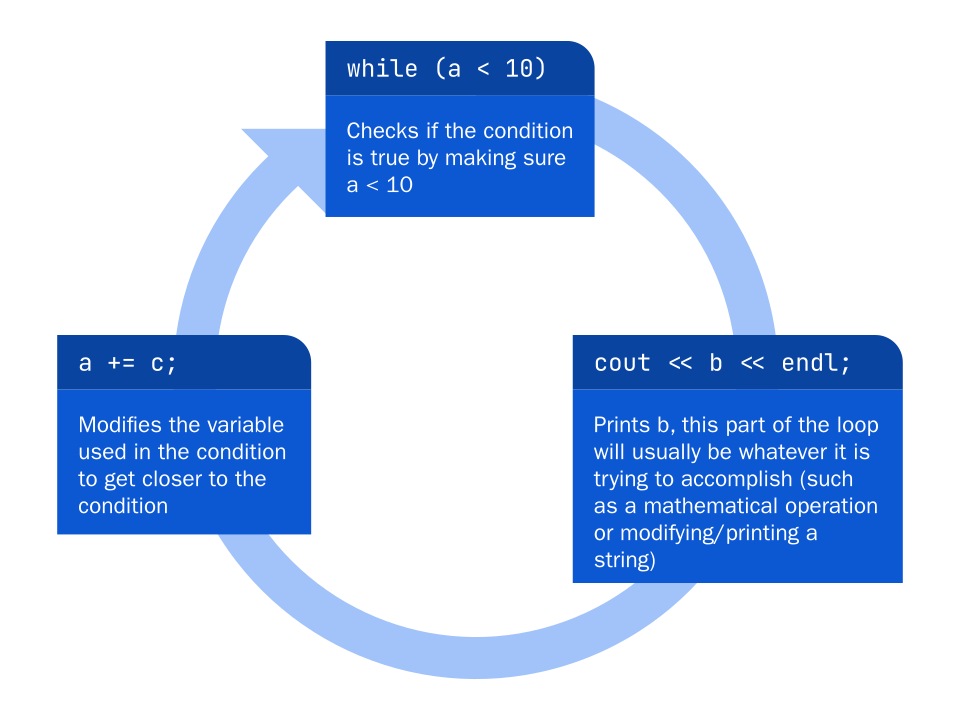
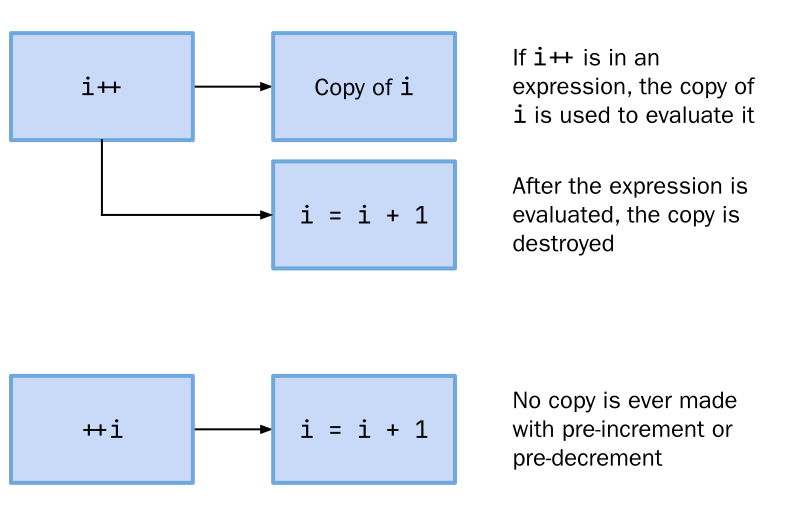
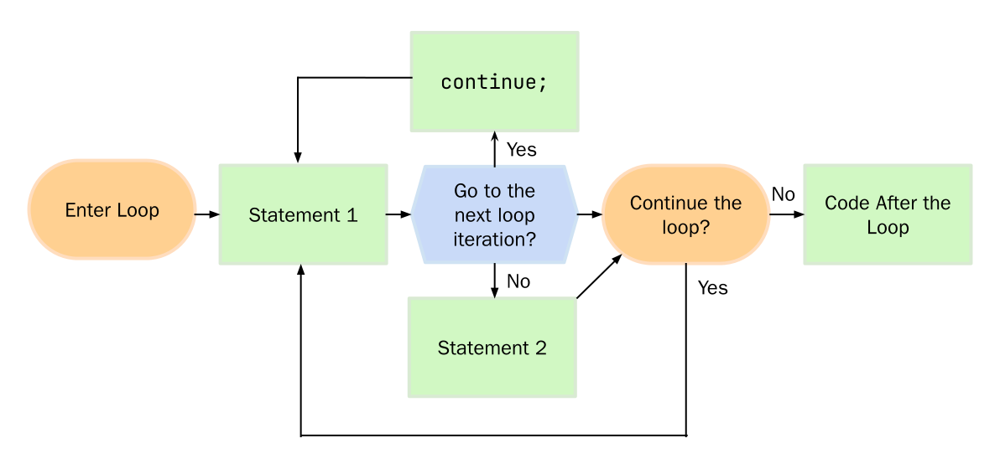

In the last lesson, we learned about conditionals, a type of control structure that changed the program flow depending on whether certain conditions were met. Just like conditionals, **loops** execute code when a condition is met, but instead of moving on, they keep repeating the code until the condition is no longer met. 

# The Need for Loops
Consider a program where you want to output the string `Hello World!` to the console 5 times. Now, we could type a cout statement once and copy and paste it 5 times. That would make it a little easier to type.

```cpp
#include <iostream>

using namespace std;
int main()
{
	cout << "Hello World!" << endl;
	cout << "Hello World!" << endl;
	cout << "Hello World!" << endl;
	cout << "Hello World!" << endl;
	cout << "Hello World!" << endl;
}
```

Now, that's not too bad. But what if you wanted to print something fifty times? Or even a hundred times? Or better yet—you wanted to print something a different amount of times based on what the user inputs. 

Maybe our purpose is more abstract; we want to look through a large database of names to find something. How can we tell the computer to check things many times over and over again?

These would all take a long time to program, and it might not even work correctly for all inputs. That's where loops come in.

# Loops
Before we start writing code, let's discuss the syntax and terminology with loops in C++. C++ offers us three different types of loops: the **while**, **do-while**, and **for** loop. They each have their own use cases, but the format is roughly the same. 

The basic structure of a loop includes a **header** and a **body**. The header tells C++ what type of loop it is and provides the necessary information for that loop. The body is the code that is executed each time the loop "loops". We call a single execution of the loop an **interation**. Part of the header is usually a conditional—only if that condition is met will the body iterate.

Just like with conditionals, we wrap the body of the loop with curly braces (`{`  and `}`). This tells C++ which code will be repeated. If only a single line needs to be repeated, we can omit the curly braces, just like with if/else blocks.

# The `while` Loop
We can use a `while` loop to replace our cout statements. The syntax of it is the following:

```cpp
while (condition) //header
{  
	// body  
}
```

The while loop is kind of like an infinite if-statement: it will continue to iterate until the condition is false. Therefore, the body will repeatedly execute **while** the condition is true, hence the name. For the condition, we can put anything that evaluates to a boolean, just like with the condition in an if-statement. The order of execution is as follows:

1. The loop checks whether the condition after the while keyword is true
2. If so, it executes everything in the body (dictated by curly braces)
3. Repeat steps 1 and 2 until the condition is false
4. End the loop by skipping the body and continuing through to the rest of the program

Consider the following while loop

```cpp
while (a < 10)
{
	cout << b << endl;
	a += c;
}
```

We can visualize what is going on as the graphic below



Now, there are two pitfalls that we might find ourselves in after coding a while loop. First of all, notice that before the loop is even run, the condition is checked. Thus, it is possible for the loop to **never run** if the initial condition is not met.

The opposite of this would be the **infinite loop** which happens if the condition never becomes false. The body of the loop would keep on executing. The code after the loop is never executed, and the program will not keep running until it crashes or is stopped manually. This can be a dangerous error to encounter and could even freeze up your computer.

Now let's replace the cout statements with the following loop: 

```cpp
int count = 0;
while (count++ < 5)
	cout << "Hello World!" << endl;
```

Let's understand step by step what this code is doing. The first thing we do is initialize a variable called `count` to 0. We use this variable to keep track of how many times the loop has executed. Our condition is a bit complicated, we use the [Post-Increment](/introcpp/arithmetic#pre-and-post-incrementdecrement) operator with the count variable, and say that it should be less than 5. 

Now, obviously, we want the loop to execute 5 times, but we say less than five, so wouldn't this loop iterate 4 times? That's not quite correct because we have to realize that we are using the post-increment operator, so the value goes up **after** the condition is checked. 

We could **trace** out the loop in a table to sort of visualize what the value of count would be before and after the program evalues the condition.

| Iteration | Before | Check Condition | After |
| --- | --- | --- | --- |
| 1 | count = 0 | `0 < 5` is true | count = 1 |
| 2 | count = 1 | `1 < 5` is true | count = 2 |
| 3 | count = 2 | `2 < 5` is true | count = 3 |
| 4 | count = 3 | `3 < 5` is true | count = 4 |
| 5 | count = 4 | `4 < 5` is true | count = 5 |
| END | count = 5 | `5 < 5` is false | count = 6 |

The last check of the condition evalues to false, so the code is not run again. If we were to use the pre-increment operator, we would have to change the condition to be `++count <= 5` for that to work. Tracing through the table this time looks like this:

| Iteration | Before | Check Condition | After |
| --- | --- | --- | --- |
| 1 | count = 1 | `1 <= 5` is true | count = 1 |
| 2 | count = 2 | `2 <= 5` is true | count = 2 |
| 3 | count = 3 | `3 <= 5` is true | count = 3 |
| 4 | count = 4 | `4 <= 5` is true | count = 4 |
| 5 | count = 5 | `5 <= 5` is true | count = 5 |
| END | count = 6 | `6 <= 5` is false | count = 6 |

This time the before and after the check condition is the same, because the increment to the count variable  happens **before** the while loop checks the condition. It all essentially boils down to precedence.

# The `do while` Loop
However, if we wanted to keep the condition as `++count < 5` and have it execute 5 times, we could use a special kind of while loop, the do while loop. If we were to use the aforementioned condition in a regular while loop, it would iterate 4 times. However, the **condition is evaluated after each iteration** of the loop rather than before, meaning that **the body of the loop is always executed at least once**.

The fact that the condition is evaluated after each iteration is what really helps us. The count variable is increased after each time the condition is checked, but with a do while loop, the condition isn't checked the first iteration. So we can think of the behavior of a do-while loop as the same as a while loop, but with an "iteration 0" that always occurs. So our table might look like this: 

| Iteration | Before | Check Condition | After |
| --- | --- | --- | --- |
| 1 | count = 1 | `1 < 5` is true | count = 1 |
| 2 | count = 2 | `2 < 5` is true | count = 2 |
| 3 | count = 3 | `3 < 5` is true | count = 3 |
| 4 | count = 4 | `4 < 5` is true | count = 4 |
| END | count = 5 | `5 < 5` is false | count = 5 |

But, we still need to consider our "iteration 0" that runs code once first for a total of 5 iterations. 

The syntax of a do while loop is: 

```cpp
do
{
	//body
} while (condition); //header
```

In this loop, the header comes after the body of the loop, but we still have to include the `do` keyword at the beginning to signify the beginning of the loop.

The loop that would do as we were discussing before would look like this:

```cpp
do
	cout << "Hello World!" << endl;
while (++count < 5);
```

We don't need the curly braces with a single line of code, just like with the while loop. 

# The `for` Loop
With the while loops, we had to initialize the count variable outside of the loop before we could use it. The for loop both includes a part where you can initialize a variable, and also a part where you can increment the variable. The syntax looks like the following:

```cpp
for (init-statement; condition; update-statement) //header
{
	//body
}
```

The **header** of the loop includes use of the `for` keyword as well as a couple statements. Each of these statements are separated with a semi-colon as shown above.

The **init-statement** is a piece of code that is only run once before the first iteration of the loop. It is typically used to initialize a counter variable.

The **condition** is evaluated before each iteration of the for loop, just like in a while loop. As with the while loop, the body is only ran if the condition is met. If the condition evalutes to false, the loop exits.

The **update-statement** is a piece of code that runs after each iteration of the for loop. Is is typically used to increment/decrement the counter variable initialized in the init-statement.

To write the code that outputs `Hello World!` 5 times, we would use the following loop:

```cpp
for (int i = 0; i < 5; ++i)
	cout << "Hello World!" << endl;
```

Although we could name the variable anything we want, typically programmers use the letter `i` as the variable name in their for loops, short for iteration. This letter is a lot shorter to type than count. 

When we write for loops, we can think of them coming out to the following code with a while loop:

```cpp
{
	init-statement;
	while (condition)
	{
		//body
		update-statement;
	}
}
```

The variables initialized in the init-statement are **local** to the for loop, meaning they can only be accessed inside it. However, variables declared inside the for loop are not accessible to the condition. Even though we wrote the update-statement inside the while loop, variables declared inside the for loop are also not accessible to the update-statement.

The init-statement, condition, and update-statement are all **optional**. We could write a for loop keeping them all blank, or some of them blank, and it would still run fine.

For example, 

```cpp
for (;;)
	cout << "Infinite Loop" << endl;
```

is legal code, and would result in an infinite loop. This is because omitting a condition statement by default makes the condition true.

Another thing to note is that the update-statement and init-statement are like a line of code. We could technically put anything that is a valid single line of code there. However, the most useful use of this feature would be to initialize and update multiple variables at a time. We could have a loop with two counter variables like this.

```cpp
for (int up = 0, down = 5; up <= 5; up+=2, down-=2)
	cout << up << " " << down << endl;
```

## Pre or Post Increment/Decrement
With the update-statement, the effect of using pre or post increment/decrement doesn't actually change anything that your program does. The update-statement is still ran after the body and before the condition no matter what.

However, from a **memory** perspective, the pre-increment is preferred in for loop headers. This is because using a post-increment creates an extra temporary variable in memory: one variable is used to store the original value and another to store the incremented value. 



Such a creation is necessary in the case that you are attempting to use both values in your code, but it means that in cases like the for loop where no such variable is needed, it is a waste of memory and can negatively affect program execution time. Therefore, it is considered best practice to stick to the pre-increment.

# Range Based `for` Loop
C++ offers a special type of loop that allows you to iterate through elements of a `container`. We will learn more about different containers in a future lesson, but think of them as a collection of elements of a specific type. An example of a container that we have already learned is a string. A string is just a collection of `char`s. 

The syntax of it looks like:

```cpp
for (type variable : container)
{
	//body
}
```

For each iteration of the loop, it creates a variable of the specified type and stores an element of the container into the variable. So if we ran a range based for loop on a string `Hello`, the first iteration the variable would store `H`, the next `e`, then `l`, and so on. The following loop would output all the individual characters of `Hello`:

```cpp
for (char t : "Hello")
	cout << t << endl;
```

One thing to note is that the variable is a copy of the particular element. It does not change the value of the original container. For example, if we ran the code

```cpp
#include <iostream>

using namespace std;
int main()
{
	string in = "Hello";
	cout << in << endl;
	for (char t : in)
		t = 'x';
	cout << in << endl;
}
```

It would output `Hello` twice. Even though we change the value of the variable in the loop, it does not affect the original string because it is a copy. If we wanted to be able to `mutate` the original value, we would need to replace the type `char` with `char&`. The `&` operator is a special operator that gets the address of the variable. We will learn more about that in a fture lesson. Essentially, it just avoids copying the variable by storing the exact memory location. 

So if we replaced our loop with

```cpp
for (char& t : in)
	t = 'x';
```

Then the second cout would output `xxxxx` instead of `Hello`. 

# Nested Loops
You are allowed to nest as many loops as you want, just like with if/else statements. You can mix and match different types of loops. Each iteration of an outer loop involves every iteration of an inner loop, allowing for more nuanced control over program execution. For example:

```cpp  
#include <iostream>

using namespace std;
int main()
{
	string dOfWeek = "MTWTF";
	for (int i = 1; i <= 5; ++i) 
	{
	    cout << "Week " << i << "... ";
	    for (char d : dOfWeek)
	        cout << d << " ";
	}  
}

>>> Week 1... M T W T F
>>> Week 2... M T W T F
>>> Week 3... M T W T F
>>> Week 4... M T W T F
>>> Week 5... M T W T F
```

The for each iteration of the outerloop, the inner loop goes through all iterations of the inner loop, so we get the output as shown above. When nesting for loops with count variables, the typical semantic is for the outer loop to use `i`, then `j`, `k`, and so on. 

# `break` and `continue`
Consider a situation where you are looking for a particular solution to a problem. You have an infinite loop to keep on searching until you find the solution. But infinite loops can't stop unless the program crashes or the program is killed manually! That's normally true, but C++ allows has a special keyword called `break` that will exit the current loop when executed.

For example, if you had the user enter a passcode and you wrote a program to guess it by counting up by one each time, you could write your code like this.

```cpp
#include <iostream>

using namespace std;
int main()
{
	int in;
	cout << "Enter your password: ";
	cin >> in;
	int guess = 0;
	while (true)
		if (++guess == in)
			break;
	cout << "Your password is: " << guess << endl;
}
```

Now obviously this program is inefficient and there are better ways to write the code, but use cases for break statements will come up when you are coding. 


Sometimes you might want to continue iterating a loop, but not execute the rest of the code in the loop. Rather than writing a large if/else block, we can simplify code using a `continue` statement. If we wanted to write a program that looped through numbers, omitting ones that are multiples of 5 and 7, we could contain it all in an if/else block. However, it might be simpler and make the meaning more obvious to use a continue statement.

```cpp
#include <iostream>

using namespace std;
int main()
{
	for (int i = 1; i < 100; i++)
	{
		if (i % 5 == 0 || i % 7 == 0)
			continue;
		cout << i << " ";
	}
}
```

This is also trivial to do with an if/else statement, but with more complicated code, continue can really help out.



>Both break and continue only do so in the loop they are called in. A break statement called within nested loops will only exit the loop it is called in.

# What Type of Loop Should I Use?
Deciding on what type for loop you should use can sometimes be tricky. You could use any of the loop types for whatever use case you want. However, in some cases this could require extra code. To avoid needless code, we should try to pick a loop type that best fits the scenario. 

Below is a table that outlines the typical use case for each of the loops we went over:

| Loop | Use Case |
| --- | --- |
| `for` | Iterating through a loop a certain number of times known **before** you enter the loop |
| range based `for` | Iterating through elements of a container | 
| `while` | Iterating through a loop as long as a condition is true and the condition  must be true before entering the loop |
| `do while` | Iterating through a loop at least once and then testing for a condition, typically used with repeating code until a user wants to exit |

Let's do some practice on determing what type of loop you should use based on the scenario. 

<details>
<summary>You want to check if a given number is prime.</summary>
Answer: For loop
Although you might not think that the number of iterations that are needed is known before entering the loop, we do know the maximum number of iterations we might encounter. We only need to check all numbers less than or equal to the squareroot of the number because that would be the greatest number that you could divide by such that you don't get repeats. An example implementation might be: 

```cpp
for (int i = 2; i <= sqrt(inp); i++)
	if (inp % i == 0)
	{
		cout << "Not Prime" << endl;
		break;
	}
```
</details>
<br/>
<details>
<summary>You want to keep on running a program until the user enters "stop" to exit</summary>
Answer: Do While Loop
Although the code would work with a while loop, this avoids you having to initialize the input to something other than stop at first. In a program where you might not know what to initialize it to until the user inputs something, a do while loop is necessary.

```cpp
do
{
	//do whatever you want
	cout << "Run again? ";
	cin >> inp; 
} while (inp != "stop");
```
</details>
<br/>
<details>
<summary>Euclid's Algorithm for GCD</summary>
Answer: While Loop
If you don't know what the algorithm is, you can find out about it in [this page](https://en.wikipedia.org/wiki/Euclidean_algorithm). The algorithm must initially make sure that one of the inputs that is being modded is not 0 to avoid an error, thus the condition must be checked first.

```cpp
while (b != 0)
{
	int temp = b;
	b %= a;
	a = temp;
}

cout << "GCD is " << a << endl;
```
</details>

# Defensive Programming

One of the most important aspects of coding is **defensive programming**, which is used to ensure that user input doesn’t crash the program and sticks to the program’s demands. Many times, the bulk of your code will be devoted to defensive programming. Consider this example – you want to create a program to divide two positive integers, but you know that the program will crash if the divisor is 0 or if the input is not numeric. To avoid such issues, you write the following code:

```cpp
#include <iostream>

using namespace std;
int main()
{
	string divisor, dividend, error;
	bool fail;
	do
	{
		cout << error << "Enter two positive integers to divide: ";
		cin >> divisor >> dividend;
		fail = false;
		for (char d : divisor + dividend)
			if (d < '0' || d > '9')
			{
				fail = true;
		        error = "Please enter only positive numbers\n";
				break;
			}
	    if (!fail && stoi(dividend) == 0)
	    {
		    fail = true;
		    error = "Please enter a non-zero divisor\n";
	    }
	} while (fail);
	cout << "Answer is: " << stoi(divisor) / stoi(dividend) << endl;
}
```

There's a lot of stuff going on in this program. First of all, we use a do while loop because we don't we are always taking in user input at least once. Every iteration we ask the user to enter two integers to divide and we also add an error string before. This error string is there to add an error depending on whether the user enters non-numbers or a dividend that is 0. 

Next we take in input as strings to make sure that just because the enter a non-number, it won't immediately crash the program. Then, we set a variable called fail to false to make sure that only if we trigger any of the error conditions, we run the loop again. 

After that we have a range based for loop that loops through a `divisor + dividend`. When we add strings, we do something called **concatenation** which basically combines them into one string. This avoids creating two separate loops to individually check each character of the strings. Inside the loop we check if the character is less than `'0'` or greater than `'9'`. Since chars in C++ are really in ascii, we can use our knowledge of the table to see that the equivalent numerical values are linear. So any character that is from 0 to 9 will be in the range of those equivalent characters. If it is ever not like that, we enter the if statement, we set fail to true, set an error message, and break out of the loop since we don't need to check any other characters.

The next if statement first checks that exit has not already been set. This is because if fail is true, that means the divident string could have a non-number in it. The `stoi` function converts a string to an integer, but will crash the program if the string has non-number characters. C++ uses something called lazy evaluation, which means that it will evaluate the left hand side of the `&&` first. If it is false, C++ knows that the whole statement will be false, and it won't bother to evaluate the rest of it, thus avoiding the program from crashing. If dividend is `0`, we again set fail to true and update the error message.

If all characters are numbers and the dividend is not zero, fail is still false, so the loop exits. We then just output the result of the division between the divisor and dividend. Also note that we are dividing between two integers, so the results will be that of integer division (like 3 / 4 = 0). This program combined a lot of things we learned over the past lessons, so it is ok if you didn't understand it all. We will be slowly working towards enhancing your C++ programming knowledge and one day you will be able to write far more complex programs.
