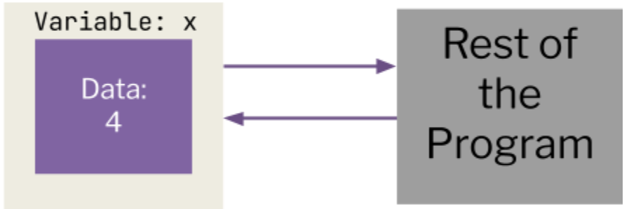

# Why are variables important?

In general, programs do two things: store data and they do calculations. They need a way to store data (types of data) to do their calculations, and the way they do this is with variables. 
# What is a Variable?
A variable is anything that stores information (a container for information). Information can be represented in a variety of ways to represent different things around us:


What is it? | What do we call?
----| -----
Amount of apples in a basket |Number
What day of the week it is | Word
A series of words |Sentence
A series of sentences| Paragraph

Each type of information is represented in a different way that makes sense to that specific kind of information. 

**A variable in programming is block of computer memory that holds a certain value.** In other words, it is any single piece of data. Variables must be declared, or given a memory location, before it is used. Once declared, the data can be calculated by other variables, manually initialized, or inputted by the user. 

%%TODO: What does mean?, also technically the data type can be changed with casting%%

In any part of a program, the data can be accessed or changed. The value of a variable is not fixed hence the name **vari**able. However, the data type (we'll explain this later) of a variable as well as its name are **defined once** and cannot be changed.

In programming, variables are a key aspect of almost every program. They are useful for storing and managing data which is used later in the program. We can also **manipulate** variables and perform operations on them.



# What Are the Parts of a Variable?
Variables have three parts: they have a name (identifier), type, and value. 

## The Identifier

Variables need names, which we call identifiers. C++ links the identifiers to their memory locations, so whenever we use that variable's name, the program can access and edit the memory there. An identifier has a set of rules that must be followed for it to be acceptable:

The identifier...

1. It must begin with a letter of the alphabet or an underscore.
2. It cannot start with a number. `4thExam` is not allowed. `Exam4` is allowed.
3. The name must contain only alphanumeric characters (letters and numbers) or underscores
4. Variable names are case-sensitive. DAYS, Days, and days are different variables.
5. Keywords cannot be used as variable names. This includes cout, int, cin, etc (this is so that c++ doesn't get confused between your variables and other instructions)

The identifier of a variable should also reflect its purpose. For example, if I want to represent the total revenue of a company, I would name my variable `totalRevenue`.

## The Data Type

Data Types define the actual properties of a variable. A data type will change what the variable is allowed to contain, as different data types will naturally require different forms of information, or data.

On the next page, you can see the different data types in C++. The data types cannot be used interchangeably. Furthermore, an Integer cannot contain “True”, and a boolean cannot contain an int value of “30”

Data Type | C++ Syntax | Description | Example | Example Value
--- |--- | ---- | ----| ---
Integer | int | Positive or negative whole numbers (including 0) | Number of windows in your room | 5
Float | float | Positive or negative decimals (up to 6 or 7 decimal places)| Bank account balance | 12,345.67 
Double  |   double |  Positive or negative decimals (up to 15 decimal places) | Bank account balance | 12,345.67 
Character | char  | A single, number, character or symbol | Grade on your report card  | `'A'`  
Boolean  | bool | A condition; True or False | If there is a snow day today |True 

## The Value
Variables also have values, based on their data types. For example, we could store integers in int variables, but not doubles. The value of a variable can be manipulated with operations and by directly changing the value, to represent changes to data in real life. 

# Declaring Variables

We can declare one variable by using the following format:

```cpp
[Data Type] [Identifier];
int myVariable; // Declares a variable named myVariable of the integer type
```

As discussed before, the data type defines the basic properties of a variable. We start the declaration line with the C++ Syntax of our data type. After a space, we have our identifier, which assigns the variable a specific name that can be used to reference it later on.

Notice that in this declaration, there is no data specified. When we declare a variable without giving it data, it is an undetermined value. 

> Be careful with undetermined values! They can be random, and C++ won't restrict you from using a variable that hasn't been initialized. This will cause random, unpredictable behavior!

## Declaring Multiple Variables

We can declare more than one variable, using the same format but separating each new declaration with a comma `,`.

All of the variables created will fall under the same data type. Though each variable may be declared on its own line, it is more efficient and readable to have multiple declarations in one line.

```cpp
int a,b,c; // Three variables, a, b, and c, of the integer type
char myVal, newChar; // Two variables, myVal and newChar, of the character type
double avg, sum, difference; // Three variables, avg, sum, and difference, of the double (double-precision decimal) type
```

# Initializing Variables
When we declare a variable, we give the variable a name and type. 
Along with this, we can set it with a value. This is known as Initialization.

When we initialize one variable, the variable receives a value, which is stored in the memory location given to the variable. Initialization may occur after or during declaration, but not before.
```cpp
[Data Type] [Identifier] = [Value];
int myVariable = 30; // Declares myVariable as an integer and gives it the value 30
```

We can also initialize multiple variables, building on the syntax for multiple declarations. Each identifier & value pair (joined by the =) should be separated with a comma `,`

Not all variables must be initialized; some can be initialized and others can be only declared. A variable cannot be initialized without being declared, or there will be an error.

```cpp
int a = 2, b, c = 44; // Mix between initialized and uninitialized
char myVal = ‘B’, newChar = ‘J’;
double avg= 4.4, sum= 8.2, difference;
```

# Applications of Variables

At this point, you've learned about some simple console input/output, and now variables and data types.

Run the following code in your IDE. What does it produce?

```cpp
#include <iostream>  

using namespace std;

int main()
{
	int age = 10; // Variable declaration and initialization
	cout << "I am "; 
	cout << age; // Outputting our variable
	cout << " years old.";
}
```

This is an example of a variable definition, followed by the code accessing the variable. 

In later lessons, you'll learn how to manipulate and do operations on variables.