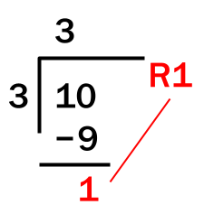

> This guide is still under development. We'll be overhauling the Introduction to Python content in the next few months. Stay tuned for more changes and better tutorials!
> 
> ~ *The Return STEM team*

Arithmetic is a fancy way of saying “math”. We use arithmetic every day!

Calculating the total amount needed to pay at a restaurant, the amount of tax or tip on an item, figuring out distance from two places - these are just some of the ways in which we use math daily.

Students of various ages use math daily – it’s a part of their curriculum. Such math may be easy to do without the help of a program. However, at times it can get repetitive. The math might just take a really long time to do by hand.

For example, imagine that you are organizing a wedding and eventually decide that four hundred guests will attend. You need to find the total cost of the food and drinks, among others, for four hundred people. A small error in one place could ruin the entire calculation. Not only that, it would take a long time. Now obviously, you might say, why don't you use a calculator?

The benefit of programming is that you can code it so that you don't even have to type all the numbers in for yourself. If the people RSVPing to a wedding did it online, you could load the data into your program and let your program do all the calculations.

# Doing Math in Python
You can do math in Python just like you would in your math class, using symbols for basic operations. For example: `a = 5 + 3` causes `8` (5 + 3) to be assigned to the variable `a`. The symbols (5 and 3) on the sides of the operator (+) are called  __operands__. Remember that basic math rules still apply. For example, python observes order of operations, and there are some operations that will cause errors, such as dividing a number by zero. 

| Python Syntax | Operation | Math Symbol | Example | Result |
| :-: | :-: | :-: | :-: | :-: |
| `+` | Addition | + | `5 + 2` | `7` |
| `-` | Subtraction | − | `6 - 4` | `2` |
| `*` | Multiplication | × | `4 * 3` | `12` |
| `/` | Division | ÷ | `8 / 4` | `2` |

## Advanced Operators

You have learned about the previous operations in a class before. However, Python has its own operations that may be less familiar that can be used for other purposes: 

### Integer Division (`//`)

Integer division, which uses the `//` operator (two slashes in a row), returns the whole number component of a division operator by two integers or floats. 

For example, `11/4` evaluates to  `2` with a remainder of `3`, or `2.75`. `11/4` instead evaluates to just `2`, since the non-whole number part is left out. 

### Modulus (`%`)
Modulus gives the  __remainder__ of a division operation between two integers (whole numbers) or floats. For example, 11 divided by 4 is 2 with a  __remainder of 3__. Therefore, `11 % 4`  __equals 3__. 



Modulus can be used for many different uses, including if a number is even or odd. 
> When a number is odd, it always has a remainder of 1 when divided by 2. If it is even, its remainder is always 0. 

A program that determines the parity of two numbers can be implemented like this: 

```python
num = int(input("Enter an integer: "))
parity = num % 2
print("The integer is odd: ", bool(parity))
```

This property of numbers will become more useful when you learn if-statements in the next lesson. 

### Exponent  (`**`)
Exponent raises the power of the left operand to the right operand.
Three raised to the fifth power equals 243. In other words, 
`3 ** 5 = 3 * 3 * 3 * 3 * 3 = 243`

Even though we use `^` in math or other forms of notation, __do not__ use the `^` operator in Python. It doesn't denote exponent, and instead represents the exclusive xor operator, which you learn more about [here](https://en.wikipedia.org/wiki/Exclusive_or)

| Python Syntax | Operation | Math Symbol | Example | Result |
| :-: | :-: | :-: | :-: | :-: |
| `//` | Integer Division | None | `13 // 4` | `3` |
| `%` | Modulus | `%` | `17 % 4` | `1` |
| `**` | Exponent | Superscript | `5 ** 2` | `25` |


## Reference Table: Arithmetic Operators

In this example, `a` has the value of 10 and `b` has the value of 20. 

| Symbol | Operator | Definition | Example |
| :-: | :-: | :-: | :-: |
| `+`  | Addition | Adds values on either side of the operator. | `a + b = 30` |
| `-`  | Subtraction | Subtracts right hand operand from left hand operand. | `a – b = -10` |
| `*`  | Multiplication | Multiplies values on either side of the operator | `a * b = 200` |
| `/` | Division | Divides left hand operand by right hand operand | `b / a = 2` |
| `%`  | Modulus | Divides left hand operand by right hand operand and returns remainder | `b % a = 0` |
| `**`  | Exponent | Performs exponential (power) calculation on operators | `a ** b = 1020` |

# Rounding floats
When casting from a float to an int, the value does not round, it  __truncates__ the decimal is just removed without any rounding. Thankfully, Python has a built-in `round()` function. Put the number you want to round inside the parenthesis. 

```python
a = int(3.8) # a is 3

b = int(3.1) # b is 3

a = round(3.8) #a is 4

b = round(3.1) #b is 3
```

# Example: Math Machine

This code asks for two numbers and prints out the result of every operation we have learned: [Math Machine](https://replit.com/@returnSTEM/MathMachine)

```python
first = input("Enter your first number: ")  # Inputs the numbers to be calculated
second = input("Enter your second number: ")

first = int(first)  # Typecast input strings to integers
second = int(second)

result = first + second  # Addition
print("Result:", first, "+", second, "=", result)  # Output Formatting

result = first - second  # Subtraction
print("Result:", first, "-", second, "=", result)  # Output Formatting

result = first * second  # Multiplication
print("Result:", first, "*", second, "=", result)  # Output Formatting

result = first / second  # Division
print("Result:", first, "/", second, "=", result)  # Output Formatting

result = first // second  # Integer Division
print("Result:", first, "//", second, "=", result)  # Output Formatting

result = first % second  # Modulus
print("Result:", first, "%", second, "=", result)  # Output Formatting

result = first**second  # Exponent
print("Result:", first, "**", second, "=", result)  # Output Formatting
```

# Order of Operations

Python has an order of operations similar to arithmetic, which you can remember with the mneumonic __P E M/D A/S__
Expressions are evaluated from left to right for each level of PEMDAS:
1. P: Items inside  __parenthesis__ will be evaluated first
2. E:  __Exponents__  will then be evaluated
3. MD: Multiplication, division,  __modulus, integer division__  all have the same priority
4. AS: Finally, addition and subtraction is evaluated
## Example
Evaluate `3 * 5 ** 2 + (4 + 3 - 2) // 3 % 4`
1. First, we evaluate parenthesis: `(4 + 3 - 2)`
    * Addition and subtraction is on the same level, so evaluate left to right
      * `4 + 3 = 7`, `7 - 2 = 5`
2. `3 * 5 ** 2 + 5 // 3 % 4`
    * Exponent: `5 ** 2 = 52 = 25`
3. `3 * 25 + 5 // 3 % 4`
    * Multiplication, division, modulus, integer division
      * Multiplication, integer division, modulus are on the same level, so evaluate left to right
      * `3 * 25 = 75`
        * `75 + 5 // 3 % 4`
      * `5 // 3 = 1`
        * `75 + 1 % 4`
      * `1 % 4 = 1`
        * `75 + 1`
4. `75 + 1`
    * Addition: `75 + 1 = 76`

## Let’s Practice

Evaluate each of the python expressions:

1. `1 + 2 * 3 / 4.0`
2. `2 ** 8`
3. `1000 % 365`
4. `80 % 400`
5. `480 % 400.0`
6. `880 % 400`
7. `8 * 6 - 7 ** 2`

# Equation Building

You can use variables as operands, as well as in conjunction with numbers (Python will just evaluate the variable as its value). This is useful when writing programs where you need to:
  * Take input from a user (the variable value will need to change)
  * Use longer numbers (using a variable called pi is much shorter than typing out  3.141592653589793 every time you want to use it)

This makes code more readable/understandable
  * Using a specific name for a value is useful(especially when others read your code)
  * Better to use a variable instead of the number each time it is used
  * This is helps keep track of many different values when you are working with math
```python
a = 4

b = 5

c = a ** b  # Store the value that is

# equal to 4 ** 5 in c

print(c)

>>> 1024
```

```python
a = 4       # Assign 4 to a
b = 5       # Assign 5 to b

c = a + b   # Store the sum of a and b in c

print(c)
>>> 9
```

# Modules

To reduce the size of Python, some of Python's features are divided into many parts that can be included as needed, called modules. Python has many __modules__ , portions of pre-written code that we can use in our programs. Each module contains code for a specific purpose. These modules can save time by doing a lot of the work for us
To use them, modules can be __imported__ , or brought into our project for our use.

One important module is called `math`, which you can use for float operations and other functions. To import a module, we use the keyword `import`. Modules can be thought of as a subscription for an app. To use certain features you need to purchase a subscription or in this case import the module Other modules include: `datetime`(working with dates/times), `random`, etc.

To use the `math` module in your programs, include the import statement at the top of the program:

```python
import math

rest_of_program()
```
Generally, we write import statements at the top of our code. This is so that we can get all the tools we need to write the program. If you have multiple modules to import, you can write it like this:

```python
import module1
import module2
import module3 
...
import modulen
```

## Float operations

Floats can be converted to integers by always rounding up or always rounding down. 

For example:
  * If you have enough batter for 4.65 cookies, you can only practically make 4 whole cookies (always round down, "floor" function)
  * If you have to transport 10 people and each car only holds 4 people, you will need 3 cars, not 2.5 (always round up, "ceiling" function)
  * To do this, we need the  __math__  module, which can be imported using this statement at the top of your file:
    * `import math`
  * From there, you can use `math.floor()` (down) and `math.ceil() (up)`

```python
import math

math.floor(5.9) → 5

math.floor(2.1) → 2

math.ceil(3.3) → 4

math.ceil(8.999) → 9
```

## The `math` Module

`math` also contains some other useful functions and variables: 

* `math.sqrt(x)`
  * returns the square root of the integer/float x as a float
* `math.fabs(x)`
  * returns the absolute value of x
* `math.factorial(x)`
  * returns the factorial of x, if x is not an integer or is negative, raises an error
* `math.gcd(x,y)`
  * Returns the greatest common divisor of x and y, if either is not an integer, raises an error
* `math.pi`
  * Evaluates to the digits of pi
* `math.e`
  * Evaluates to the digits of e (it's ok if you don't know this number, you'll learn it later in math class)
* For constants in Python, don't add parentheses ()

```
import math

math.sqrt(4)
>>> 2.0

math.sqrt(-4)
>>> ValueError

math.fabs(2)
>>> 2.0

math.fabs(-2)
>>> 2.0

math.factorial(7)
>>> 5040

math.factorial(6.3)
>>> ValueError

math.sqrt(3)
>>> 1.7320508075688772

math.gcd(75, 35)
>>> 5

math.pi
>>> 3.141592653589793

math.e
>>> 2.718281828459045
```


[List of Math Functions in Python](https://docs.python.org/3/library/math.html)

## The `random` Module

The `random` module is used to generate random data. You can use `random` to generate random numbers, as the name implies. We use random numbers for many purposes. `random` can be used for many differnet purposes, from a simple roll of a dice to terrain generation in video games. 

* `random.random()`
  * Returns a random  __float__  between 0 and 1
* `random.uniform(x , y)`
  * Returns a random  __float __ in the range x - y
* `random.randint(x , y)`
  * Returns a random  __integer __ in the range x - y
* The `random` module can also be used to work with lists, which you will learn about later

```
import random

random.random()
>> 0.15074098317978457

random.uniform(1,5)
>>> 2.8951547807157176

random.randint(1,5)
>>> 4
```
Let's say you want to write a program to represent the rolling of a dice:
```python
import random

dice = random.randint(1, 6)
print("The value is:", dice)
```

# The `datetime` Module

The `datetime` module is used to work with dates/times. You can use `import datetime` at the top to use the module
* `y=datetime.date(year, month, date)` allows you to make the variable a certain date
* `datetime.date.today()`
  * Returns the local date in the form year-month-date
* If a certain date is assigned to the variable `x`
  * `x.year` returns the year
  * `x.day` returns the day
  * `x.month` returns the month
  * `x.weekday()` returns the day of the week where Monday is 0 and Sunday is 6

TO find the number of days until another date, you can subtract them, shown in the program below: 

```python
#Program to find days until Christmas

import datetime

y = datetime.date(2021,12,25)

x = datetime.date.today()

print(y - x)
```

# Compound Assignment Operators

In Python, you can add two values and then assign it to the left operand

This is done using the operator used, followed by a `=`.

| Using =  | Shortcut |
| :-: | :-: |
| `a = a + b` | `a += b` |
| `a = a - b` | `a -= b` |
| `a = a / b` | `a /= b` |
| `a = a // b` | `a //= b` |
| `a = a * b` | `a *= b` |
| `a = a % b` | `a %= b` |
| `a = a ** b`  | `a **= b` |

# Basic Operations Practice

_Write the following short programs_

Write a program that takes a temperature in Fahrenheit from the console, which it then converts into Celsius.

_Formula:_   (F - 32) * 5 / 9 = C

Write a program a calculates the area of a rectangle given the length and width _Formula:_  A = l * w

**CHALLENGE: Write a program converts seconds to Hours:Minutes:Seconds format.** 

>  _Tip:_ You can use // to do integer division and % find the remainders after you have divided

## Test Cases

| Test Cases for Problem 1  |  |
| :-: | :-: |
| Input | Output |
| 32 | 32 degrees Fahrenheit is 0.0 degrees Celsius. |
| 68 | 68 degrees Fahrenheit is 20.0 degrees Celsius. |
| 130.1 | 130.1 degrees Fahrenheit is 54.5 degrees Celsius. |
| 5 | 5 degrees Fahrenheit is -15.0 degrees Celsius. |


| Test Cases for Problem 2 |  |
| :-: | :-: |
| Input | Output |
| 2<br />3 | The area is 6 meters squared. |
| 23<br />12.5 | The area is 287.5 meters squared. |
| 100<br />23.2 | The area is 2320 meters squared. |
| 55<br />21 | The area is 1155 meters squared. |


| Test Cases for Problem 3 |  |
| :-: | :-: |
| Input | Output |
| 1432 | 0:23:52 |
| 61942 | 17:12:22 |
| 1500 | 0:25:0 |
| 72591 | 20:9:51 |

# Vocabulary

| Word | Definition |
| :-: | :-: |
| Order of Operations | The precedence of various operations in Python. It determines what steps are done first. |
| Arithmetic Operators | Operators that perform mathematical actions on operands |
| Operand | Symbols (variables/numbers) that operators perform actions on |
| Modules | portions of pre-written code that we can use in our programs |
| math | A module which has a large number of mathematical functions that can be imported |

# Python Concepts

| Word | Definition |
| :-: | :-: |
| Integer Division (`//`) | Gives the whole number result of a division operation between two integers (whole numbers) |
| Modulus (`%`) | Gives the remainder of a division operation between two integers (whole numbers) |
| Exponent (`**`) | Raises the left operand to the power of the right operand |
| import | Allows programmers to add, or import, modules in their code |
| `math.floor()` | rounds floats down |
| `math.ceil()` | rounds floats up |
| `math.sqrt(x)` | returns the square root of the integer/float x as a float |
| `math.fabs(x)` | returns the absolute value of x<br /> |
| `math.factorial()` | returns the factorial of x, if x is not an integer or is negative, raises an error |
| `math.gcd(x,y)` | Returns the greatest common divisor of x and y, if either is not an integer, raises an error |
| `math.pi` | Evaluated to the digits of pi |
| `math.e` | Evaluates to the digits of e<br /> |
| `random.random()` | returns a random float between 0 and 1 |
| `random.uniform(x, y)` | returns a random float in the range x - y |
| `random.randint(x, y)` | returns the factorial of x, if x is not an integer or is negative, raises an error |
| `y=datetime.date(year, month, date)` | assigns a date to the variable y |
| `datetime.date.today()`| returns the local date |

