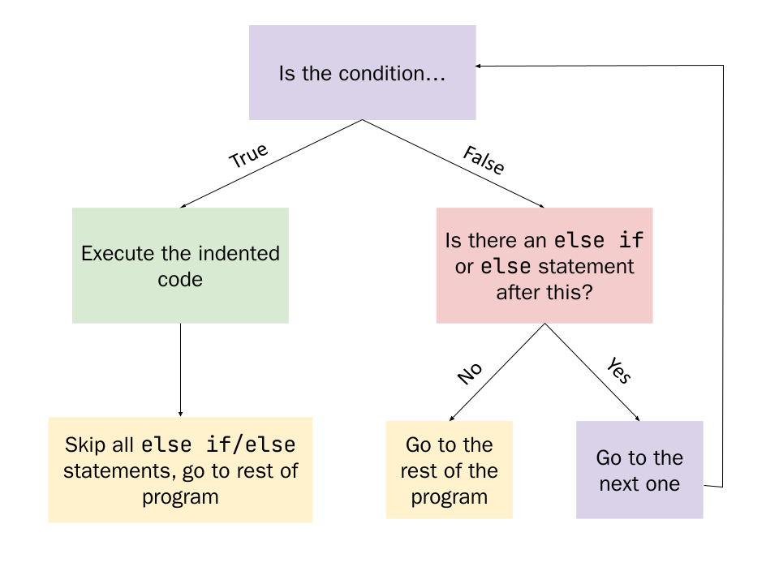

> This guide is still under development. We'll be overhauling the Introduction to Python content in the next few months. Stay tuned for more changes and better tutorials!
> 
> ~ *The Return STEM team*


Up until now, you have made linear programs - the way it runs is straightforward, but it might change based on user input. 
Control structures change that up a bit. This lesson, we'll be showing you how to write programs that decide what code to run. This is called the control flow of the program, or which "path" the program takes. Think of it like a fork in the road–you decide to either go right or left. 

Let's say that you wanted to write a program that, given a fahrenheit temperature reading from a thermometer, tells the user whether the patient has a healthy body temperature or not. 
You already know how to take input from a user, and then assign it to a variable. You also have learned how to print out information for the user to see through the console. Now, you will learn the conditional, which makes the program change what it does, based on the user input. Python implements this with the `if` statement. 

# How do computers make decisions?

Computers make decisions a little differently from humans. When I choose what I'll eat for lunch, I need to ask myself a few questions: What do I want? How much am I willing to spend? How convenient is it for me to get it? All these questions have an infinite number of answers. 

However, Computers operate on an on-or-off basis; each question can only have two answers: `True` or `False`. These values are known as _booleans_. For example, a boolean could represent whether it's the weekend or not: If the day is saturday or sunday, it will evaluate to `True`, because the day is in the weekend. However, if it is any other day, it will evaluate to `False`. 

Can you think of any other values that could be represented by a boolean?

# Relational Operators

Relational operators compare two pieces of data and evaluate to a boolean type–exactly what we're looking for! For simplicity's sake, we will only use relational operators on numbers for now, so we will be comparing the values of numbers. You might recognize some of these from math, they work the same way:

| **Relation**             | **Operator** |
|--------------------------|--------------|
| Equal to                 | `==`       |
| Not equal to             | `!=`       |
| Less than                | `<`       |
| Greater than             | `>`       |
| Less than or equal to    | `<=`      |
| Greater than or equal to | `>=`      |

To use these, we'll have to place two `operands`, what the operation is performed with, on either side. These work a lot like the arithmetic operators from last lesson. Just as 4 + 5 equals 9, 3 < 4 equals `true`. Here are some examples. Pay attention to what questions they ask and what they evaluate to.

| Code     | Asks this question…                             | Which evaluates to… |
|----------|-------------------------------------------------|---------------------|
| 2 == 3   | Is 2 equal to 3? No.                            | `False`           |
| 3 != 5   | Is 3 not equal to 5? Yes.                       | `True`            |
| 4 < 5   | Is 4 less than 5? Yes.                          | `True`            |
| 10 > 12 | Is 10 greater than 12? No.                      | `False`           |
| 3 <= 3  | Is 3 less than 3 or equal to 3? Yes, equal.     | `True`            |
| 4 >= 5  | Is 4 greater than 5 or equal to 5? No, neither. | `False`           |

Alright, now we have a boolean answer to a question. How do we use it?


## Relational Operators Practice
Evaluate each of the Python expressions:

1. `5 == "5"
2. `3 != 5 - 2`
3. `5.0 == 5`
4. `True == "True"`
5. `False == "False"`
6. `5 > 3``
7. `8 <= 8`

Try evaluating these statements with Python afterwards.

```python
print(1 > 2)

>>> False
```

# The `if` statement

The if statement is structured like this:
```python
if (condition):   
	do this
```

When the condition is `True`, the statements under the indent are executed.

If it is `False`, the statements under the indent are ignored. 

We can tell the user whether they have a fever or not: 

```python
temperature = input("What is your temperature?")
if (temperature > 100): 
	print("You have a fever")
```
If the user's temperature is above 100, the program will print `You have a fever`. If the user's temperature is not, it won't print anything. 



The condition does not need to be surrounded in parenthesis, but it can be.

```python
if (a < b):
	statement()

if a < b:
	statement()
```
Are equally valid statements, but the second (omitting parenthesis) may be more aesthetically pleasing. 

# Indents in Python
When writing programs in Python, you’ll notice that some lines of code are  _indented_ .

```python
num = int(input())
if (condition):
	do this # Indented
```
Indented lines are used to tell python which lines are part of the if statement and should be executed, like this:

```python
condition = True

if (condition):    
	print(“Part of the if statement”)    
	print(“Also part of the if statement”)
	a = 3 + 5 * 4 # Also part of the if statement
print(“This is outside the indent, so it is not part of the if statement.”)
# Statements after the indent are always executed.
```

# Solving the problem

Let's solve the problem at the start, but this time using `if` statements. 

We can see that we need user input, so we need to first store an input inside of a variable, then cast it into a float.

```python 
body_temp = float(input())
```

We want `body_temp` to be a `float` because temperatures are usually stored to higher precision than just whole numbers. Differences between this can be a big deal. 

Next, we need to check if the number is greater than 100. We can use an `if` statement for this. 

```python
body_temp = float(input())
if body_temp > 100:    
	print(“Not Healthy”)`
```

How can we modify the code so that it prints `Healthy` if the body temperature is not greater than 100?

# Logical Operators

Operators that deal with boolean values are called  __logical operators__.

There are three basic logical operators:

| Operator | Definition | Example |
| :-: | :-: | :-: |
| `and` | If both the operands are true then condition becomes true. | True and True → True |
| `or` | If any of the two operands are non-zero then condition becomes true. | True or False → True |
| `not` | Used to reverse the logical state of its operand. | not (True or False) → False |

Logical operators also have an order of precedence:
1. `not`
2. `and`
3. `or`

## The `and` Operator

The “`and`” operator can return either `True` or `False`.

It returns `True` if both of its operands are `True`, and `False` if any one of its operands are `False`. 

You can think of it this way:
I want you to give me an apple and a banana.
- I would not be satisfied with just an apple and no banana `False`
- I would not be satisfied with just a banana and no apple `False`
- I would also not be satisfied with neither `False`
- You need to give me  _both_  conditions, for me to be satisfied. `True`

```Python
a = 4
b = 5

(a == 4) and (b == 5)
>>> True

(a == 3) and (b == 5)
>>> False

(a == 4) and (b == 4)
>>> False
```

In the first statement, `a == 4` and `b == 5`, so it is `True`. 

However, for the next statement, `a` does not equal `3`, so it is `False`.

In the last statement, even though `a == 4`, `b` does not equal `4`, so it is also `False`.

When none of the conditions are met, `and` still returns `False`. 

## The `or` Operator

If I wanted an apple  _or_ a banana, I would be fine with you giving me either, or both:	 
- If I gave you neither an apple or a banana, it would return `False`.
- If I gave you either an apple or a banana, it would return `True`. 
- If I gave you both an apple and a banan, it would also return `True`. 

```Python
a = 4
b = 5

(a == 4) or (b == 5)
>>> True

(a == 3) or (b == 5)
>>> True

(a == 3) or (b == 4)
>>> False
```

## The `not` Operator

The `not` reverses the value:

`not True` → `False`
`not False` → `True`

```
a = 4

b = 5

not ((a == 4) or (b == 5))
> False

(a == 4) and (not(b == 6))
> True

```
In the first example, `a == 4 or b == 5` is `True`, but `not True` is `False`. 

Next, `b == 6` is `False`, but `not False` is `True`. `a == 4 and True` is `True`. 

# Conditionals with Strings

We can use both numbers and strings in our conditionals.

When two strings are **exactly the same**, Python considers them equal (`==`).

```
a = “hello world”
b = “HELLO WORLD”

print(a == b)
>>> False

print(a == “hello world”)
>>> True

print(a != b)
>>> True
```

## Let’s Practice

Evaluate if the expression is True or False:

> Remember: The order of precedence is parenthesis > `not` > `and` > `or`

1. `True and True or False`

2. `(5 != 0) or (0 != 0)`

3. `not (27/3 + 3 == 3*2*4/2)`

4. `False or False and True`

5. `not (25/(13+12) != 1) and True`

## Try it yourself

Write a program which asks the user two integers: the length and width of a rectangle. The program then tells the user whether the rectangle is a square or not.

Example output:

```
length: 10
width: 20
>>> not a square
```

```
length: 25
width: 25
>>> Square
```

```
length: 0
width: -10
>>> Not a square
```

# Else and Else If Statements

Sometimes, we want to make more complex logic. For example, in the first program we wrote, we determine whether the user had a healthy temperature, by warning them when the temperature is unhealthy. However, we can also make it tell the user if they *are* healthy. 

We can do this with `else`. 

You can use an `else` statement for anything that does not satisfy all preceding conditions.

```python
if (A):
# Do this if A is True
else:
# Do this if everything else is False
```
For example, we can write a more complex program like this:

```python
temperature = float(input("What is your temperature? ))
if temperature > 100:
	print("You have a fever!")
else:
	print("Your temperature is healthy!")
```

Else if statements come after if statements and use the `elif` keyword.

```
if (A):    
# Do this if A is True
elif (B):
# Do this if A is False, but B is True


elif (C):    # Do this if A and B is False, but C is True
```
Essentially, Python checks for all of the `elif` statements one by one. If one of them ends up being `True`, Python stops checking them and moves on to the next block of code that is not part of the `if` statement. 

## Try it yourself

Write a program that accepts passwords from the user, and tells the user whether the password matches with the one stored inside.

> **Important: Don't put any of your actual passwords, repl projects are public!**

Ex. if my password is the string `"EggsAndSpam123"`:

```
Enter a password: Hello World 
>>> Not correct

Enter a password: SpamAndEggs
>>> Not correct

Enter a password: eggsandspam123
>>> Not correct

Enter a password: EggsAndSpam123
>>> Correct
```

# Nested `if` statements

You can write `if` statements inside of other `if` statements.

This is called a **nested `if`**


```python
if (a):
	# a is True
	if (b):
		# b is True	
	else:		
		# b is False
else:	
	# a is False
```

First, the program checks for the condition in the outside `if`.
if `a` is `True`, it will execute the code inside the `if`. This causes it to look inside the inner `if`. However, if `a` is `False`, it will skip the inside and never check if `b` is `True`.

## Try it yourself

Write a program to test if a given year is a leap year or not.

A leap year is defined under the following conditions:
- The year is divisible by 4
- However, if the year is a century year (1800, 1900, 2000), it must be divisible by 400 to be considered a leap year
	- Hint: You can use `%` to check whether a number is divisible by another

```
Enter a year: 1900
>>> not a leap year

Enter a year: 2000 
>>> leap year

Enter a year: 2016
>>> leap year

Enter a year: 2021
>>> not a leap year
```

# What can we make?

Now that you’ve learned conditionals, you can do many more useful things with programming. One of them could be a simple 4 function calculator.

You can look at the repl.it [here](https://replit.com/@liuj05/5-Conditionals-Programming) as an example.

Using the code provided in this repl, make modifications to it:

1. Add the modulus function to this calculator
2. Add the power function (exponent) to this calculator
3. Change it so that it can accept floats as its input

# Python Concepts

| Word | Definition |
| :-: | :-: |
| if (condition1): | Executes the statements after it which are indented if condition1 is True. |
| elif (condition2): | Executes the statements after it which are indented if condition2 is True, and everything before it is False. |
| else: | Executes the statements after it which are indented if everything before it is False |
| and | True if both sides are True |
| or | True if either sides are True |
| not | True if it is False, but False if it is True |

# Vocabulary

| Word | Definition |
| :-: | :-: |
| Nested If  | An if-else statement structured inside of another if-else statement. |
