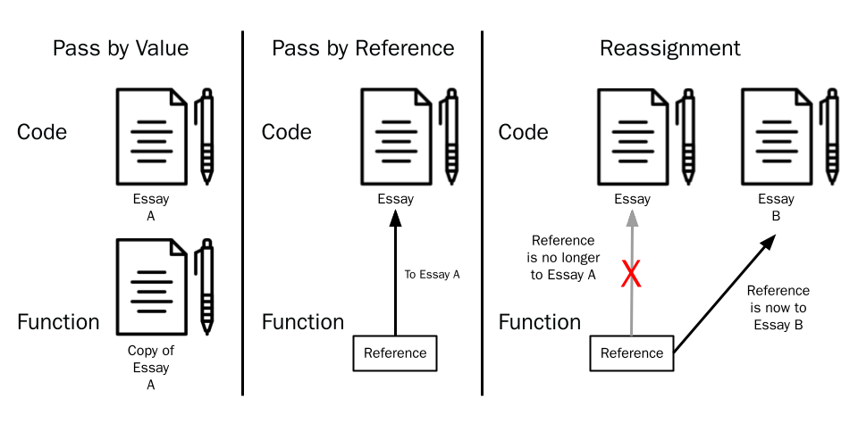
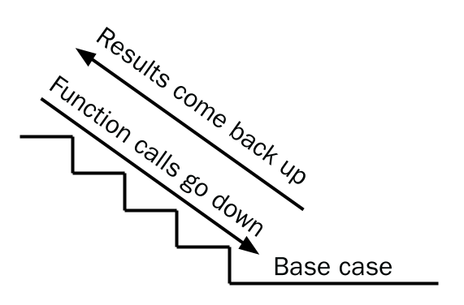
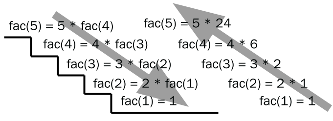

You've already used functions in the past. One of their biggest advantages is reusability - you can use functions to sort lists (`sort`), round numbers (`round`), and more. You can use it as many times as you want, and you'll never need to write your own sort function again. Furthermore, functions are useful because you don't need to know the exact algorithm something is designed in, you just need to know how to use the function. You don't need to know how to sort to use `sort`, only how to use the `sort` function. 

In this lesson, you will learn how to write your own functions.

# Style

The **style** of a program is how it looks. This affects the code's readability. Code should be easy to read and look good so it's easier to expand and improve in the future.

Look at the programs below: which one looks easier to read?
```python
# Example 1
MyVeryLongVariableName = 0
while True:
    if not MyVeryLongVariableName < 5: break
    MyVeryLongVariableName += 1; print(“hello”); 
print(“world”)
```
```python
# Example 2
i = 0
while i < 5:
    i += 1
    print(“hello”)
print(“world”)
```

Despite producing the same output, the code in `Example 1`looks less complicated and therefore easier to read

```python
Output:
>>> hello
>>> hello
>>> hello
>>> hello
>>> hello
>>> world
```

Most programming languages come with **style guides** that tell you how to format your code.

> The style guide for Python is called **PEP-8**, and you can access it [here](https://peps.python.org/pep-0008/)
> 
> PEP-8 goes into very fine details about Python--don't worry if you can't understand all of it yet!

Readable code is important for other people to know what your code does

# What are functions?

All programs are basically just sets of instructions that process some inputs, and then return outputs back to you. Functions are like mini-programs: they receive input, do operations on them, and then output something. You have already used many functions, such as  `print`, `input`, and `len`. These functions we have been using are actually very complex pieces of code.

You can define a function like this: 

```python
def function_name(parameter1, parameter2, parameter3):
```
If the function takes no parameters, there will be nothing in the parenthesis. It's necessary that you specify the name of the function, since you'll need it to call the function later to use. 

<details>
<summary> 
Practice: Which function is declared correctly?
	
1. `def add two numbers():`
2. `def add_two_numbers():`
3. `def add_two_numbers:`
4. `def add_two_numbers()`
	
</summary>
Answer: 2 is declared correctly. (1) has spaces between each word of the name, which is not allowed. (3) has no parenthesis. You must include parenthesis for the function, even if there are no parameters. (4) has no colon. 
</details>

Let's write a simple function that adds two numbers:
```python
def add_two_nums(a, b):
    sum = a + b
    return sum
```

The `def` keyword defines the functions. `add_two_nums` has two parameters, a and b. When the function is run, a and b will be specified based on order, so the function knows which one is which. The `return` keyword specifies what the function should give back to us (return to us). 

For example,
```
print(add_two_nums(4, 5))
```
Displays 9 on the screen, since 4 + 5 = 9. 
However, you won't always need to define a variable like `sum` to return. Instead, you can also put expressions in your `return` statement:

```python
def add_two_nums(a, b):
    return a + b
```
Which shortens the process. 

## Naming Functions

Just like variables, functions should be named according to their purpose. A function that finds the prime numbers in a list might be called `find_primes`. Remember to keep your function names reasonably short. They should make sense to use. Additionally, you should follow the same naming conventions as variables.

Come up with names for the functions below:

1. A function, which, given a number, finds whether the number is prime or not
2. A function, which, given a number, finds the factorial of that number
3. A function that accepts someone's name as a parameter, and then greets that person.
4. A function that sorts a given list
5. A function that adds one to every value in a list

# Calling functions

After declaring the function, you can write any code that will be run when the function is **called**. All code inside a function should be indented--this signifies that the code is inside the function, just like with `if` blocks.

Now you can run the code inside the function by **calling it.** To call a function, put its name followed by a set of parenthesis. When you call a function, Python will jump to where the function is defined and execute the code that is part of the function

```python
def my_function():
    print("I am inside my_function")
my_function()

>>> I am inside my_function
```

You can call a function multiple times. Your function can have any amount of any valid Python code. This means that your function can have:
- Loops
- Conditionals
- Functions (including itself)
- Anything else

```python
def count_to_5_evens():
    for i in range(0, 5):
        if i % 2 == 0:
            print(i)
print("First time")
count_to_5_evens()
print("Second time")
count_to_5_evens()

>>> First time
>>> 0
>>> 2
>>> 4
>>> Second time
>>> 0
>>> 2
>>> 4
```

# Function parameters

Functions can also have **parameters** (input for the function). When you give them values, they are called **arguments**. Parameters give functions more specific instructions or tell it to calculate with certain values with parameters. Parameters are defined by including them inside of the parenthesis:

```python
def count_to_n_by_m(n, m):
	# We can use n and m as parameters inside our function
```

> Parameters are like placeholders for the values that you will pass to the function, while arguments are the values actually passed to the function.

```python
def add_two_nums(a, b): # Parameters
    return a + b

add_two_nums(4, 5) # Arguments
```

Python differentiates the arguments you give it by the order. The first value you give it will be `n` and the second value you give it will be `m`:

```python
def count_to_n_by_m(n, m):
    for i in range(0, n + 1, m):
        print(i)

# Count to 2 by 4
count_to_n_by_m(2, 4)
>>> 0

# Count to 4 by 2
count_to_n_by_m(4, 2)
>>> 0
>>> 2
>>> 4
```

Giving too little or too many parameters returns an error:

```python
def count_to_n_by_m(n, m):
    for i in range(0, n + 1, m):
        print(i)

count_to_n_by_m(3, 3, 5) # Error, what to do with 5?
>>> TypeError: count_to_n_by_m() takes 2 positional arguments but 3 were given

count_to_n_by_m(1) # Error, what would m be then?
 >>> TypeError: count_to_n_by_m() missing 1 required positional argument: 'm'
```

## Optional Parameters

Functions can have optional parameters, which you can specify when declaring the function. Optional parameters don't need to have an order, so an example like this is acceptable:

```python
def greet_me(name, times = 1, greeting = "Good Morning"):
    for i in range(0, times):
        print(f"{greeting}, {name}!"
greet_me("Sam", greeting = "Hello") # times still defaults to 1
>>> Hello, Sam!
```

Always put arguments which are positional in front of those which are non-positional (optional) arguments:

```python
greet_me("Sam", greeting = "Hello", times = 2) # This will work
>>> Hello, Sam!
>>> Hello, Sam!

greet_me(greeting = "Hello", "Sam", times = 2) # This will not
>>> SyntaxError: positional argument follows keyword argument
```

# Return values
A function can also give back (return) a value. The `input` function is an example of a function that returns a string. We can then assign that returned value to a variable or give it to another function as an argument.

We can make a function return a value using the `return` keyword at the bottom of our function:

```python
def add_two(num):
    return num + 2 # returns a number 2 above num
x = add_two(5)
print(x)

>>> 7
```

## Pass by Value
Integers, floats, booleans, and strings are **primitive data types** in Python. When one of these are passed to a function, the function gets a **copy** of what is passed in. This means if we change the copy, those changes **will not affect** the original variable we gave it:

```python
# doesn't work since the function only got a copy
def double(num):
num *= 2
num = 10
double(num)
print(num)

>>> 10 # does not alter the original variable
```

If we wanted to change that variable, we could reassign it:

```python
# return the value, then reassign
def double(num):
return num * 2
num = 10
num = double(num)
print(num)

>>> 20 # Alters the original variable

```

## Pass by Reference

Non-primitive data types (everything else, like lists) are **passed by reference**. This means that the function receives a reference to the data we pass in. If we change (mutate) the argument, those changes **will affect** the original variable.

```python
# Pass by Reference - Mutating
def mutate(value):
    value[0] = "new data"
my_val = ["test", "test", "test"]
mutate(my_val)
print(my_val)
>>> ["new data", "test", "test"] 
```

However, if the argument is **reassigned** inside of the function, that reassignment is not carried over to the original variable we pass in.

```python
# Pass by Reference - Reassignment
def reassign(value):
    value = ["new data", "more data"]
my_val = ["test", "test", "test"]
reassign(my_val)
print(my_val)
>>> ["test", "test", "test"]
```

## An analogy

Imagine that you're working on an essay with your friend. You already wrote some of it, and you want to give it to your friend for him to work on it.

I can give him a copy of my essay (pass by value). However, I wouldn't see any of the changes he makes unless he gives his edited copy back to me.

I can also tell him to read it and come to me (in room 104) whenever he wants to make a change (pass by reference). Any change he wants to make is immediately applied to the original copy of the essay. 

> However, if he decides to go to some other classroom (room 105), my essay would not be changed because I would not know what to change (he told someone else, and not me)



# Using Functions in your Code
Aside from very simple programs with few lines, it is almost always useful to use functions in your program. Functions should be made to do specific tasks that can be reusable, and should be named accordingly with appropriate names.

Example: A function which triples a number should be called `triple_number` and not `my_func`

For example, let’s say that I define a function that can sort a list of integers:

```python
def sort(arr):
    for i in range(1, len(arr)):
        key = arr[i]
        j = i - 1
        while j >= 0 and key < arr[j]:
            arr[j+1] = arr[j]
            j -= 1
        arr[j+1] = key
```

If we didn't use functions, sorting two lists would look like this. Notice how much code we have to repeat here:

```python
 for i in range(1, len(some_list)):
		 key = some_list[i]
		 j = i - 1
		 while j >= 0 and key < some_list[j]:
			   some_list[j+1] = some_list[j]
			   j -= 1
		 some_list[j+1] = key

 for i in range(1, len(another_list)):
		key = another_list[i]
		j = i - 1
		while j >= 0 and key < another_list[j]:
			  another_list[j+1] = another_list[j]
			  j -= 1
		another_list[j+1] = key
```

Conversely, we could use functions, which gets rid of a lot of repeated code and makes our code shorter overall:

```python
 def sort(arr):
	for i in range(1, len(arr)):
		key = arr[i]
		j = i - 1
		while j >= 0 and key < arr[j]:
			arr[j+1] = arr[j]
			j -= 1
		arr[j+1] = key
 sort(some_list)
 sort(another_list)
```

# Recursion
A **recursive function** is a function that **calls itself**. When a recursive function runs, it will call itself multiple times until a "base case" is reached. The base case doesn't have a recursive call and gives a definite value.

Think of a recursive function like a flight of stairs: 

1. You will go down the flight of stairs until you reach the floor
2. After that, you will go back up, collecting each result using information from the previous step
3. Each time a recursive function calls itself, we go down a step
4. After that, we use the result we find at the bottom to evaluate each function until we reach the top again



## Example
We can use recursion to solve the **factorial**. A factorial is defined like this:
> For a number n, the factorial n is multiplied by every whole number less than n.

Factorials are represented by a !

> 5! = 5 * 4 * 3 * 2 * 1
> 
> 7! = 7 * 6 * 5 * 4 * 3 * 2 * 1

To find the factorial of 5 (5!), we need to
  1. Evaluate `5 * 4 * 3 * 2 * 1`
  2. Evaluate `4 * 3 * 2 * 1`
  3. Evaluate `3 * 2 * 1`
  4. Evaluate `2 * 1`

This can be done with recursion:

```python
fac(5) = 5 * fac(4) # Evaluate fac(4)
fac(4) = 4 * fac(3) # Evaluate fac(3)
fac(3) = 3 * fac(2) # Evaluate fac(2)
fac(2) = 2 * fac(1) # Evaluate fac(1)
fac(1) = 1          # Base case evaluates to 1
```




# Practical Application: Date Converter
The following function returns the index that corresponds with the day of the week.

> This example uses a dictionary, a data structure you haven't learned yet. It looks up the number based on the key (`"Sun"`, `"Mon"`, etc.), instead of a number (like lists do). 


```python
 def day_to_index(day):
    translate = {
        "Sun": 0,
        "Mon": 1,
        "Tue": 2,
        "Wed": 3,
        "Thu": 4,
        "Fri": 5,
        "Sat": 6
    }
    return translate[day]
 meet_links = [link0, link1, link2, link3, link4, link5, link6]
 x = input(“What day of the week is it?”)
 print(meet_links[day_to_index(x)])
 
 >>> What day of the week is it? Fri
 >>> link5
```

# Vocabulary
| Word | Definition |
| :-: | :-: |
| Function | Pieces of code that can be called from other parts of the code |
| Abstraction | Hiding away unnecessary details and the inner workings of the code |
| Parameters | Names listed in the function definition:<br />def function(p) |
| Arguments | The actual values that are passed into a function<br />def function(p) → function(5) |
| Recursion | A programming technique that involves functions that call themselves |
| Pass by Value | When you make a copy in the memory of the value of the passed argument |
# Python Concepts
| Syntax | Definition |
| :-: | :-: |
| `def` | Used to define a function<br /> |
| `return` | Allows values to be returned from a function |

