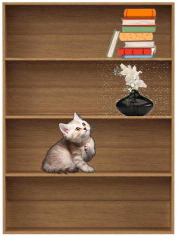
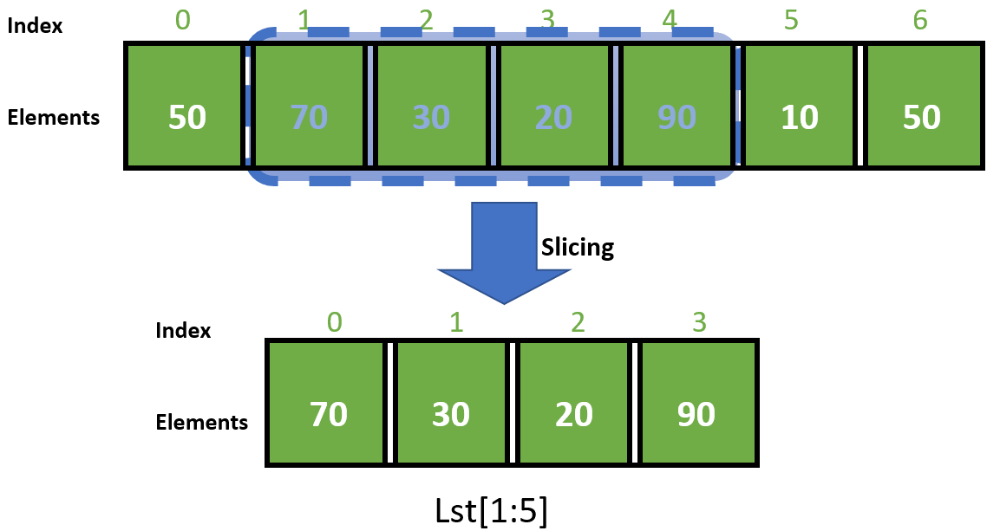

In past lessons, you learned about different data types and how to manipulate them. Now you will learn one of the most commonly used structures in Python, the list. Lists are useful ways to store collections of data, and will help you write algorithms and other complex programs. 

If you have studied another language in the past, Python lists are similar to arrays. 

# What are lists?


A list is simply an ordered collection of items (that we call **elements**). You've already learned what these items can be: 
- Integers/floats/booleans
- Strings
- Other data types

You can think of lists like a shelf. Shelves can contain different types of items - like books or other ornaments. You put the books there to organize them, and it makes tasks like finding a certain book much easier (compared to if you were to search through every room in your house). 



A list is just a way for us to organize data, especially when they are related. Imagine you are writing a program to record the grades that each student gets in a school. You could represent each grade as a float, and put all those grades into a list to store them together. 

When data is organized like this, it is clear and concise. Additionally, we can do the same task on each element of the list, such as finding the average value of each number in the list, or others. 

# Syntax

Lists are declared like variables, but use square brackets `[]` to enclose whatever is inside them:

```python
list1 = ["cat", "dog", "cow"]
# assigns the strings cat, dog, and cow to list1.
```

Each element is separated by a comma `,`. For example, this is a list of all the integers from 0 - 9:
```python
numbers = [0, 1, 2, 3, 4, 5, 6, 7, 8, 9]
```
But a list can be any data type, for example booleans. If you wanted a list to represent the days that somebody works out in a week, you could make a list with 7 elements, with each element being `True` or `False`, representing whether somebody worked out or not:
```python
days = [True, False, False, True, True, False, False]
```
In the future, you will learn other more complex data types like classes and other data structures. These can also reside inside lists. 

# Why Use Lists?

This program represents some information about a student John in some school:

```python
name = "John"
grade = 8
scores = [98.0, 93.0, 87.5, 100.0]
attendance = [True, False, True, True, True]
```

Instead of writing out attendance as individual variables, we can just include it as a list. 

But there's another advantage to this: tt becomes much easier to find John’s average score, or find how many days he has missed class.
In fact, most functions that work on groups of data in Python will ask for list input. 

# Indices
Each item in the list has an **index** that describes its position in the list. This is similar to someone's position in line--if you're first in line, you are at the front of the line.

However, in programming, the **first element in the list has the index 0**, not at 1. 

> This is called **zero-indexing**, where zero is the first value of a sequence of numbers (count starting from zero)

```python
my_list = ['a', 'b', 'c', 'd']
#           ^    ^    ^    ^
#           0    1    2    3
```

You can access the element at index _n_ like this:
```python
my_list[n]
```
Which finds the element with index `n` in the list. For example, if
```python
my_list = ['a', 'b', 'c', 'd']
```
then
`my_list[0]` would be `'a'`, `my_list[1]` would be `'b'`, `my_list[2]` would be `'c'`, and `my_list[3]` would be `'d'`.


## Negative indices

Positive indices reference elements from *left to right*. But, you can also index from the opposite side, using negative indices. 

Negative indices start from the opposite side, from right to left.

```python
my_list = ['a', 'b', 'c', 'd']
#           ^    ^    ^    ^
#           -4    -3    -2   -1
```
In this example,
`my_list[-1]` is `'d'`, while `my_list[-2]` is `'c'`. 

You can use negative indices to find the last element of a list, or the second to last element, etc. 

However, you will eventually learn ways to do this even without using negative indices. 

# Getting and Setting Elements
You know that you can access elements of a list by using index operator `[]`. You can not only get values from them, but also change the value stored at that location in the list. For example, 
`x = list[0]` sets variable `x` to `'a'`, the first element (index 0) in the list

You can also set individual elements as well using this technique:
`my_list[2] = 'y'` sets the third element (index 2) to `'y'`
`my_list` now has the value `['a', 'b', 'y', 'd']`

```python
my_list = ['a', 'b', 'c', 'd']
print(my_list)
my_list[2] = 'y'
print(my_list)
```
```
['a', 'b', 'c', 'd']
['a', 'b', 'y', 'd']
```

# IndexError

When designing programs to use lists, you may encounter more errors. One of the common ones that beginners encounter is called the `IndexError`. Python does this when you call for an index in the list that doesn't exist.

Consider this list:
```python
my_list = ['a', 'b', 'c', 'd']
my_list[5]
```
Notice that since the list only has 4 elements, `my_list[5]` doesn't exist! Python will display this error:
```python
IndexError: list index out of range
```
To fix this error, you can trace your code and determine where it's calling for an index that doesn't exist. 
> Remember that because lists are zero-indexed, a list with _n_ elements will have a maximum index of _n - 1_, not _n_!

## List Slicing

Just like in strings, lists can also be **sliced**. Slicing effectively *creates a new list* using a part of the original list. Slicing **does not** effect the old list. 



The syntax looks like this: 

```python
list_name[start:end]
``` 
(where `start` and `end` are both indices)

For example:

```python
lst = [50, 70, 30, 20, 90, 10, 50]
print(lst[1:5])
>>> [70, 30, 20, 90]
```

> Remember that `start` is inclusive, but `end` is exclusive. Python will include the element of the `start` index inside, but will stop just before the `end` index. 

Omitting `end` like `list_name[start:]` will make the code slice till the end of the list
Meanwhile, omitting `start`, like `list_name[:end]` will make the code slice from the beginning

You can think of it as Python slicing a sandwich. If you wanted a chunk of the sandwich in the middle, you would define where to start and where to end. But, if you wanted the front end of the sandwich, you wouldn't cut at the beginning - you would just cut once in the middle and take the end. Or, if you want to get the back end of the sandwich, you would also cut in the middle, but not at the end. 

## Indices Practice

```python
nums = [1, 1, 2, 3, 5, 8, 13, 21, 34, 55]
animals = ['cat', 'dog', 'cow', 'sheep', 'pig']
fruits = ['apple', 'banana', 'lemon', 'tomato']
```
Using the declarations above, evaluate:

1. `nums[1]`
2. `animals[4]`
3. `fruits[-2]`
4. `nums[-1]`
5. `fruits[3]`
6. `nums[1:5]`
7. `animals[0:2]`
8. `fruits[1:]`
9. `nums[:5]`

<details>
<summary> Answers: </summary>
1. 1
2. 'pig'
3. 'lemon'
4. 55
5. 'tomato'
6. [1, 2, 3, 5]
7. ['cat', 'dog']
8. ['banana', 'lemon', 'tomato']
9. [1, 1, 2, 3, 5]
</details>

## `len()`

To get the length of a list as an integer, you can use `len()`. 

```python
my_list = ['a', 'b', 'c', 'd']
print(len(my_list))
>>> 4
```

This also works for strings:

```python
my_str = "Hello World"
print(len(my_str))
>>> 11
```
> Remember that spaces are included in the length, along with other special symbols. However, the quotes `"` that surround strings are not included. 

## Debug-printing lists

Lists can be directly printed out like this:

```python
my_list = ['a', 'b', 'c', 'd']
print(my_list)
>>> ['a', 'b', 'c', 'd']
```

However, this might not be the best way you would like to present your information, since the format cannot be changed.
	
> We call this **debug logging**, since this would not be used in a real application; it's only for us to see what's going on in our code.

One way to print out lists in a better way is to *iterate* through each element and print them out individually.

# Iterating through lists

Iterating through lists can be useful to perform the same operation on every element of the list (such as `print()`, but could also be mathematical functions, checking for a condition, etc.)

You already know how to use for loops to go through a series of numbers, so you could do the following to iterate (go through all the elements) through a list:

```python
my_list = ["orange", "apple", "pear", "banana", "kiwi"]
for i in range(0, len(my_list)):
    print(my_list[i])

>>> orange
>>> apple
>>> pear
>>> banana
>>> kiwi
```

In this example, we first create a for loop that iterates over the numbers from 0 to the length of the list. For `my_list`, the length is `5`, so the loop will iterate over `0, 1, 2, 3, 4`. 

Remember that we can do different operations on the list, like math:
```python
numbers = [0, 1, 2, 3, 4, 5, 6, 7, 8, 9]
for i in range(0, len(numbers)):
    numbers[i] += 1
print(numbers)

>>> [1, 2, 3, 4, 5, 6, 7, 8, 9, 10]
```
Additionally, you don't need to iterate over the *entire* list. For example, if you want to iterate over the first half of a list, you can do
```python
for i in range(0, len(numbers) / 2):
```
However, if your list had an odd number of terms, you would need to adjust this depending on whether you want the greater half or the lesser half. 

## `for` loop short syntax

Remember that `for` loops don't just iterate over numbers. Instead, they can also iterate over lists directly:
```python
my_list = ["orange", "apple", "pear", "banana", "kiwi"]
for i in my_list:
    print(i)

>>> orange
>>> apple
>>> pear
>>> banana
>>> kiwi
```
In the previous method, you were cycling through numbers, and using numbers to reference elements in the list. Now you are directly cycling through the elements of the list without having to worry about indices.

> **You cannot use this type of loop to change the values inside a list.**

However, you can use this method to change _other_ values, just not those inside the list. 

# List Methods & Operations

In the introduction, we talked about a grading system. You could define a bunch of variables for each grade the student receives - but what if the teacher inputs a new grade? You would run out. Fortunately, lists can change in size. 

## `.pop()`

To delete a single element from a list, you can use the `.pop()` function. For example, `letters.pop(2)` deletes the item at the second index (3rd element).
Notice that this shifts all indexes after the deleted item:
- Before: `letters[0] = "a", letters[1] = "b", letters[2] = "c", letters[3] = "d"`
- After: `letters[0] = "a", letters[1] = "b", letters[2] = "d"`

```python
letters = ["a", "b", "c", "d"]
letters.pop(2)
print(letters)

>>> ['a', 'b', 'd']
```

## `.append()`

To add an element to the end of the list, you can use` .append()`. 
Just like `.pop()`, use it after the name of the list, with the value you want to append.

For example, to append `'e'` to the end of the list `letters`, you can use `letters.append('e')`

```python
letters = ['a', 'b', 'c', 'd']
letters.append('e')
print(letters)
>>> ['a', 'b', 'c', 'd', 'e']
```

## List Operators: * and +

Similar to strings, `+` and `*` can be used on lists. 

The `+` operator concatenates two lists together. This joins the two lists into one list, such as in the example below. 

The `*` operator repeats a list multiple times. 

```python
word = ['racecar']
print(word * 4)
>>>['racecar', 'racecar', 'racecar', 'racecar']
print(['racecar', 'bus'] + ['train'])
>>>['racecar', 'bus', 'train']
print([1, 2, 3] + [4, 5, 6])
>>>[1, 2, 3, 4, 5, 6]
```
Notice that the values are not added together,  instead the lists are.
## `in`

While `in` is a keyword when writing `for` loops, you can also use it to check whether an element is present in the list. 
`in` returns `True` if the value is in the list/string and `False` if the value is not.

```python
my_list = ['a', 'b', 'c', 'd']
print('a' in my_list)
>>>True
```
This also works for strings:

```python
my_str = "Hello World"
print('o' in "Hello World")
>>>True
```
# Tuples

While you explore more libraries, you will find that many functions return a special data type called a **tuple**. Tuples are declared like lists, but use `()` instead of `[]`.

These data types behave like lists, but are **immutable*** *(cannot be changed)*. Therfore, you cannot reassign values in a tuple, and the size of a tuple cannot change.

Reference a tuple's elements just like you would in a list:

```python
my_tuple = (0, "apple", 2)
print(my_tuple[1])
>>> apple
```

Keywords like `in` and functions like `len()` can also be used on tuples

```python
animals = ("pig", "cow", "sheep")
print("cow" in animals)
>>> True
```

You can use `list()` to convert a tuple to a list

```python
animals = ("pig", "cow", "sheep")
print(animals)
print(list(animals))
>>> ('cow', 'pig', 'sheep')
>>> ['cow', 'pig', 'sheep']

```

# List Input and Output
## Input with Lists

You cannot directly input lists with `input()`, since `input()` accepts everything as a string, rather than another data type. 

```python
my_input = input("Enter input: ")
print(type(my_input))
Enter input: [1, 2, 3]

>>> <class 'str'>
```

Instead, you can have the user input each element of the list with a space in between, using the `.split()` method on `input()`.

```python
my_input = input("Enter input: ").split()
print(type(my_input))
print(my_input)

>>> Enter input: 1 2 3
>>> <class 'list'>
>>> ['1', '2', '3']
```

If you put nothing in `.split()`, it will split the string by spaces. However, you can choose to include a string inside of `.split()` to tell it what to split by.

## Multiline Input

Another method of inputting values into a list could be on multiple lines, using `input()` many times with a loop.

In this method, we can use a loop, after getting how many elements will be inputted.

```python
reps = input("How many inputs? ")
my_list = []
for i in range(reps):
    ele = input()
    my_list.append(ele)
print(my_list)

>>> How many inputs? 3
>>> 1
>>> 2
>>> 3
>>> ['1', '2', '3']
```

## Casting an Entire List

Notice that when you used `input().split()` to get inputs into a list from the user, everything was a string.

However, you can't use `int()` on `input()` like earlier, since `int()` cannot cast spaces and other formatting.

One way to do this is to *iterate* through each element, and change their type one by one.

```python
vals = ["1", "2", "4", "3"]
print(vals)
for v in range(len(vals)):
	vals[v] = int(vals[v])
print(vals)
>>> ['1', '2', '4', '3']
>>> [1, 2, 4, 3]
```

## Outputting a list

When using `print()` on a list, you'll notice that it prints it with brackets and commas.

If you don't want that, you can do
```python
str.join(list_name)
```
`str` is what should be in between the printed elements, usually `' '` for our purposes:

```python
words = ["quickly", "scurry", "and", "find", "freedom"]
sentence = ' '.join(words)
print(sentence)
other_sentence = ', '.join(words)
print(other_sentence)
>>> quickly scurry and find freedom
>>> quickly, scurry, and, find, freedom
```

# Multidimensional Lists

Lists can also have multiple dimensions (2D, 3D, 4D).  You can do this by putting lists inside of lists, like this:
```python
[["r1c1", "r1c2"], ["r2c1", "r2c2"]]
```

|  | Element  0 | Element 1 |
| :-: | :-: | :-: |
| List 0 | "r1c1" | "r1c2" |
| List 1 | "r2c1" | "r2c2" |

This list has two lists inside of it that are two elements long (it is "2 by 2"). It behaves like a 2-dimensional table, with rows and columns.

Elements can be addressed by indexing twice (`my_list[row][col]`)

Multidimensional lists can be used to model many real-world things. Tables and graphs are all 2-dimensional data that can be modeled with multidimensional lists

You can also make 3, 4, and 5 dimensional lists (and so on)
Put list inside of lists inside of lists until you have achieved the number of desired dimensions.

## Example

We can use 2D lists to represent more complex situations, a seating chart through a multidimensional list:

```python
seating_chart = [
    ["Nobody", "Tim", "Sally", "Ben"],
    ["Arnav", "Jason", "Mary", "Rav"],
    ["Aditya", "Nobody", "Samantha", "Lee"]
    ["Joshua", "Tyrone", "Adam", "Aarav"]
    ["Ethan", "Lilly", "Daryl", "Danny"]
]
# Print the person sitting in the first row and first column
print(seating_chart[0][0])
>>> Nobody
# Print the person sitting in the third row and fourth column
print(seating_chart[2][3]
>>> Lee
```

In this way, we can represnet much more complex situations. Think of a map of the city - each element in a list could represent a building, with its position representing where the building is in a city. 

## Iterating through multidimensional lists
You can iteratively print values of a list:
```python
for i in range(len(list)): 
    print(i)
```

However, if you did this using a multidimensional list, it would print simply the lists inside, rather than each individual value:

```python
two_d_list = [[1,2,3],[4,5,6],[7,8,9]]
for i in range(len(two_d_list)):
	print(two_d_list[i])
	
>>> [1,2,3]
>>> [4,5,6]
>>> [7,8,9]
```

We can solve this with nested loops. A nested loop can iterate through multidimensional lists. The list `[1, 2, 3]` inside **two_d_list** is actually `two_d_list[0]`. Similarly, `[4, 5, 6]` is `two_d_list[1]` and `[7, 8, 9]` is `two_d_list[2]`.

An outer loop will retrieve the lists inside the combined list, while the inner loop will retrieve the values inside the inner lists.

The inner loop will iterate through `two_d_list[i]`, or every list that is inside the combined list:

```python
two_d_list = [[1,2,3],[4,5,6],[7,8,9]]
for i in range(len(two_d_list)):
	for j in range(len(two_d_list[i])):
		# New - prints on the same line
		print(two_d_list[i][j], end = “ ”)
		# Have we reached the last element?
		# Then prints a new line
		if j == len(two_d_list[i])-1:
			print(“”)
>>> 1 2 3
>>> 4 5 6
>>> 7 8 9
```

| Iteration | Value of loop variables | Value printed |
| :-: | :-: | :-: |
| 1 | i = 0, j = 0 | 1 |
| 1 | i = 0, j = 1 | 2 |
| 1 | i = 0, j = 2 | 3 |
| 2  | i = 1, j = 0 | 4 |
| 2 | i = 1, j = 1 | 5 |
| 2 | i = 1, j = 2 | 6 |
| 3 | i = 2, j = 0 | 7 |
| 3 | i = 2, j = 1 | 8 |
| 3 | i = 2, j = 2 | 9 |

Here's a trace table of the example represented earlier, that shows what each for loop is going through. 


# List Methods
| Function | Usage | Example |
| :-: | :-: | :-: |
| len() | Returns the length of the list | len([0, 1, 2]) returns 3 |
| max() | Returns the largest value of the list | max([1, 9, 3]) returns 9 |
| min() | Returns the smallest value of the list | min([1, 9, 3]) returns 1 |
| .pop() | Removes the element at the specified index, then returns it | [1, 2, 3].pop(1) returns 2and changes list to [1, 3] |
| .append() | Adds the element to the end of the list | [1, 2, 3].append(4) changes list to [1, 2, 3, 4] |
| .sort() | Sorts the list from least to greatest | [5, 6, 2].sort() changes list to [2, 5, 6]  |

# Vocabulary

| Word | Definition |
| :-: | :-: |
| List | An organized and mutable (changeable) sequence of items |
| Tuple | An organized but immutable (unchangeable) sequence of items |
| Element | The items inside of a list (like each shelf in a bookshelf) |
| Index | The position of an element inside of a list |
| Slicing | The process of creating a list by taking a part of one that already exists |
| Mutable/Immutable | An object that can be changed / cannot be changed.<br />Lists are mutable, tuples are immutable. |

