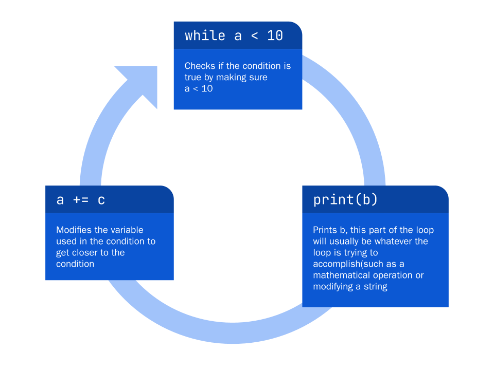
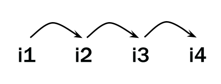
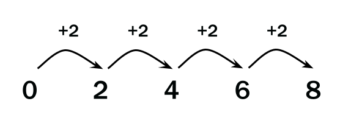

In the previous lesson, you learned about conditionals, which opened you up to more complex and useful programs. In this lesson, you will learn about loops, which are all about repetition. In any case where repetition is needed, you will need to use a loop. 
For example, if you wanted to write a program that can check for a value in a large database, a loop would be needed, instead of manually going through each one.
Additionally, if your input (which changes from program to program) determines how many times an instruction should be executed, you will need to use loops. 
Simply put, loops tell the program to execute the same code multiple times, though each time might be slightly different. Loops might execute a certain number of times, or till a condition is met. 

Let's look at the first kind of loop: the `while` loop. 


# Structure of loops

Every loop contains a **header** and a **body**. The header tells the loop when to stop, and the body tells the loop what code to execute. Every cycle that the loop repeats is called an **iteration**. 

Here are two loops that you will learn, and what they look like: 
```python
while (condition):             # Header
    print("Loop body")         # Body
    print("I am inside loop")  # Body
print("Outside loop")          # Outside of body
```

```python
for item in iterable:          # Header
    print("Loop body")         # Body
    print("I am inside loop")  # Body
print("Outside loop")          # Outside of body
```
# The `while` Loop

The `while` loop executes its body _while_ a certain condition is `True` (hence its name). 

The basic syntax of the `while` loop is:

```python
while (condition):
	# Execute code inside the body
```

Let's look at a simple example of a `while` loop: 
```python
a = 0
while (a < 10):
	print(a)
	a += 1
```
In the program above, first we initialize a variable called `a`. Then, we create a loop that runs its code so long as `a < 10` is `True`. Since `0 < 10`, it will enter the loop and `print(a)`. Then, it adds 1 to `a`. It will constantly do this until `a < 10` is `False`.
The output of that program would look like this:
```
>>> 0
>>> 1
>>> 2
>>> 3
>>> 4
>>> 5
>>> 6
>>> 7
>>> 8
>>> 9
```
When the condition is `False`, Python simply moves on to the rest of the code, just like it would with an `if` statement. 

```python
while a < 10:
	print(b)
	a += c
```



## Infinite Loops

Notice that in the previous programs, we always changed the variable in the condition of the `while` loop so that it would stop after a while. However, when we don't give it that, it will run on forever.

Try running this:

```python
while True:
	print("something")
```

The program will execute the body forever. However, there are multiple ways that we can create infinite loops. In our example, the condition inside the `while` loop was `True`, but you might write certain code that checks for a condition that is always true, like this:
```python
i = 0
while i == 0:
	print("This is an infinite loop")
```
Since `i` is never modified, this will never end. 

For our purposes, this is not very useful. Let's talk about how we can stop them. 

The first way that we can do this is by setting a condition inside the loop that will evaluate to `False` eventually. In the example earlier, we set `a` to 0, but we added 1 to it each time so that eventually `a < 10` would no longer be `True`. Let's say that we want a loop to end when it's found a certain character:
```python
phone_number = "123-456-7890"
n = 0
while (phone_number[n] != "6"):
	print(phone_number[n])
	n += 1
```
This program prints the string stored inside `phone_number` till it encounters the character `'6'`. When it does, it leaves the loop. 

# `break` and `continue`

There are other ways to stop or change while loops without changing the condition, the `break` statement and the `continue` statement.

The `break` statement tells the program to immediately exit the loop and move on the rest of the program, without completing the current iteration. 

```python
 i = 1
 while i > 0:
     print("This is an Infinite Loop")
     if i == 5:
         break
     i += 1
```

This program will output `This is an Infinite Loop` 5 times and then stop, since it encountered a `break`. 

The `continue` statement will stop the current iteration of the while loop and move on to the next iteration. 

```python
 i = 0
 while i < 10:
     i += 1
     if i == 5:
         continue
     print(i)
```

This program will output the numbers from 1 to 10 but skip 5.

## Ending while Loops

The `else` statement can be used at the end of while loops to output something else when the condition is no longer true.

> The else statement won't run if the loop exited because of a `break`. 

```python
 i = 0
 while i < 10:
     i += 1
     print(i)
 else:
	   print("The numbers 1-10 have been printed")

```
This program will output the numbers 1-10 and then print `The numbers 1-10 have been printed`.

The `else` statement behaves slightly differently when it's used with `while` loops. `else` always runs after the condition inside the `while` loop is `False`, even if it was `True` at some point. However, if the statement inside the if statement is `True`, the `else` will never run. 

# Tracing Loops

When you’re debugging a very straightforward program like this:

```python
 a = input()
 b = input()
 print(a / b)
```

The process of debugging code like his is usually intuitive. You can look at each line of code, line by line, and figure out what works and what doesn't. For loops, this is more complex. Many students mess up the condition inside the loop, which it causes it to run an incorrect number of times. Remember that the program will only check for the condition at the start of an iteration. Other times, you might write a loop with a condition that is never `True`. The loop will never run if the condition is never `True`. 

One of the ways that we can figure out exactly what's going on with loops is using a **trace table** to analyze the code: 

```python
i = 4
j = 0
while (j < 3):
	i += 1
    j += 1
print(i + j)
```

| Iteration | Statement | Value | Explanation |
| :-: | :-: | :-: | :-: |
| 1 | i += 1 | i = 5, j = 0 | Since j < 3 is True, Python enters the loop. |
| 1 | j += 1 | i = 5, j = 1 |  |
| 2 | i += 1 | i = 6, j = 1 | j < 3 is still True, so Python repeats the code. |
| 2  | j += 1 | i = 6, j = 2 |  |
| 3 | i += 1 | i = 7, j = 2 | j < 3 is still True, so Python repeats the code again. |
| 3 | j += 1 | i = 7, j = 3 |  |
| END | N/A | i = 7, j = 3 | j < 3 is now False, so Python stops the loop. |

# The `for` Loop

The `while` loop executes the content inside the loop while certain conditions are met. However, a lot of the looping that you will do in Python will be related to data structures like strings, lists, or other iterables (You might not know about these yet, but you will learn them in the next lesson.)

The `for` loop iterates (walks) through a list, string, dictionary, or other data structure. 

> If something is able to be iterated (walked through a piece at a time) through, it is classified as **iterable**

Example of an iterable:



The `for` loop goes across each element of the sequence, after executing the body of the loop every time it moves on to a new element.

```python
for element in iterable:
	execute body of the code
```
As you learn more about Python, you will know more iterables that can be used with `for`. In this lesson, we will cover `range()` and how it is used with `for` to generate sequences of numbers. 

## The `for` loop over a range of numbers

To iterate through a set of numbers, you can use the `range()` function.

`range()` basically creates a group of numbers based on the values that you give it. 

The basic format is:

```python
for i in range(start, end, increment):
	body_of_loop
```

> **`start`:** Starting value, inclusive
> 
> **`end`:** Ending value, exclusive
> 
> **`increment`:** How much to increase by

```python
for i in range(0, 10, 2):
	body_of_loop
```

In this example, `range` is a group of numbers, `0, 2, 4, 6, 8`.

`for` then iterates through each number, causing `i` to take on each value of `range` each iteration. 




If you only give one number, it will use that number as `end` and use `start = 0` and `increment = 1`.

If you only give two, it will use the first as `start` and the second as `end` and `increment`  will default to 1.

### Examples

```python
for i in range(0, 10, 2):
	# body_of_loop
	# Iterates through 0, 2, 4, 6, 8

for i in range(0, 10):
	# body_of_loop
	# Iterates through 0, 1, 2, 3, 4, 5, 6, 7, 8, 9

for i in range(10):
	# body_of_loop
	# Iterates through 0, 1, 2, 3, 4, 5, 6, 7, 8, 9

for i in range(5, 0, -1):
	#body_of_loop
	# Iterates through 5,4,3,2,1
```

## The process of a `for` loop

Let's get a deeper understanding of `for` loops by taking a look at one and breaking down each iteration: 

```python
for i in range(0, 6):
	print(i)
```

| `i =` | Statement | Explanation |
| :-: | :-: | :-: |
| 0 | print(i) | First, Python starts the loop with i = 0. It then executes print(i). Since there is no more in the body, the loop then goes to the next value of i. |
| 1 | print(i) | i = 1,so it does print(i), and goes to the next value. |
| 2 | print(i) | i = 2, so it does print(i), and goes to the next value. |
| 3 | print(i) | i = 3, so it does print(i), and goes to the next value. |
| 4 | print(i) | i = 4, so it does print(i), and goes to the next value. |
| 5 | print(i) | i = 5, so it does print(i), and there are no more values. |
| END | N/A | Since there are no more values, the loop ends. |

## The `for` Loop Over a String

In the previous [lessons](console-io), you learned that you can access the characters of a string by using `str_name[index]`. Remember that indices start from 0. 

For example:

```python
s = "Hello World"
s[0]
>>> H
s[1]
>>> e
s[5]
>>>  
s[6]
>>> W
```

To iterate through a string, you can create a loop which iterates through a set of numbers, then use those numbers to reference each character:

```python
s = "Hello World"
for i in range(len(s)):
	print(s[i])
```

This code will output `"Hello World"` with each character on its own line.

In the example above, we created a `range` iterable and iterated through it. Then, with the numbers contained in `range`, we referenced characters in `s`. However, strings are also iterable!

This means that we can directly iterate through strings: 

```python
s = "Hello World"
for i in s:
	print(i)
```

In this example, `i` will take on each character of the string `s` each time the body of the loop is executed.

```python
s = "Hello World"
for i in range(len(s)):
	print(s[i])
```

Though they produce the same product, directly using string is much more readable. 

## `break` in `for` loops

If you want a for loop to prematurely end, you can use the keyword `break`.

```python
 s = 'Python'
 for letter in s:
 	if letter == 'h':
		break
 	print("Current letter", letter)
```
```
>>>	Current letter: P
>>>	Current letter: y
>>>	Current letter: t
```
In this code, the code iterates through the letters of the string `s` until reaching `'h'`.

When the code reaches `'h'`,  the loop is broken and the code stops.

## `continue` in `for` loops

For loops can also use the `continue` keyword and in for loops this keyword can skip over a current iteration.

```python
 s = 'Python'
 for letter in s:
 	if letter == 'h':
		continue
	print("Current letter", letter)
```
```
 >>>	Current letter: P
 >>>	Current letter: y
 >>>	Current letter: t
 >>>	Current letter: o
 >>>	Current letter: n

```
In this example, the for loops iterates through each letter in the string `s` but skips the letter `h`, since it `continue`s to the next iteration if `letter == h`. 

## `else` in `for` loops

The else keyword can be used in for loops to print something when the loop is done, **if the loop does not exit prematurely with** **`break`**

This can be used to output a final remark once the loop is done without incorporating an `if` statement in your loop.

These two blocks of code output the same thing, but the use of the `else` statement is shorter and easire to read.

```python
 for i in range(10):
    print(i)
 else:
    print(“Those were the numbers 0-9”)
```

```python
 for i in range(10):
    print(i)
    if i == 9:
       print(“Those were the numbers 0-9)
```

This code prints the letters 0 through 9 with the `for` loop and then prints 10 with the `else` statement.

## `for` Loop Practice
Which use of the range function goes through every odd number from 1-20?
	a. `for i in range(20, 2)`
	b. `for i in range(1, 20, 2)`
	c. `for i in range(1, 20, 1)`
	d. `for i in range(20, 1)`

Which data type can a for loop not iterate through?
	a. Strings
	b. Lists
	c. Integers

<details> 
<summary> Answers: </summary>
B, C
</details>

# Determining the type of loop to use

You've just learned two types of loops. Here are some situation in which a while loop would be good:
1. When the number of iterations is unknown
2. When the condition isn't based on a quantity of iterations, but instead another value
3. When you want to ask for user input many times
4. If the increment of the while loop increases by a non-consistent value each time

In other situations, a for loop would be better:
1. When the number of iteration is already known
2. When you are iterating through a data structure such as a list or string
3. When you iterate through a sequence of numbers


# `if` statement inside of `while`/`for` loops
In previous examples, you'll see that we included `if` statements inside of loops.

`if` statements simply check for the condition, every time to loop runs

You still need to indent specifically for the `if` statement.

```python
s = 'Python'
for letter in s:
	if letter == 'h':
		break
    print("Current letter", letter)

>>> Current letter: P
>>> Current letter: y
>>> Current letter: t
```

You can use `if` statements to check for certain conditions and end loops early, or do operations on specific characters (the character is equal to `"a"`, etc.)
# Nested loops
You can also have loops inside of loops to repeat complex tasks multiple times.

The inner loop would be fully executed every time the outer loop cycles (iterates) one time.

```python
days_of_week = 'MTWHF'
for weeks_of_month in range(1,5):
	print("week " + str(weeks_of_month))
	for day in days_of_week:
		print(day)

>>> week 1 # Outer Loop iterates once
>>> M # Inner Loop iteration 1
>>> T # Inner Loop iteration 2
>>> W # Inner Loop iteration 3
>>> H # Inner Loop iteration 4
>>> F # Inner Loop iteration 5
>>> week 2 # Outer loop iterates once
>>> M # Inner Loop iteration 1
>>> T # Inner Loop iteration 2
>>> W # Inner Loop iteration 3
>>> H # Inner Loop iteration 4
>>> F # Inner Loop iteration 5
>>> week 3 # Outer loop iterates once
>>> M # Inner Loop iteration 1
>>> T # Inner Loop iteration 2
>>> W # Inner Loop iteration 3
>>> H # Inner Loop iteration 4
>>> F # Inner Loop iteration 5
>>> week 4 # Outer loop iterates once
>>> M # Inner Loop iteration 1
>>> T # Inner Loop iteration 2
>>> W # Inner Loop iteration 3
>>> H # Inner Loop iteration 4
>>> F # Inner Loop iteration 5

```

# Defensive Programming

Any program that requires user input to function should be **denfensive**. This means that it can deal with any kind of input taht the user gives it, even if it is invalid. The program should not crash if the user gives it something it can't handle. For example, if your program asks for a number, and the user enters a string, many times it won't run properly. Therefore, it is important to check what kind of input the user is giving. 

In this example, the program asks the user for a three letter word. It continues to ask the user for a three letter word till the user gives it valid input. If the user gives it a three letter word the first time, it exits the loop and the program continues.
```python
while True:
    x = input("Please enter a three letter word")
    if len(x) == 3:
        break
    print("The word you entered is not three letters long. Please try again")
# Do something with the three letter word
# We now know for sure it is three letters and a string
```

You can and should perform any check that may crash the program:

```python
print("This program does division for you")
while True:
	x = input("Enter a positive integer dividend: ")
	y = input("Enter a positive integer divisor: ")
	if not (x.isnumeric() and y.isnumeric()):
		print("Please enter numbers")
		continue
	# Now we know x and y can be safely casted to integers without crashing
	x = int(x)
	y = int(y)
	if y == 0:
		print("Your divisor cannot be zero")
		continue
	# If we pass all above checks, we can break out of the input loop
	break
# Now we can safely divide by y without possibly causing ZeroDivisionError
print(x / y)
**
```

# Vocabulary

| Word | Definition |
| :-: | :-: |
| Loop | Used for repeating an action multiple times |
| Iterable | Something that can be stepped through element by element |
| Cycle/Iteration | A term for each time a loop runs |
| Loop Header | The part of a loop that determines the behavior of a loop |
| Loop Body | The statements that execute on each loop iteration |
| Defensive Programing | Making sure no invalid inputs from the user can crash your program; Use if and while statements to deal with invalid inputs |

# Python Concepts

| Word | Definition |
| :-: | :-: |
| `while (condition):` | A loop that will continue to cycle until the condition is False. Checks the condition before each iteration. |
| `range(start, end, increment)` | Iterates through a sequence of numbers |
| `for val in seq:` | A loop that cycles through each element in the sequence |
| `break` | Keyword that halts execution of a loop body and exits the loop; skips to the next line of unindented code |
| `continue` | Keyword that halts execution of a loop body and skips to the next cycle |

